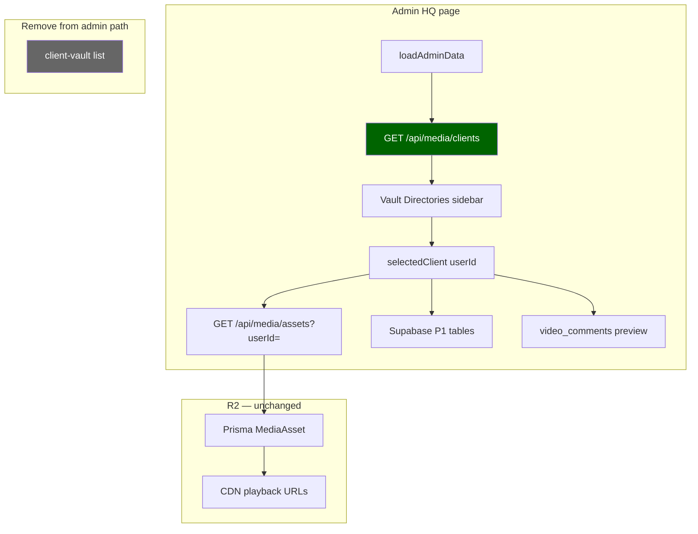

# Admin HQ Client Discovery — Migration Plan

**Created:** 2026-07-04  
**Type:** Inspection and plan only — no code changes, no implementation, no bucket creation  
**Status:** Phase 1 **implemented** (2026-07-04) — pending operator manual verify on `/admin`  
**Hard rules:**
- Supabase = database / auth / metadata (tables + JWT)
- Cloudflare R2 = all media / video / object storage
- Admin HQ must **not** depend on Supabase Storage for media or client discovery
- Large video playback remains R2 / CDN based

**Context:** `admin-storage-architecture-review.md` — `client-vault` is legacy; only Vault Directories uses Storage; 6 `MediaAsset` rows / 1 user / 0 storage folders (Phase 1 verification).

**Related:** `admin-dashboard-qa-issue-map.md` (ADM-002, ADM-003), `admin-hq-recovery-phase1.md`, `legacy-supabase-tables-migration-plan.md`

---

## Executive summary

| Item | Conclusion |
|------|------------|
| **What changes** | Replace `fetchClientFolders()` (`client-vault` `list()`) with backend-driven client list keyed by `userId` |
| **What stays the same** | Single-page admin layout, `selectedClient` UUID contract, `fetchClientData()`, R2 playback, Supabase P0/P1 metadata tables |
| **New endpoint needed?** | **Yes** — `GET /api/media/assets` does not expose distinct clients for admin today |
| **Bucket creation** | **Not required** for Admin HQ after migration; defer `client-vault` to legacy route cleanup (`picture-lock`, `video-uploaded`) |
| **Phases** | 1 → distinct `MediaAsset.userId` · 2 → display names · 3 → merged sources |

---

## 1. Current `app/admin/page.tsx` behavior

### 1.1 State and sidebar

| State | Type | Set by | Used for |
|-------|------|--------|----------|
| `clients` | `any[]` | `fetchClientFolders` | Vault Directories sidebar |
| `selectedClient` | `string \| null` | `fetchClientData(clientId)` | All panel scoping |
| `clientAssets` | `MediaAssetRecord[]` | `fetchMediaAssets({ userId })` | Vault Assets list |
| `currentStatus` | `string` | `project_status` | Phase buttons |
| `clientBrief` | `object \| null` | `project_status_details` | Brief panel |
| `clientInvoices` | `any[]` | `client_invoices` | Billing panel |

### 1.2 Client discovery (to replace)

```65:76:rendorax-frontend/app/admin/page.tsx
  useEffect(() => {
    const loadAdminData = async () => {
      await fetchClientFolders();
      setLoading(false);
    };
    loadAdminData();
  }, [supabase]);

  const fetchClientFolders = async () => {
    const { data } = await supabase.storage.from("client-vault").list();
    if (data) setClients(data.filter((item) => !item.metadata));
  };
```

**Sidebar render:** `client.name` → `fetchClientData(client.name)` — display `Client_{name.substring(0,8)}...`

**Legacy assumption:** Storage folder at bucket root = `auth.users.id`.

### 1.3 Client data load (unchanged in migration)

```78:118:rendorax-frontend/app/admin/page.tsx
  const fetchClientData = async (clientId: string) => {
    ...
    const assets = await fetchMediaAssets({ userId: clientId });
    ...
    supabase.from("project_status").select("status").eq("user_id", clientId).single();
    supabase.from("project_status_details").select("*").eq("user_id", clientId).single();
    supabase.from("client_invoices").select("*").eq("user_id", clientId).order("created_at", ...);
  };
```

**Preview / playback (unchanged):** `getMediaPlaybackUrl`, `getMediaOriginalUrl` → R2 CDN — no Storage.

### 1.4 Migration touch surface (minimal)

| Function | Phase 1 change |
|----------|----------------|
| `fetchClientFolders` | **Replace** — call new client-list API; map to `{ id: userId, label? }` |
| `fetchClientData` | **No change** — already uses `userId` |
| `updateStatus`, invoices, preview | **No change** |
| Sidebar JSX | **Optional** — use `client.id` instead of `client.name` (same value) |

---

## 2. Backend / Prisma media API

### 2.1 `MediaAsset` model (canonical media index)

```52:77:rendorax-backend/prisma/schema.prisma
model MediaAsset {
  id                String               @id @default(uuid())
  fileName          String
  publicUrl         String
  ...
  userId            String?
  ...
  @@index([userId])
}
```

- Bytes live in R2 (`objectKey`); row in Postgres via Prisma.
- Dashboard sets `userId` on `POST /api/media/assets` from JWT `auth.uid()`.

### 2.2 Existing `GET /api/media/assets`

```288:299:rendorax-backend/src/routes/media.routes.ts
    const scopedUserId =
      isAdminUser(req) && requestedUserId?.trim()
        ? requestedUserId.trim()
        : authenticatedUserId;

    const assets = await prisma.mediaAsset.findMany({
      where: {
        ...(scopedUserId ? { userId: scopedUserId } : {}),
```

| Caller | `?userId=` | Result |
|--------|------------|--------|
| Admin | **Set** to client UUID | That client's assets ✓ |
| Admin | **Omitted** | **Admin's own** assets only — not all clients |
| Non-admin | Omitted or own | Own assets only |

**Gap:** No query returns **distinct client IDs** for admin. Phase 1 **requires a new endpoint** (or admin-only query param on a new route).

### 2.3 Admin auth (existing)

- `requireAuth` on all `/api/media/*` routes.
- `isAdminUser(req)` → `req.user.role === "admin"` from JWT `app_metadata.role`.
- Frontend: `getBackendAuthHeaders()` → `Authorization: Bearer <access_token>`.

### 2.4 Proposed endpoint (plan only — not implemented)

**Option A (recommended):** `GET /api/media/clients`  
**Option B:** `GET /api/admin/clients` (new router)  
**Option C:** `GET /api/media/assets?distinctUserIds=true` (avoid — overloads asset route)

**Phase 1 response shape (minimal):**

```json
[
  { "userId": "1a2f97b5-942e-44ee-9c32-7de0c1c8328d", "assetCount": 6 }
]
```

**Phase 2 addition:** `email`, `displayName` from Prisma `User` left join.

**Phase 3 addition:** `sources: ["media", "project_status", "invoices", "agency"]`.

**Prisma sketch (Phase 1):**

```sql
SELECT "userId", COUNT(*)::int AS asset_count
FROM "MediaAsset"
WHERE "userId" IS NOT NULL
GROUP BY "userId"
ORDER BY MAX("createdAt") DESC;
```

Guard: `if (!isAdminUser(req)) return 403`.

### 2.5 Frontend wiring (plan only)

- Add `fetchMediaClients()` in `utils/mediaAssets.ts` (mirrors `fetchMediaAssets`).
- No Next.js API proxy required if CORS allows direct `backendFetch` (same as assets today).

---

## 3. Supabase metadata dependencies (unchanged by migration)

All use **`user_id` = `selectedClient` UUID** — same key whether discovered from Storage or `MediaAsset`.

| Table | Admin operations | Storage bucket? | After migration |
|-------|------------------|-----------------|-----------------|
| `project_status` | SELECT, UPSERT | No | Unchanged |
| `project_status_details` | SELECT | No | Unchanged |
| `client_invoices` | SELECT, INSERT, UPDATE, DELETE | No | Unchanged |
| `video_comments` | SELECT (preview) | No | Unchanged |
| `video_metadata` | Not used on admin page | No | Unchanged |

**Supabase role:** PostgreSQL tables via PostgREST + browser JWT. **Not** object storage.

**FK note:** P1 tables reference `auth.users(id)`. `selectedClient` must remain a valid auth UUID (same as today).

---

## 4. Recommended client list sources

### 4.1 Priority by phase

| Phase | Sources | Purpose |
|-------|---------|---------|
| **1** | `DISTINCT MediaAsset.userId WHERE NOT NULL` | Clients with uploaded media (matches R2 reality) |
| **2** | + Prisma `User` (`email`, `displayName`) | Human-readable sidebar labels |
| **3** | + `project_status.user_id`, + `client_invoices.user_id`, + `AgencyProject.clientId` | Clients with HQ metadata but no assets yet |

### 4.2 Source evaluation

| Source | Aligns with R2 | Coverage | Access today |
|--------|----------------|----------|--------------|
| **`MediaAsset.userId`** | **Yes** | Clients with assets | Backend Prisma — **needs new route** |
| **`project_status`** | N/A (metadata) | Clients with phase row | Supabase browser client (admin RLS) |
| **`client_invoices`** | N/A | Clients with invoices | Supabase browser client |
| **`project_status_details`** | N/A | Clients with brief | Supabase browser client |
| **Prisma `User`** | N/A | Seeded agency users | Backend — join in Phase 2 |
| **`AgencyProject.clientId`** | N/A | Formal agency clients | Backend agency routes — Phase 3 |
| **`auth.users`** | N/A | All auth users | Service role only — avoid in browser |
| **`client-vault` folders** | **No** | Legacy | **Remove from admin** |

### 4.3 Phase 3 merge rule (recommended)

```
clientIds = UNION(
  MediaAsset.userId,
  project_status.user_id,
  client_invoices.user_id,
  AgencyProject.clientId
) WHERE id IS NOT NULL
```

Dedupe by UUID. Sort by `lastActivityAt` (max asset `createdAt` or status `updated_at`) descending.

**Implementation location:** Backend single endpoint (keeps admin page thin; one JWT check).

---

## 5. Minimal safe migration path

### Principles

1. **No dashboard redesign** — zero changes to `/dashboard`.
2. **Preserve admin single-page structure** — `app/admin/page.tsx` stays one file.
3. **Replace only discovery** — `fetchClientFolders` → `fetchMediaClients` (name TBD).
4. **Keep R2 playback** — no changes to `getMediaPlaybackUrl`, `StreamingVideoPlayer`, `objectKey` flow.
5. **Do not create `client-vault`** for Admin HQ.

### Step sequence (when approved)

| Step | Action | Files (estimated) |
|------|--------|-------------------|
| 1 | Add `GET /api/media/clients` (admin-only) | `media.routes.ts` |
| 2 | Add `fetchMediaClients()` | `utils/mediaAssets.ts` |
| 3 | Replace `fetchClientFolders` body; remove `storage.from("client-vault")` | `app/admin/page.tsx` |
| 4 | Map API rows to sidebar: `key={userId}`, `onClick={() => fetchClientData(userId)}` | `app/admin/page.tsx` |
| 5 | Manual test: admin login → sidebar shows `1a2f97b5-...` → 6 assets load | — |
| 6 | Document ADM-002/003 closed for admin scope | checklist |

**Out of scope (same migration effort):** `picture-lock`, `video-uploaded` Storage cleanup — separate track.

---

## 6. Risks

| Risk | Severity | Mitigation |
|------|----------|------------|
| **Client with P1 data but no assets missing in Phase 1** | Medium | Phase 3 union; or manual seed `project_status` until Phase 3 |
| **Prisma `User` row missing** | Low | Phase 1 uses UUID label; Phase 2 join optional |
| **Email not available in browser** | Low | Never read `auth.users` from admin page; backend join only |
| **Display name fallback** | Low | `Client_{uuid.slice(0,8)}` (current pattern) or `email` when present |
| **Admin JWT missing / wrong role** | High | 403 on new endpoint; same as today for cross-user assets |
| **`MediaAsset.userId` null** | Low | `WHERE userId IS NOT NULL` in query |
| **Backend not running** | High | Same as ADM-004 — empty sidebar + console error; surface error in Phase 2 UX |
| **CORS / `NEXT_PUBLIC_BACKEND_URL`** | Medium | Same as existing `fetchMediaAssets` |
| **Invalid UUID in sidebar** | Medium | Only expose IDs from DB; P1 upsert may fail FK if orphan UUID seeded |
| **Double maintenance if bucket also created** | Medium | **Do not create bucket** for admin; document deprecation |

---

## 7. Proposed phases (detail)

### Phase 1 — List clients from `MediaAsset.userId`

**Goal:** Unblock Admin HQ without Supabase Storage.

| Deliverable | Detail |
|-------------|--------|
| Backend | `GET /api/media/clients` — admin-only, distinct `userId` + `assetCount` — **implemented** `media.routes.ts` |
| Frontend | `fetchMediaClients()` + `fetchClientFolders` uses API — **implemented** `mediaAssets.ts`, `app/admin/page.tsx` |
| Verification | Local: build pass; endpoint 401 without JWT; manual `/admin` sidebar — **pending operator** |
| Resolves | **ADM-003** (architecture); **ADM-002** bypassed for admin |

**Acceptance criteria:**
- [x] Code: admin `/admin` loads Vault Directories via `GET /api/media/clients` (no Storage `list`)
- [x] Code: HQ shell not blocked on client discovery (init hang fix 2026-07-04)
- [ ] Operator: clicking client loads assets via existing `fetchMediaAssets`
- [ ] Operator: R2 preview unchanged

### Phase 2 — Admin client endpoint with display names

**Goal:** Readable sidebar without exposing service role to browser.

| Deliverable | Detail |
|-------------|--------|
| Backend | Extend clients endpoint: `LEFT JOIN "User" ON id = userId` → `email`, `displayName` |
| Fallback | `displayName ?? email ?? Client_{uuid[0:8]}` |
| Prisma | `ensureAgencyUser` may not have run for all clients — join still works if row missing |

**Acceptance criteria:**
- [ ] Sidebar shows email when `User` row exists
- [ ] Graceful UUID fallback otherwise

### Phase 3 — Merge client sources

**Goal:** Full HQ coverage for clients without media.

| Deliverable | Detail |
|-------------|--------|
| Backend | Union `MediaAsset.userId`, P1 `user_id`s (via Prisma raw or Supabase service in backend), `AgencyProject.clientId` |
| Note | P1 tables are in same Postgres as Prisma — can query via Prisma `$queryRaw` or separate Supabase admin client server-side |
| Frontend | No structural change — consumes richer client list |

**Acceptance criteria:**
- [ ] Client with invoice but no assets appears in sidebar
- [ ] Client with `project_status` only appears
- [ ] No duplicate sidebar entries

---

## 8. Architecture diagram (target)



---

## 9. What not to do

| Action | Why |
|--------|-----|
| Create `client-vault` bucket for admin | Workaround; contradicts R2 architecture |
| List clients from Storage after bucket create | Perpetuates legacy; empty under R2 uploads |
| Move P1 tables to Prisma in this migration | Out of scope; Supabase metadata is fine |
| Change dashboard upload flow | Not required |
| Read `auth.users` from admin browser client | Security / no admin list API on anon key |
| Implement before approval | Per `AI_TEAM_PROTOCOL.md` |

---

## 10. Verification plan (post-implementation)

| Test | Expected |
|------|----------|
| Network on `/admin` load | `GET /api/media/clients` 200; **no** `storage/.../client-vault` |
| Sidebar | ≥1 client when `MediaAsset` rows exist |
| Select client | `GET /api/media/assets?userId=` 200 |
| Phase / invoice / brief | Supabase 200 (after P1 SQL applied) |
| Video preview | R2 / CDN URL in player |
| Non-admin JWT on `/api/media/clients` | 403 |

---

## 11. Checklist cross-reference

| Issue | After Phase 1 |
|-------|---------------|
| ADM-002 (`client-vault` bucket) | **Not required** for Admin HQ |
| ADM-003 (storage vs R2 drift) | **Resolved** for discovery |
| ADM-004 (backend connectivity) | Still required |
| ADM-001 (P1 tables) | Independent — still required for phase/billing/brief |

---

## 12. Approval gate

| Step | Status |
|------|--------|
| Architecture review | ✅ `admin-storage-architecture-review.md` |
| Migration plan | ✅ This document |
| Implementation | ✅ Phase 1 + init hang fix (2026-07-04) — pending manual verify |
| Bucket creation for admin | ❌ **Explicitly declined** |

---

*End of plan. Inspection and documentation only — no code or infrastructure was modified.*
