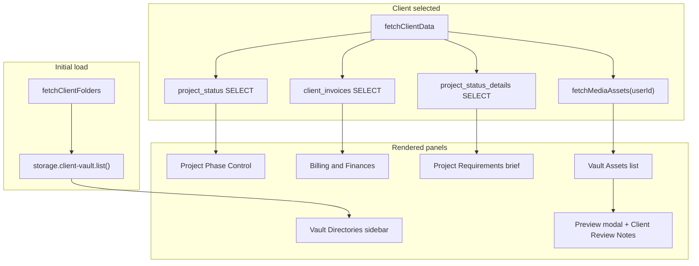

# Admin Dashboard — QA Issue Map

**Inspection date:** 2026-07-04  
**Type:** Inspection only — no code changes, no implementation  
**Scope:** `rendorax-frontend/app/admin/page.tsx` and all data paths it touches  
**Method:** Static code inspection + dev-server access log review (`GET /admin 200`)  
**Operator context:** `admin-studio@kachnamedia.com` has `app_metadata.role = "admin"`; `/admin` loads (auth gate **resolved**)

**Related:** `admin-login-failure-trace.md`, `admin-account-setup-guide.md`, `legacy-supabase-tables-migration-plan.md`, `dashboard-qa-issue-map.md`

---

## Executive summary

The admin portal is a **single monolithic client page** (`app/admin/page.tsx`, ~800 lines). There is **no** `app/admin/layout.tsx`, **no** dedicated admin components folder, and **no** agency API integration despite backend agency routes existing.

**Auth/middleware:** Working — `/admin` requires authenticated user with `app_metadata.role === "admin"`.

**Primary breakage drivers (code + infra):**

| Driver | Impact |
|--------|--------|
| **P1 Supabase tables missing** (`project_status`, `project_status_details`, `client_invoices`) | Status upsert, brief panel, billing — fail or appear empty |
| **`client-vault` storage bucket** used for client list | Empty sidebar if bucket missing/empty in new project |
| **R2 + Prisma media** vs **Supabase Storage client discovery** | Clients with R2 assets invisible in sidebar if no storage folders |
| **Silent error handling** | Failures look like empty UI, not errors |
| **No admin chrome** | No header, sign-out, or nav — feels broken/incomplete |
| **Global widgets** on admin route | Chatbot + Live Session overlay on HQ page |

---

## 1. Admin route / page structure

### File map

| Path | Role |
|------|------|
| `rendorax-frontend/app/admin/page.tsx` | **Only** admin route — full UI + all data loading |
| `rendorax-frontend/middleware.ts` | `/admin` auth + `isAdmin()` gate |
| `rendorax-frontend/utils/auth/roles.ts` | `isAdmin()` → `app_metadata.role === "admin"` |
| `rendorax-frontend/app/layout.tsx` | Root layout — injects `ChatbotWidget`, `GlobalLiveWidget` on **all** routes including `/admin` |
| `rendorax-frontend/utils/supabase/client.ts` | Browser Supabase client (legacy table + storage calls) |
| `rendorax-frontend/utils/mediaAssets.ts` | `fetchMediaAssets`, `deleteMediaAsset`, playback URL helpers |
| `rendorax-frontend/utils/backendAuth.ts` | Bearer JWT for backend media API |
| `rendorax-frontend/utils/backendFetch.ts` | `NEXT_PUBLIC_BACKEND_URL` (default `http://localhost:4000`) |
| `rendorax-frontend/components/dashboard/StreamingVideoPlayer.tsx` | Video preview modal |
| `rendorax-frontend/components/dashboard/MediaPreviewPanel.tsx` | Preview shell |
| `rendorax-backend/src/routes/media.routes.ts` | `GET /api/media/assets?userId=` (admin-scoped) |
| `rendorax-backend/src/middleware/requireAuth.ts` | JWT validation; role from `app_metadata` |

**Not used by admin today:** `app/api/agency/*`, Prisma `AgencyProject` / `Task`, `components/DashboardHeader.tsx`, dedicated admin components.

### UI panels (in render order)

### Data loading paths

| Panel | Source | API / table |
|-------|--------|-------------|
| **Vault Directories** | Supabase Storage | `storage.from("client-vault").list()` — folder names = client `user_id` |
| **Vault Assets** | Backend + Prisma | `GET {BACKEND}/api/media/assets?userId={clientId}` |
| **Project Phase** | Supabase legacy | `project_status` SELECT + upsert |
| **Brief** | Supabase legacy | `project_status_details` SELECT (read-only in app) |
| **Invoices** | Supabase legacy | `client_invoices` SELECT / INSERT / UPDATE / DELETE |
| **Review notes (preview)** | Supabase legacy | `video_comments` SELECT by `file_name` + `user_id` |

---

## 2. Auth / role behavior (verified — not a blocker)

| Check | Result |
|-------|--------|
| Login path | `/access` → `signInWithPassword` → session cookies |
| Middleware `/admin` unauthenticated | Redirect `/access?redirectTo=/admin` |
| Middleware `/admin` non-admin | Redirect `/dashboard` |
| Middleware `/admin` admin JWT | Allow — **operator confirms working** |
| Backend admin asset scope | `isAdminUser(req) && requestedUserId` → cross-user `MediaAsset` query |
| Role source | `user.app_metadata.role === "admin"` (middleware + backend) |
| Prisma `User.role` | Not consulted for `/admin` gate |

**No redirect issue remains** for the reported admin account.

---

## 3. Issue register

### Critical

| ID | Area | Symptom | Root cause | Evidence |
|----|------|---------|------------|----------|
| **ADM-001** | Project Phase + Billing + Brief | Status buttons appear to do nothing; invoice create fails; brief never shows | **P1 legacy tables not created** in project `bviltofeuqsibbgancby` | Checklist §14; `supabase-p0-legacy-review-tables.sql` is P0 only; `legacy-supabase-tables-migration-plan.md` §3–5; admin `.from("project_status")` etc. |
| **ADM-002** | Vault Directories | Empty client sidebar — cannot select any client | **`client-vault` bucket** missing, empty, or RLS denies `list()` | `fetchClientFolders()` line 74; checklist §14 "not confirmed in new project" |

### High

| ID | Area | Symptom | Root cause | Evidence |
|----|------|---------|------------|----------|
| **ADM-003** | Vault Assets | "No assets to display" for all clients | **Architecture drift:** client list from Supabase Storage; assets from **R2 + Prisma** `MediaAsset`. New uploads never create storage folders. | `media.routes.ts` admin `userId` scope; admin storage list vs `fetchMediaAssets` |
| **ADM-004** | Vault Assets | Empty asset list; console error only | **Backend not running** or `NEXT_PUBLIC_BACKEND_URL` wrong → `fetchMediaAssets` throws, caught → `setClientAssets([])` | `backendFetch.ts`; `fetchClientData` try/catch lines 85–91 |
| **ADM-005** | Project Phase | Status change silently fails | `updateStatus` upsert — **no `error` UI** when table missing or RLS denies | `updateStatus` lines 120–141 — success message only if `!error` |
| **ADM-006** | Billing | "Invoice generation failed." with no detail | `client_invoices` missing or RLS blocks admin INSERT; generic catch | `handleCreateInvoice` lines 246–247 |
| **ADM-007** | Review notes (preview) | Notes empty despite dashboard comments | **Query mismatch:** admin filters `file_name` + `user_id`; dashboard loads/comments by `file_name` only; vault may use `userId_filename` prefix vs `MediaAsset.fileName` | `admin/page.tsx` 185–190; `useLiveComments.ts` 55–58; dashboard `handlePreview` strips display name |

### Medium

| ID | Area | Symptom | Root cause | Evidence |
|----|------|---------|------------|----------|
| **ADM-008** | Layout / UX | Page feels unfinished — no way to sign out or return to dashboard | **No admin layout/header**; does not reuse `DashboardHeader` | Only `app/admin/page.tsx`; no `/admin` link in dashboard |
| **ADM-009** | Layout / UX | Live Session + AI chat float over HQ | **Root layout** mounts `ChatbotWidget` + `GlobalLiveWidget` on `/admin` | `app/layout.tsx`; `GlobalLiveWidget` shows for all authenticated non-dashboard routes |
| **ADM-010** | Error UX | Broken areas look like empty data | **Errors swallowed** — most Supabase calls destructure `{ data }` only, ignore `error` | `fetchClientFolders`, status/brief/invoice loads |
| **ADM-011** | Header | Misleading "PostgreSQL Node: Synced" | **Hardcoded static text** — not tied to health check | `page.tsx` line 302 |
| **ADM-012** | Brief panel | Brief never appears for real clients | **`project_status_details` read-only** — no dashboard form writes briefs; requires manual SQL seed | No insert in codebase for `project_status_details` |
| **ADM-013** | P1 RLS | Admin ops fail after tables created without policies | Admin writes need `(auth.jwt() -> 'app_metadata' ->> 'role') = 'admin'` | `legacy-supabase-tables-migration-plan.md` §Required RLS |

### Low

| ID | Area | Symptom | Root cause | Evidence |
|----|------|---------|------------|----------|
| **ADM-014** | Agency features | No projects/tasks in admin | Agency API exists; **admin UI never wired** | Checklist §16; `review-collaboration-layer-map.md` |
| **ADM-015** | Navigation | No in-app path to `/admin` | Dashboard has no admin link for `isAdmin` users | Grep: no `/admin` in `dashboard/page.tsx` |
| **ADM-016** | Assets | Delete may 403 for wrong owner scope | Backend checks admin role on delete — should work if JWT role present | `media.routes.ts` `assertMediaAssetAccess` |
| **ADM-017** | Global assets | `/assets/logo.png` 404 on related auth pages | Missing file (dev log on `/access`) | Terminal: `GET /assets/logo.png 404` — affects login, not admin core |

---

## 4. Expected console / network errors (when infra missing)

Operator can confirm in browser DevTools while on `/admin`:

| Request | Missing resource | Typical error |
|---------|------------------|---------------|
| `GET .../rest/v1/project_status?...` | Table | `PGRST205` — relation not in schema cache |
| `GET .../rest/v1/project_status_details?...` | Table | `PGRST205` |
| `GET .../rest/v1/client_invoices?...` | Table | `PGRST205` |
| `POST .../rest/v1/project_status` | Table / RLS | `404` or `403` |
| `POST .../rest/v1/client_invoices` | Table / RLS | `404` or `403` |
| `GET .../storage/v1/object/list/client-vault` | Bucket | `404` bucket not found or empty `[]` |
| `GET http://localhost:4000/api/media/assets?userId=...` | Backend down | `Failed to fetch` / network error |
| `GET .../rest/v1/video_comments?...` | Table (P0) | `PGRST205` if P0 SQL not applied |

**Note:** P0 tables (`video_comments`, `video_metadata`) verified **local dev 2026-07-03** per checklist — preview notes may work if P0 applied and query keys align (ADM-007).

---

## 5. Data dependencies matrix

| Dependency | Required for | Status (checklist / code) | Admin impact if missing |
|------------|--------------|---------------------------|-------------------------|
| Supabase Auth + `app_metadata.role` | `/admin` access | **Resolved** (operator) | N/A — gate passes |
| `project_status` (P1) | Phase control | **Not created** in new project | ADM-001, ADM-005 |
| `project_status_details` (P1) | Brief panel | **Not created** | ADM-001, ADM-012 |
| `client_invoices` (P1) | Billing | **Not created** | ADM-001, ADM-006 |
| `video_comments` (P0) | Preview notes | **Local verified**; production pending | Empty notes panel |
| `video_metadata` (P0) | Picture lock (dashboard) | Not used on admin page | None on admin |
| Storage `client-vault` | Client sidebar | **Not confirmed** | ADM-002 |
| Prisma `MediaAsset` + backend | Vault Assets | Requires backend + DB | ADM-003, ADM-004 |
| `NEXT_PUBLIC_BACKEND_URL` | Media API | Default localhost:4000 | ADM-004 |
| `SUPABASE_SERVICE_ROLE_KEY` | picture-lock API only | Not used on admin page | None |
| R2 / `NEXT_PUBLIC_R2_PUBLIC_URL` | Playback URLs | Local configured | Preview/download broken if CDN wrong |
| Agency Prisma models | Future HQ features | API only, no admin UI | ADM-014 |

---

## 6. Broken UI areas (operator-visible)

| UI section | Likely broken appearance | Primary issue IDs |
|------------|--------------------------|-------------------|
| **Vault Directories** (left column) | Empty list | ADM-002, ADM-003 |
| **Project Phase Control** | Buttons show default "Awaiting Assets"; clicks fail silently | ADM-001, ADM-005 |
| **Billing & Finances** | "No financial records"; create invoice fails | ADM-001, ADM-006 |
| **Project Requirements** | Panel never renders (`clientBrief` null) | ADM-001, ADM-012 |
| **Vault Assets** | "No assets to display" | ADM-003, ADM-004 |
| **Preview modal — Client Review Notes** | "No client feedback yet" | ADM-007, P0 table gap |
| **Page chrome** | No header/sign-out; floating widgets | ADM-008, ADM-009 |
| **Status line** | Always green "Synced" | ADM-011 |

---

## 7. Frontend assumptions (document for fix planning)

1. **Client ID = Supabase Storage folder name** under `client-vault` (typically auth user UUID).
2. **That same UUID** is passed as `userId` to `fetchMediaAssets` — must match `MediaAsset.userId` in Prisma.
3. **Legacy Supabase tables** are queried with **browser anon client + user JWT** — not service role.
4. **Admin role in JWT** must be present for P1 RLS policies (after tables exist).
5. **Brief data** is never collected from clients in current dashboard — admin brief is seed-only.
6. **Invoice currency** hardcoded as BDT (৳) in display — not a bug, but fixed assumption.
7. **No loading/error state** for Supabase legacy calls — empty vs error indistinguishable.

---

## 8. Recommended fix order

Smallest safe fixes first. **No redesign** — preserve single-page admin structure.

| Order | Action | Type | Fixes | Risk if skipped |
|-------|--------|------|-------|-----------------|
| **1** | Apply P1 SQL (`project_status`, `project_status_details`, `client_invoices` + admin RLS) per `legacy-supabase-tables-migration-plan.md` | **Ops / SQL** | ADM-001, ADM-005, ADM-006, ADM-013 | Billing + status remain broken |
| **2** | Create/configure `client-vault` bucket + authenticated list policy (`update_rls_policy.sql`) | **Ops / Supabase** | ADM-002 | Empty sidebar |
| **3** | Seed `project_status_details` for test client (SQL) OR accept brief empty until client form exists | **Ops / seed** | ADM-012 | Brief panel empty (expected) |
| **4** | Ensure backend running locally; confirm `NEXT_PUBLIC_BACKEND_URL` | **Env / ops** | ADM-004 | No assets |
| **5** | **Code (small):** Surface Supabase `error` in admin toast/banner — no layout change | Code | ADM-010 | Operators cannot diagnose |
| **6** | **Code (small):** Show upsert/invoice failure messages from `error.message` | Code | ADM-005, ADM-006 | Silent failures |
| **7** | **Code (medium):** Fallback client list — distinct `MediaAsset.userId` from backend when storage list empty | Code | ADM-003 | R2-only clients invisible |
| **8** | **Code (small):** Minimal admin header (sign out, link to dashboard) — reuse patterns from `DashboardHeader` | Code | ADM-008, ADM-015 | UX incomplete |
| **9** | **Code (small):** Exclude `/admin` from `GlobalLiveWidget` / `ChatbotWidget` or add `app/admin/layout.tsx` without widgets | Code | ADM-009 | Visual clutter |
| **10** | **Code (medium):** Align `video_comments` query with dashboard `file_name` convention | Code | ADM-007 | Preview notes empty |
| **11** | Wire agency API read-only into admin (optional, later) | Code | ADM-014 | No project/task HQ view |

**Do not start with a full admin rewrite or Prisma migration** — checklist explicitly says preserve legacy table usage in admin page.

---

## 9. Verification checklist (post-fix, for operator)

- [ ] `/admin` loads for admin user (already passing)
- [ ] Vault Directories shows at least one client
- [ ] Selecting client loads Vault Assets from backend
- [ ] Project Phase change persists after reload (Supabase `project_status` row)
- [ ] Invoice create appears in list; status toggle works
- [ ] Video preview opens; Client Review Notes show comments (if any)
- [ ] No `PGRST205` in Network tab for P1 tables
- [ ] No silent failures — errors visible in UI

---

## 10. API routes summary

| Route | Used by admin? | Notes |
|-------|----------------|-------|
| Supabase REST `project_status` | Yes | Direct browser client |
| Supabase REST `project_status_details` | Yes | Read only |
| Supabase REST `client_invoices` | Yes | Full CRUD |
| Supabase REST `video_comments` | Yes | Preview modal only |
| Supabase Storage `client-vault` | Yes | Client list |
| `GET /api/media/assets?userId=` | Yes | Via `backendFetch` → Express backend |
| `DELETE /api/media/assets/:id` | Yes | Purge asset |
| Next.js `/api/agency/*` | No | Not integrated |
| `/api/picture-lock` | No | Dashboard only |

---

*End of issue map. Inspection only — no code or infrastructure was modified.*
