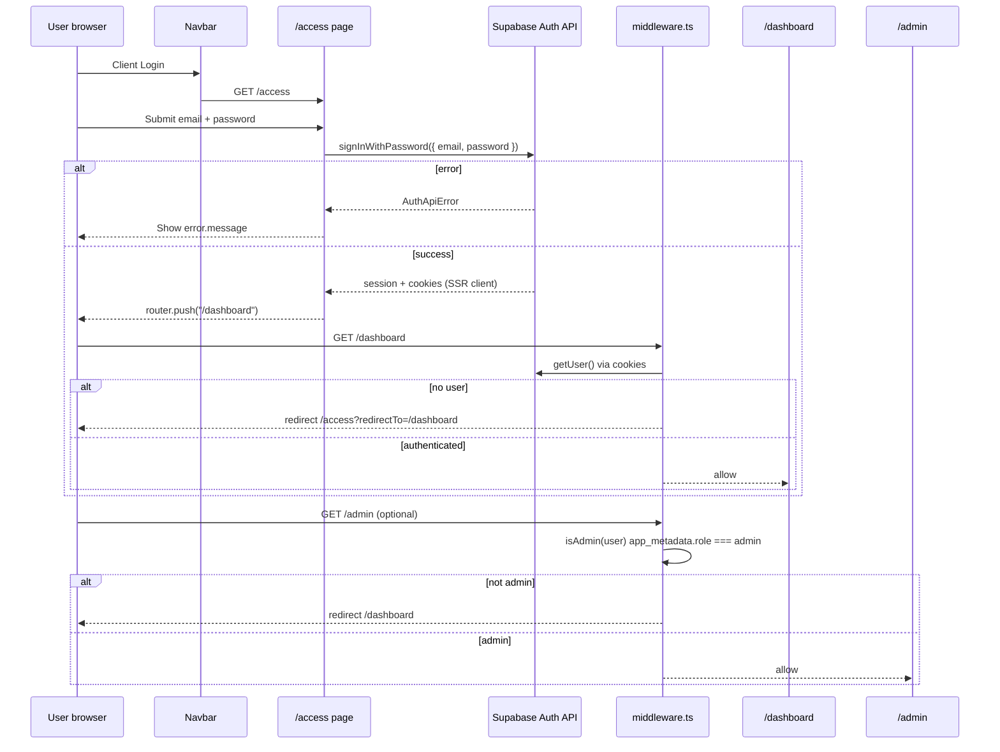

# Admin Login Failure — Inspection Trace

**Created:** 2026-07-04  
**Type:** Inspection only — no code changes, no password reset, no user creation  
**Reported credentials:** `admin-studio@kachnamedia.com` / `KachnaStudio2026#`  
**Active Supabase project (local config):** `bviltofeuqsibbgancby`  
**Cannot verify from repo alone:** Whether the reported user exists in live Supabase Auth or Prisma `User` — operator must run verification steps in §6.

---

## Executive summary

| Question | Inspection answer |
|----------|-------------------|
| Does `admin-studio@kachnamedia.com` exist in repo/bootstrap scripts? | **No** — not referenced anywhere in codebase |
| What admin does the repo bootstrap script create? | `admin-studio@rendorax.com` / `RendoraxStudio2026#` (`rendorax-backend/scripts/create-admin.ts`) |
| Can login fail if user missing? | **Yes** — Supabase returns `Invalid login credentials` |
| Can login succeed but admin fail? | **Yes** — `/admin` requires `app_metadata.role === "admin"`; missing role → redirect to `/dashboard` |
| Is there OAuth/callback involved? | **No** — email/password only via `signInWithPassword` |
| Prisma `User` required for login? | **No** — only Supabase Auth + cookies; Prisma row created lazily on agency API use |
| Most likely cause (reported email) | **User does not exist** in project `bviltofeuqsibbgancby`, or credentials are from **legacy project / different bootstrap email** |

---

## 1. User existence — Supabase Auth vs Prisma

### 1.1 Supabase Auth (`auth.users`)

| Source | Finding |
|--------|---------|
| Repo grep | **Zero** matches for `admin-studio@kachnamedia.com` or `KachnaStudio2026#` |
| Bootstrap script | `rendorax-backend/scripts/create-admin.ts` provisions **`admin-studio@rendorax.com`** with **`RendoraxStudio2026#`** |
| Migration context | Checklist/docs state auth migrated to **`bviltofeuqsibbgancby`** — users from old Supabase projects are **not** auto-migrated |
| Signup UI | **None** — users must be created via Supabase Dashboard, SQL, or `create-admin.ts` |

**Conclusion:** The reported email/password pair is **not** the pair encoded in the repo’s admin bootstrap script. Unless an operator manually created `admin-studio@kachnamedia.com` in the new project, **the user likely does not exist** in `bviltofeuqsibbgancby`.

### 1.2 Prisma `User` (`public.User`)

| Field | Source |
|-------|--------|
| Model | `rendorax-backend/prisma/schema.prisma` — `User.id` matches `auth.users.id` |
| Role enum | `AgencyRole`: `admin`, `editor`, `client` |
| Created when? | `ensureAgencyUser()` on agency API calls — **not** at login time |
| Required for `/access` login? | **No** |

**Conclusion:** Missing Prisma row would **not** block `signInWithPassword` or `/dashboard`. It would only affect agency API routes after login.

### 1.3 Operator verification (read-only — do not run destructive SQL)

**Supabase Dashboard → Authentication → Users**

- Search: `admin-studio@kachnamedia.com`
- Note: `Confirmed` status, `User UID`, `Created at`

**Supabase SQL Editor:**

```sql
SELECT id, email, email_confirmed_at, created_at,
       raw_app_meta_data->>'role' AS app_role,
       raw_user_meta_data->>'role' AS user_role
FROM auth.users
WHERE email = 'admin-studio@kachnamedia.com';
```

**Prisma (optional, after auth user exists):**

```sql
SELECT id, email, role FROM "User"
WHERE email = 'admin-studio@kachnamedia.com';
```

---

## 2. Failure mode analysis

### 2.1 Symptom: error on `/access` (login form)

| Cause | Supabase / UI behavior | Likelihood (reported creds) |
|-------|------------------------|----------------------------|
| **User does not exist** | `Invalid login credentials` | **High** — email not in bootstrap script |
| **Wrong password** | `Invalid login credentials` | **High** — password differs from script (`Kachna…` vs `Rendorax…`) |
| **Email not confirmed** | May block sign-in if confirm required | Medium — depends on Supabase Auth settings |
| **Wrong Supabase project** (env) | Auth against empty/wrong project | Medium locally if `.env` stale; **High** on production if Vercel keys wrong |
| **Placeholder Supabase client** | Build-time placeholders if env missing | Low at runtime if `.env.local` loaded |

### 2.2 Symptom: login “works” but cannot reach admin

| Cause | Behavior | Likelihood |
|-------|----------|------------|
| **`app_metadata.role` not `admin`** | Middleware redirects `/admin` → `/dashboard` | **High** if user exists but role never set |
| **`user_metadata.role` only** | **Ignored** by app — `isAdmin()` reads `app_metadata` only | Medium if role set in wrong metadata bucket |
| **Session cookie not set** | Middleware treats user as logged out | Low if dashboard loads |

### 2.3 Not a login blocker (for `/access`)

| Item | Why |
|------|-----|
| Middleware restriction on `/dashboard` | Only requires **any** authenticated user |
| Backend `requireAuth` | Affects API calls after login, not initial `signInWithPassword` |
| Role mismatch | Blocks `/admin` only, not login itself |
| Prisma `User` missing | Agency APIs only |

### 2.4 Auth callback issues

**Not applicable** — no `/auth/callback`, no OAuth, no `exchangeCodeForSession` in frontend.

---

## 3. Exact login flow trace



### Step-by-step (file references)

| Step | File | Lines / function | What happens |
|------|------|------------------|--------------|
| 1. Entry | `components/Navbar.tsx` | Link → `/access` | “Client Login” |
| 2. Form | `app/access/page.tsx` | `handleLogin` | `signInWithPassword({ email, password })` |
| 3. Client | `utils/supabase/client.ts` | `createBrowserClient` | Uses `NEXT_PUBLIC_SUPABASE_URL` + `NEXT_PUBLIC_SUPABASE_ANON_KEY` |
| 4. Success redirect | `app/access/page.tsx` | `router.push("/dashboard")` | **Always `/dashboard`** — does not read `redirectTo` query on success |
| 5. Middleware | `middleware.ts` | `updateSession()` | `supabase.auth.getUser()` from cookies |
| 6. Dashboard gate | `middleware.ts` | `isDashboardRoute && !user` | Redirect to `/access?redirectTo=...` |
| 7. Admin gate | `middleware.ts` | `isAdminRoute` + `isAdmin(user)` | Non-admin → `/dashboard` |
| 8. Role helper | `utils/auth/roles.ts` | `isAdmin()` | **`user.app_metadata?.role === "admin"`** |
| 9. Dashboard RBAC | `app/dashboard/page.tsx` | `loadUser` effect | `isEditor` if role is `admin` or `editor` |
| 10. Backend API | `utils/agencyBackend.ts` | `getBackendAuthHeaders()` | Bearer token from session for `/api/agency/*` |
| 11. Backend JWT | `rendorax-backend/src/middleware/requireAuth.ts` | `getUser(token)` | Role from `app_metadata.role` |

### API routes involved in login

| Route | Role in login |
|-------|---------------|
| **`/access`** (page) | Login UI — **only** auth entry point |
| **Supabase Auth API** (external) | `POST /auth/v1/token?grant_type=password` (via SDK) |
| `/api/agency/*` (Next proxy) | **After** login — not part of sign-in |
| `/api/*` (other) | Not used during login |

**No** dedicated `app/api/auth/login/route.ts`.

---

## 4. Files involved

| File | Purpose |
|------|---------|
| `rendorax-frontend/app/access/page.tsx` | Login form + `signInWithPassword` |
| `rendorax-frontend/utils/supabase/client.ts` | Browser Supabase client |
| `rendorax-frontend/utils/supabase/server.ts` | Server SSR client (cookies) |
| `rendorax-frontend/utils/supabase/middleware.ts` | Session refresh in middleware |
| `rendorax-frontend/middleware.ts` | Route protection `/dashboard`, `/admin` |
| `rendorax-frontend/utils/auth/roles.ts` | `isAdmin()` — `app_metadata.role` |
| `rendorax-frontend/app/dashboard/page.tsx` | Post-login session + `isEditor` |
| `rendorax-frontend/app/admin/page.tsx` | Admin HQ (middleware-gated only) |
| `rendorax-frontend/components/DashboardHeader.tsx` | Sign out — `auth.signOut()` |
| `rendorax-frontend/components/Navbar.tsx` | Login link |
| `rendorax-backend/scripts/create-admin.ts` | Admin **provisioning** script (not auto-run) |
| `rendorax-backend/src/middleware/requireAuth.ts` | Backend JWT validation |
| `rendorax-backend/src/lib/agencyUsers.ts` | Prisma `User` upsert + role mapping |
| `rendorax-backend/prisma/schema.prisma` | `User`, `AgencyRole` |

---

## 5. Supabase auth assumptions

| Assumption | Evidence |
|------------|----------|
| Project ref (local) | `bviltofeuqsibbgancby` — `rendorax-frontend/.env.local`, checklist §2 |
| Auth method | Email + password only |
| Session storage | Supabase SSR cookies (middleware `getUser`) |
| Admin role location | **`app_metadata.role`** = `"admin"` (not `user_metadata` alone) |
| Editor role | `app_metadata.role` ∈ `{admin, editor}` for Go Live / `isEditor` |
| Service role | `SUPABASE_SERVICE_ROLE_KEY` in frontend `.env.local` — used by `create-admin.ts` only |
| Email confirmation | Bootstrap uses `email_confirm: true`; manual users may differ |
| No signup | Users must be provisioned |
| Production env | Vercel keys **not** readable from repo — must match `bviltofeuqsibbgancby` (§14 checklist) |

### Env vars required for login (frontend)

```
NEXT_PUBLIC_SUPABASE_URL=https://bviltofeuqsibbgancby.supabase.co
NEXT_PUBLIC_SUPABASE_ANON_KEY=<anon key for bviltofeuqsibbgancby>
```

If missing at runtime, `client.ts` falls back to placeholders → auth will fail against fake host.

---

## 6. Expected admin role source

| Layer | Role source | Values used |
|-------|-------------|-------------|
| **Middleware `/admin`** | `user.app_metadata.role` | Must be exactly `"admin"` |
| **Dashboard `isEditor`** | `session.user.app_metadata.role` | `"admin"` or `"editor"` |
| **Backend `requireAuth`** | JWT `app_metadata.role` | Passed to agency routes |
| **Prisma `User.role`** | Synced from JWT in `ensureAgencyUser()` | `mapSupabaseRoleToAgencyRole()` |
| **`create-admin.ts`** | Sets **both** `user_metadata.role` and `app_metadata.role` to `"admin"` | Correct for this app |

**Important:** Setting role only in `user_metadata` or only in Prisma **does not** grant `/admin` access.

Example SQL (from `legacy-supabase-tables-migration-plan.md`):

```sql
UPDATE auth.users
SET raw_app_meta_data = raw_app_meta_data || '{"role":"admin"}'::jsonb
WHERE email = 'admin-studio@kachnamedia.com';
```

---

## 7. Credential mismatch (repo evidence)

| Field | Reported | Repo bootstrap (`create-admin.ts`) |
|-------|----------|-------------------------------------|
| Email | `admin-studio@kachnamedia.com` | `admin-studio@rendorax.com` |
| Password | `KachnaStudio2026#` | `RendoraxStudio2026#` |

The domain `kachnamedia.com` appears only as **`kachnamedia@gmail.com`** in `utils/contactEmail.ts` (notify recipient), **not** as an auth email.

**If the operator intended the repo bootstrap account**, try **`admin-studio@rendorax.com`** / **`RendoraxStudio2026#`** — only after confirming that user was created in `bviltofeuqsibbgancby` (inspection did not execute the script).

---

## 8. Safe seed plan (do not implement without approval)

> **Inspection only** — steps for operator when admin account is confirmed missing.

### Phase A — Verify target project

1. Confirm `NEXT_PUBLIC_SUPABASE_URL` in the environment being tested contains **`bviltofeuqsibbgancby`**.
2. Supabase Dashboard → confirm project ref matches.

### Phase B — Create Supabase Auth user (choose one path)

**Option B1 — Run bootstrap script (adjust email first if needed)**

1. Ensure `rendorax-frontend/.env.local` has `NEXT_PUBLIC_SUPABASE_URL` + `SUPABASE_SERVICE_ROLE_KEY`.
2. Edit `rendorax-backend/scripts/create-admin.ts` email/password to desired values **or** use defaults (`admin-studio@rendorax.com`).
3. From `rendorax-backend`: `npx ts-node scripts/create-admin.ts` (or project’s documented runner).
4. Script sets `email_confirm: true` and `app_metadata.role: "admin"`.

**Option B2 — Supabase Dashboard**

1. Authentication → Add user → email + password.
2. Enable **Auto Confirm User**.
3. Run SQL to set `app_metadata.role` (§6).

**Option C — If user exists but wrong role**

1. SQL update `raw_app_meta_data` with `"role":"admin"` (§6).
2. User must **sign out and sign in** (or refresh session) for JWT to pick up new claims.

### Phase C — Prisma `User` row (optional for login; needed for agency features)

1. After first authenticated agency API call, `ensureAgencyUser()` upserts automatically.
2. Or manual: `INSERT INTO "User" (id, email, role) VALUES (...)` matching `auth.users.id`.

### Phase D — Verification

1. Incognito → `/access` → reported credentials.
2. Expect redirect to `/dashboard`.
3. Navigate to `/admin` — should load (not bounce to dashboard).
4. DevTools → Application → cookies — Supabase auth cookies present.
5. Optional: `GET /api/agency/projects` with session — not `401`.

### Safety rules

- Do **not** commit passwords or service role keys.
- Do **not** run script against production without confirming project ref.
- Prefer **one** canonical admin email documented in checklist after seeding.
- `create-admin.ts` is listed in `rendorax-backend/.gitignore` — may be local-only; confirm before relying on it in CI.

---

## 9. Diagnostic decision tree

```
Cannot log in?
│
├─ Error shown on /access form?
│   ├─ "Invalid login credentials" → user missing OR wrong password OR wrong Supabase project
│   ├─ "Email not confirmed" → confirm user in Dashboard or SQL
│   └─ Network / CORS error → check SUPABASE_URL, ad blockers, project status
│
└─ No error but redirected back to /access?
    ├─ Cookies blocked / wrong domain → check Site URL in Supabase Auth settings
    └─ Middleware not receiving session → SSR cookie issue; try router.refresh after login

Login works but /admin redirects to /dashboard?
└─ app_metadata.role !== "admin" → set role in auth.users (§6)

Login works, dashboard works, API 401?
└─ Backend SUPABASE_URL/ANON_KEY mismatch or missing Bearer token
```

---

## 10. Related documents

- `production-auth-flow-walkthrough.md` — full auth path map
- `supabase-auth-live-test-report.md` — env consistency for `bviltofeuqsibbgancby`
- `auth-test-execution-report.md` — manual test cases TC-7.x admin role
- `legacy-supabase-tables-migration-plan.md` — `app_metadata.role` SQL example
- `rendorax-project-checklist.md` §14 — production auth verification pending
- `comment-author-avatar-plan.md` — notes `create-admin.ts` metadata shape

---

*End of trace. Inspection only — no code, passwords, or users were modified.*
