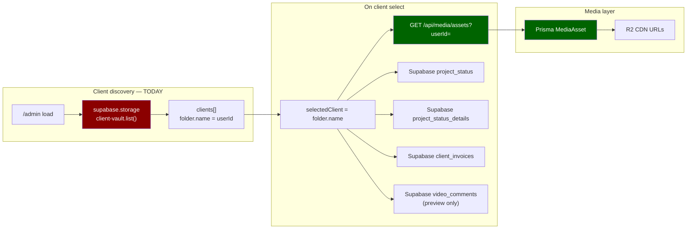
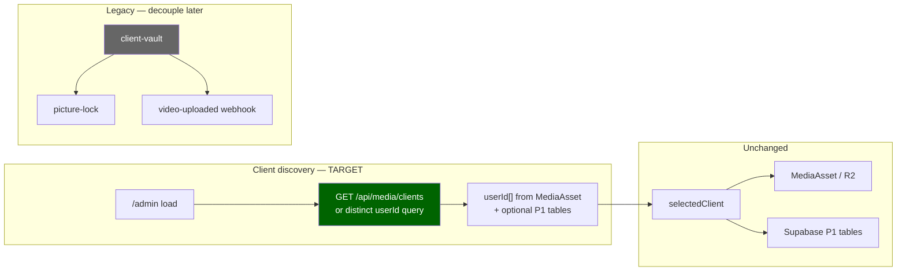

# Admin HQ Storage Architecture Review

**Created:** 2026-07-04  
**Type:** Inspection only — no code changes, no bucket creation, no implementation  
**Question:** Should Admin HQ still depend on Supabase Storage bucket `client-vault` for client discovery?  
**Current stack:** Cloudflare R2 (media) · Prisma `MediaAsset` (asset records) · Supabase (auth, legacy metadata tables, realtime)

**Related:** `admin-dashboard-qa-issue-map.md`, `admin-hq-recovery-phase1.md`, `admin-storage-architecture-review.md` (this file)

---

## Executive recommendation

| Question | Answer |
|----------|--------|
| Should Admin HQ **still** depend on `client-vault` for client discovery? | **No** — not for the current R2 + Prisma architecture |
| Is `client-vault` legacy for Admin HQ? | **Yes** — for sidebar discovery; assets and playback already use R2/`MediaAsset` |
| Is ADM-002 a real blocker? | **Yes** for the *current code path* (storage `list()` fails or returns empty) |
| Is ADM-002 **only** masking ADM-003? | **Mostly yes** — creating the bucket fixes the API error but **does not** discover R2-only clients unless folders are manually seeded |
| Preferred direction | **Migrate Vault Directories to `MediaAsset` / Prisma discovery** (smallest code change in `fetchClientFolders`); keep `client-vault` only where legacy routes still need it (`picture-lock`, `video-uploaded` webhook) until those are migrated |

---

## 1. Current Admin HQ data flow



**Observation:** Admin HQ is **hybrid** — one legacy Supabase Storage call at load, then modern backend + Supabase **tables** (not storage) for everything else.

---

## 2. `app/admin/page.tsx` — panel-by-panel dependencies

| Panel | Trigger | Data source | Uses `client-vault`? | Uses `MediaAsset`/R2? | Uses Supabase tables? |
|-------|---------|-------------|----------------------|------------------------|------------------------|
| **Vault Directories** (sidebar) | Page load | `storage.from("client-vault").list()` | **Yes — only panel** | No | No |
| **Project Phase Control** | Client selected | `project_status` | No | No | Yes |
| **Billing & Finances** | Client selected | `client_invoices` | No | No | Yes |
| **Project Requirements** (brief) | Client selected | `project_status_details` | No | No | Yes |
| **Vault Assets** | Client selected | `fetchMediaAssets({ userId })` → backend | No | **Yes** | No |
| **Preview modal** | Asset click | `getMediaPlaybackUrl` / R2 CDN | No | **Yes** | No |
| **Client Review Notes** | Video preview | `video_comments` | No | No | Yes (P0) |

### Code references

**Only `client-vault` usage in admin page:**

```73:76:rendorax-frontend/app/admin/page.tsx
  const fetchClientFolders = async () => {
    const { data } = await supabase.storage.from("client-vault").list();
    if (data) setClients(data.filter((item) => !item.metadata));
  };
```

**Assets already on MediaAsset/R2:**

```84:87:rendorax-frontend/app/admin/page.tsx
    try {
      const assets = await fetchMediaAssets({ userId: clientId });
      setClientAssets(assets);
```

**Sidebar passes `client.name` as `userId` everywhere:**

```315:316:rendorax-frontend/app/admin/page.tsx
                  <button
                    onClick={() => fetchClientData(client.name)}
```

The contract is: **folder name = `auth.users.id` UUID** — not a storage-specific concept. Any discovery source that yields valid auth user UUIDs works.

---

## 3. Vault Directories sidebar — source analysis

### What the sidebar expects

| Field | Source today | Meaning |
|-------|--------------|---------|
| `client.name` | Storage folder name at bucket root | Treated as `userId` for all downstream calls |
| Display | `Client_{name.substring(0,8)}...` | Cosmetic truncation |
| Filter | `!item.metadata` | Supabase Storage convention: folders have `metadata: null` |

### What actually populates clients in production today

| Source | Populated by dashboard uploads? | Verified Phase 1 |
|--------|--------------------------------|------------------|
| `client-vault` folders | **No** — dashboard uses R2 presign + `POST /api/media/assets` | **0** buckets, **0** objects |
| `MediaAsset.userId` | **Yes** — set on `saveMediaAsset` | **6** assets, **1** distinct `userId` |

Dashboard (`app/dashboard/page.tsx`) has **zero** `storage.from` or `client-vault` references. Vault UI is backed by `fetchMediaAssets` / `useFileManager` → Prisma.

---

## 4. MediaAsset queries (backend)

Admin asset load uses existing admin-scoped API:

```288:299:rendorax-backend/src/routes/media.routes.ts
    const scopedUserId =
      isAdminUser(req) && requestedUserId?.trim()
        ? requestedUserId.trim()
        : authenticatedUserId;

    const assets = await prisma.mediaAsset.findMany({
      where: {
        ...(scopedUserId ? { userId: scopedUserId } : {}),
        ...
      },
```

| Capability | Exists today? | Admin uses it? |
|------------|---------------|----------------|
| List assets for client `userId` | Yes — `GET /api/media/assets?userId=` | Yes |
| List **distinct client userIds** (admin) | **No dedicated endpoint** | No — gap for sidebar migration |
| Admin role check on cross-user query | Yes — `isAdminUser(req)` | Yes |

**Migration implication:** Replacing storage discovery does **not** require new asset logic — only a **client list** source (new small backend route or client-side aggregation if admin can list all assets).

`MediaAsset.userId` is indexed (`@@index([userId])` in `schema.prisma`).

---

## 5. `client-vault` dependencies across the repo

| File | Purpose | Required for Admin HQ? |
|------|---------|------------------------|
| `app/admin/page.tsx` | Sidebar `list()` | **Only admin-specific dependency** |
| `app/api/picture-lock/route.ts` | Stream file from bucket for SHA-256 hash | **No** — dashboard feature, broken for R2 assets |
| `app/api/video-uploaded/route.ts` | Webhook on storage insert → AWS MediaConvert | **No** — legacy pipeline; R2 uploads don't fire this |
| `update_rls_policy.sql` | Storage RLS for bucket | Only if bucket kept |
| `rendorax-backend/update-policy.js` | Same | Legacy helper |

**Dashboard and admin asset playback:** R2 via `objectKey` / `publicUrl` in `utils/mediaAssets.ts` — **not** `client-vault`.

---

## 6. Is `client-vault` legacy architecture?

### Historical model (inferred)

1. Clients uploaded to **Supabase Storage** under `{userId}/...` in `client-vault`.
2. Admin listed root folders → each folder = client.
3. Assets, comments, and status keyed by `user_id` / `file_name`.

### Current model (verified in code)

1. Clients upload to **Cloudflare R2** via presigned URLs.
2. **`MediaAsset`** row created in Prisma with `userId`, `objectKey`, CDN `publicUrl`.
3. Dashboard lists assets from **`GET /api/media/assets`** — no storage bucket.
4. Admin **still lists clients from storage** — **unmigrated slice**.

| Layer | Legacy (`client-vault`) | Current (R2 + Prisma) |
|-------|-------------------------|------------------------|
| Media bytes | Supabase Storage | Cloudflare R2 |
| Asset index | Storage paths | `MediaAsset` |
| Dashboard vault | Was storage | `MediaAsset` + backend API |
| Admin sidebar | **Still storage** | Should be `MediaAsset` / `User` |
| Admin asset list | Already `MediaAsset` | ✓ |
| Picture lock hash | Still storage | **Mismatch** with R2 |

**Verdict:** `client-vault` for **Admin HQ client discovery** is **legacy**. It is a **partial migration** artifact, not a requirement of the R2 architecture.

---

## 7. ADM-002 vs ADM-003 — blocker analysis

| Issue | Definition | Phase 1 evidence |
|-------|------------|------------------|
| **ADM-002** | `client-vault` bucket missing / no policies | Bucket not in `storage.buckets`; API `Bucket not found` |
| **ADM-003** | Storage discovery vs R2 `MediaAsset` drift | 0 storage folders; 6 assets for `1a2f97b5-942e-44ee-9c32-7de0c1c8328d` |

### If operator only fixes ADM-002 (creates bucket)

| Outcome | Likely result |
|---------|---------------|
| `list()` API | Returns **200** instead of error |
| Sidebar with R2-only clients | **Still empty** unless someone creates `{userId}/` folder placeholders |
| Vault Assets | **Still unreachable** without manual folder seed |
| Phase / Billing / Brief | Still blocked until client selected |

### If operator seeds folder `1a2f97b5-...` in new bucket

| Outcome | Result |
|---------|--------|
| Sidebar | Shows one client |
| Assets | **6 assets load** via existing API |
| P1 panels | Work if tables applied |

That is an **ops workaround** for legacy discovery — not alignment with how uploads work today.

### Conclusion

| | ADM-002 | ADM-003 |
|---|---------|---------|
| Real blocker for current code? | **Yes** | **Yes** (functional) |
| Root cause of empty HQ? | **Symptom** (wrong discovery channel) | **Cause** (architecture drift) |
| Fixed by creating bucket alone? | Partially | **No** |
| Fixed by MediaAsset discovery? | **Bypasses ADM-002 for admin** | **Yes** |

**ADM-002 masks ADM-003** in runbooks that say “create bucket → admin works.” For R2-only studios, **ADM-003 is the substantive issue**; ADM-002 is the missing piece of a **deprecated** discovery path.

---

## 8. Which panels truly require `client-vault`?

| Panel | Requires bucket? | Why |
|-------|------------------|-----|
| Vault Directories | **Only with current code** | Sole `storage.list()` call |
| Project Phase | **No** | `project_status.user_id` |
| Billing | **No** | `client_invoices.user_id` |
| Brief | **No** | `project_status_details.user_id` |
| Vault Assets | **No** | Already `MediaAsset` + R2 |
| Preview / playback | **No** | R2 URLs from `MediaAsset` |
| Review notes | **No** | `video_comments` table |

**Zero admin panels read file bytes from `client-vault`.** Only the **sidebar discovery** step does.

---

## 9. Which panels can be sourced entirely from `MediaAsset`?

| Panel | From `MediaAsset` alone? | Notes |
|-------|--------------------------|-------|
| Vault Directories | **Partial** | `SELECT DISTINCT userId` — clients with assets only |
| Vault Assets | **Yes** | Already implemented |
| Preview / download / share | **Yes** | `objectKey`, `playbackUrl`, CDN helpers |
| Project Phase | **No** | Needs `project_status` (Supabase table) |
| Brief | **No** | Needs `project_status_details` |
| Billing | **No** | Needs `client_invoices` |
| Review notes | **No** | Needs `video_comments`; keyed by `file_name` from asset |

### Discovery source options (future — not implemented)

| Source | Pros | Cons |
|--------|------|------|
| **`DISTINCT MediaAsset.userId`** (admin API) | Matches real uploads; no bucket; aligns with dashboard | Misses clients with status/invoices but no assets yet |
| **Prisma `User`** | Human email labels; agency-ready | Empty until users hit agency API or seed |
| **`AgencyProject.clientId`** | Business “client” concept | UI not wired; may not list all vault users |
| **`auth.users` via service role** | Complete auth user list | Over-broad; needs admin-only API; no “has vault” filter |
| **Union: MediaAsset ∪ project_status ∪ client_invoices** | Best coverage for HQ | Slightly more query logic |
| **Keep `client-vault` folders** | No code change | Perpetuates legacy; empty under R2; double maintenance |

**Recommended discovery (when approved):** Admin API returning **distinct `userId` from `MediaAsset`**, union optional rows from `project_status` / `client_invoices` (same Supabase DB, different access path). Display label: email from `User` or truncated UUID (same as today).

---

## 10. Migration assessment — should Admin HQ move to MediaAsset/R2 discovery?

### Arguments for migration (recommended)

1. **Dashboard already on R2** — admin sidebar is the last HQ piece on storage.
2. **Phase 1 proof** — assets exist in Prisma without any storage folder.
3. **Creating `client-vault`** solves API errors but not R2 drift without manual folder seeding.
4. **Single source of truth** — `MediaAsset.userId` is what `fetchClientData` already uses after click.
5. **Smallest fix** — replace `fetchClientFolders` only; preserve page structure and panels.
6. **Bucket optional** — defer ADM-002 until `picture-lock` / webhook migrated.

### Arguments for keeping `client-vault` (not recommended for HQ)

1. **Zero code** — ops creates bucket + seeds folders (fragile).
2. **Legacy webhooks** — `video-uploaded` expects bucket events (unused in R2 flow).
3. **Picture lock** — still reads bucket (dashboard issue, not admin).

### What migration is **not**

- Not a redesign — same sidebar, same `selectedClient` UUID contract.
- Not moving P1 tables off Supabase — status/brief/invoices stay as legacy Supabase tables.
- Not removing `client-vault` globally — other routes may still reference it until separately fixed.

---

## 11. Proposed target architecture (documentation only)



---

## 12. Operator decision matrix

| Strategy | Fixes empty sidebar (R2 clients) | Code change | Ops work | Aligns with R2 |
|----------|-------------------------------|-------------|----------|----------------|
| **A. Create bucket only** | No | None | Create bucket + RLS | No |
| **B. Create bucket + seed folders** | Yes (manual) | None | Bucket + folder per UUID | Partial |
| **C. Migrate discovery to MediaAsset** | Yes | Small (`fetchClientFolders` + optional admin route) | None for sidebar | **Yes** |
| **D. C + union P1 user_ids** | Yes (incl. invoice-only clients) | Small | P1 SQL if not done | **Yes** |

**Inspection recommendation:** **C** or **D** — do **not** treat ADM-002 bucket creation as the long-term Admin HQ fix.

---

## 13. Risks of MediaAsset discovery (for future implementation planning)

| Risk | Severity | Mitigation |
|------|----------|------------|
| Client with invoices/status but no assets invisible | Medium | Union P1 `user_id` values |
| `MediaAsset.userId` null on old rows | Low | Filter `userId IS NOT NULL`; data cleanup |
| No email in sidebar (UUID only) | Low | Join `User` or `auth.users` in admin API |
| Admin lists only own assets if role missing | High | Same as today — requires `app_metadata.role` |
| New backend route surface | Low | Reuse `requireAuth` + `isAdminUser` pattern from `media.routes.ts` |

---

## 14. Files involved (reference)

| File | Role in storage architecture |
|------|------------------------------|
| `rendorax-frontend/app/admin/page.tsx` | **Only** `client-vault` consumer in admin |
| `rendorax-frontend/utils/mediaAssets.ts` | R2 URL resolution; `fetchMediaAssets` |
| `rendorax-frontend/utils/backendAuth.ts` | JWT for backend |
| `rendorax-backend/src/routes/media.routes.ts` | Admin-scoped `MediaAsset` queries |
| `rendorax-backend/prisma/schema.prisma` | `MediaAsset.userId`, `User` |
| `rendorax-frontend/app/dashboard/page.tsx` | R2 path — no storage bucket |
| `rendorax-frontend/app/api/picture-lock/route.ts` | Legacy storage read |
| `rendorax-frontend/app/api/video-uploaded/route.ts` | Legacy storage webhook |

---

## 15. Final answers

| Question | Answer |
|----------|--------|
| Should Admin HQ still depend on `client-vault` for client discovery? | **No** — inconsistent with R2 + `MediaAsset`; legacy |
| Which panels truly require `client-vault`? | **Only Vault Directories**, and only because of current `fetchClientFolders` implementation |
| Which panels can use `MediaAsset` entirely? | **Vault Assets + preview/playback** (already do); **sidebar discovery** (should) |
| Is `client-vault` legacy? | **Yes** for admin discovery and dashboard media; remnants in picture-lock/webhook |
| Is ADM-002 real or masking ADM-003? | **Both** — ADM-002 blocks the legacy path; **ADM-003 is the architectural root cause** for empty HQ under R2 |
| Migrate to MediaAsset/R2 discovery? | **Yes — recommended** when implementation is approved; smallest change, preserves admin structure |

---

*End of review. Inspection only — no code, bucket, or infrastructure was modified.*
