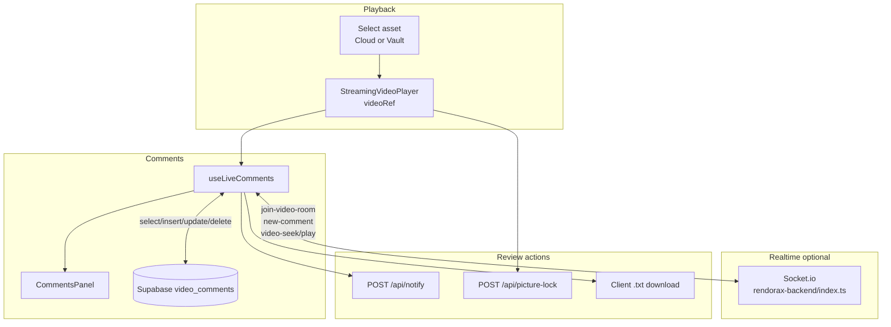

# Comment & Review Workflow Map

**Inspection date:** 2026-07-03  
**Status:** **Comment workflow P0 — Resolved — manually verified (local dev, 2026-07-03)** — production not verified  
**Scope:** Inspection + Supabase P0 tables (no application code changes)  
**Architecture preserved:** Supabase metadata (`video_comments`, `video_metadata`, `project_status`) + R2/CDN media delivery + Prisma `MediaAsset`

**Verification (local, 2026-07-03):** `video_comments` and `video_metadata` created via `supabase-p0-legacy-review-tables.sql`; PGRST205 resolved; comment create, persistence, timestamp jump, and scene thumbnails working.

**Related:** `r2-playback-review-map.md`, `r2-processing-gap-trace.md`, `comment-create-failure-trace.md`, `legacy-supabase-tables-migration-plan.md`, `dashboard-qa-issue-map.md`

---

## Executive summary

Review comments flow from **video playback** → **`useLiveComments` hook** → **direct Supabase client inserts** on table **`video_comments`** (no Next.js comment API route). Timestamps are **seconds** from `HTMLVideoElement.currentTime`. Reload is **on preview change** (no comment polling). Realtime is **partial Socket.io** (new comments + seek-from-comment only; play/pause scrub sync not wired from main controls).

**Cloud vs Vault:** For current R2 uploads, both bins usually key comments as **`MediaAsset.fileName`** (e.g. `clip.mp4`). Vault grid shows `{timestamp}_{fileName}` but preview strips the timestamp — so **Cloud and Vault typically match**. Comments can still **orphan** on rename, legacy naming, or picture-lock key mismatch.

**Resolve / Approve:** Not implemented at comment or asset level in the dashboard. **Lock** = picture lock (`video_metadata`). **Notify** = `POST /api/notify`. Admin **project_status** is a separate production pipeline dropdown, not per-asset approval.

---

## End-to-end flow



---

## 1. Comment creation flow

### UI component

| Layer | File | Role |
|-------|------|------|
| Form + list | `components/CommentsPanel.tsx` | Renders comments, timestamp buttons, edit/delete, “Post Comment”, “Notify Team” |
| Logic | `hooks/useLiveComments.ts` | CRUD, socket, notify helpers |
| Orchestration | `app/dashboard/page.tsx` | Wires hook → `CommentsPanel`; passes `previewFile`, `videoRef`, `playbackUrl` |
| Admin read-only | `app/admin/page.tsx` | Loads client comments inline (no `CommentsPanel`; custom list + `jumpToTime`) |

### Save path — **no REST API for comments**

Comments are written **directly from the browser** via Supabase JS client:

```165:175:rendorax-frontend/hooks/useLiveComments.ts
    const { data, error } = await supabase
      .from("video_comments")
      .insert([
        {
          file_name: previewFile.name,
          user_id: user.id,
          time_stamp: currentTime,
          comment_text: commentTextToSend,
        },
      ])
      .select();
```

- **Auth:** Supabase session cookie (anon key + logged-in user)
- **Not used:** Prisma backend, `/api/*` routes for comments

### Database table / model

| Store | Table | ORM |
|-------|-------|-----|
| **Comments** | `public.video_comments` (Supabase PostgreSQL) | **Not** in Prisma schema — legacy table listed in `prisma.config.ts` as external |
| **Lock metadata** | `public.video_metadata` | Legacy Supabase |
| **Project pipeline** | `public.project_status` | Legacy Supabase (admin only) |
| **Asset metadata** | `MediaAsset` (Prisma) | Separate — no comment FK |

**Inferred `video_comments` columns** (from code usage):

| Column | Usage |
|--------|--------|
| `id` | UUID primary key (edit/delete/socket dedupe) |
| `file_name` | Comment scope key = `previewFile.name` |
| `user_id` | Author (`auth.users` id) |
| `time_stamp` | Playback position in **seconds** (float) |
| `comment_text` | Note body |

> **P0 tables verified (local, 2026-07-03):** `video_comments`, `video_metadata` created in Supabase; comment CRUD and thumbnails working. P1 tables (`project_status`, etc.) — see `legacy-supabase-tables-migration-plan.md`.

### Creation sequence

1. User submits form → `handleAddComment` (`useLiveComments.ts`)
2. Guard: `newComment`, `previewFile`, `videoRef`, `user` must exist
3. Capture `currentTime` from `videoRef.current.currentTime`; pause video
4. Insert row into `video_comments`
5. Optimistic local `setComments` sort by `time_stamp`
6. `socket.emit("new-comment", { fileId: previewFile.name, ...insertedComment })`

---

## 2. Timestamp handling

### Capture

```162:163:rendorax-frontend/hooks/useLiveComments.ts
    const currentTime = videoRef.current.currentTime;
    videoRef.current.pause();
```

- Source: **same** `<video>` element as `StreamingVideoPlayer` (`videoRef` on dashboard)
- Unit: **seconds** (HTML5 media API — fractional)
- No frame-accurate rounding at insert (differs from SMPTE display which assumes 24fps elsewhere)

### Storage format

- DB column: `time_stamp` — numeric seconds (Postgres `float` / `double precision` assumed)
- Display in UI: `MM:SS` via `Math.floor(time_stamp / 60)` and zero-padded seconds

### Seek back to timestamp

**Dashboard / hook:**

```314:322:rendorax-frontend/hooks/useLiveComments.ts
  const jumpToTime = (time: number) => {
    if (videoRef.current) {
      videoRef.current.currentTime = time;
      videoRef.current.play();
      if (socket && previewFile?.name) {
        socket.emit("video-seek", { room: previewFile.name, currentTime: time });
        socket.emit("video-play", { room: previewFile.name, currentTime: time });
      }
    }
  };
```

**UI trigger:** `CommentsPanel` timestamp button → `jumpToTime(comment.time_stamp)`

**Admin:** `app/admin/page.tsx` — same pattern on `videoRef` (no socket emit)

### Scene thumbnails

`CommentSceneThumbnail` builds progressive URL `#t={seconds}` from `playbackUrl`. **HLS URLs return null** → placeholder icon (no frame grab during HLS-only playback).

### MP4 → HLS transition (post processing-gap fix)

Timestamps remain valid in **seconds** on the same timeline. Player **remount** on URL change may reset playhead; stored comments still seek correctly after reload.

---

## 3. Comment reload & persistence

### Load trigger

```38:45:rendorax-frontend/hooks/useLiveComments.ts
  useEffect(() => {
    if (!previewFile?.name || !previewFile?.isVideo) {
      setComments([]);
      return;
    }

    void fetchComments(previewFile.name);
  }, [previewFile?.name, previewFile?.isVideo, fetchComments]);
```

### Fetch query

```25:35:rendorax-frontend/hooks/useLiveComments.ts
  const fetchComments = useCallback(
    async (fileName: string) => {
      const { data } = await supabase
        .from("video_comments")
        .select("*")
        .eq("file_name", fileName)
        .order("time_stamp", { ascending: true });
      if (data) setComments(data);
      else setComments([]);
    },
    [supabase],
  );
```

- **No** `user_id` filter on dashboard (all rows for `file_name`)
- **Admin** adds `.eq("user_id", selectedClient)` when viewing a client asset

### API routes used

| Operation | Route | Used? |
|-----------|-------|-------|
| Comment CRUD | — | **Supabase direct only** |
| Notify team | `POST /api/notify` | Yes |
| Picture lock | `POST /api/picture-lock` | Yes (lock workflow) |
| Media assets | Backend `GET /api/media/assets` | Playback only |

### State management

| State | Location | Purpose |
|-------|----------|---------|
| `comments` | `useLiveComments` `useState` | Active thread for current preview |
| `newComment` | same hook | Draft text |
| `previewFile` | `useDashboardStore` / `page.tsx` | Drives `file_name` key + video context |
| `videoRef` | `page.tsx` `useRef` | Timestamp source + seek target |
| Admin `clientComments` | `admin/page.tsx` local state | Separate from dashboard hook |

### Persistence across refresh

- **Yes** — comments live in Supabase; full page reload + re-select asset re-fetches by `file_name`
- **No** automatic refetch while staying on same preview (except socket `comment-added` for inserts from other clients)

---

## 4. Cloud vs Vault consistency

### How `previewFile.name` is set

| Bin | Handler | `previewFile.name` | Example |
|-----|---------|-------------------|---------|
| **Cloud** | `handleCloudAssetPreview` | `asset.fileName` | `Pakorawala.mp4` |
| **Vault** | `handlePreview` | `displayName` = strip first `_` segment from vault grid name | `Pakorawala.mp4` |
| **Admin** | `handlePreview` | `asset.fileName` | `Pakorawala.mp4` |

Vault grid name is synthesized in `useFileManager.mapMediaAssetToVaultFile`:

```51:57:rendorax-frontend/hooks/useFileManager.ts
  return {
    id: asset.id,
    name: `${timestamp}_${asset.fileName}`,
```

`MediaAsset.fileName` at save is the **original upload name** (`file.name`) — no timestamp in DB field.

### Previous finding — verified

| Claim | Verdict |
|-------|---------|
| Cloud uses `asset.fileName` | **Confirmed** |
| Vault uses stripped display name | **Confirmed** (`substring(indexOf("_") + 1)`) |
| Same asset → same comment key | **Usually yes** — both resolve to `asset.fileName` when vault prefix is upload timestamp |

### When comments can disappear or mismatch

| Scenario | Risk | Effect |
|----------|------|--------|
| Switch Cloud ↔ Vault on **same** R2 asset | **Low** | Same `file_name` if `asset.fileName` unchanged |
| **Rename** asset (`updateMediaAsset` fileName) | **High** | Old `video_comments.file_name` orphaned |
| **Re-upload** same display name as new asset | **Medium** | Comments attach to name string, not `assetId` — may show on wrong revision |
| Legacy Supabase Storage names vs R2 `fileName` | **Medium** | Historical comments under different keys |
| **Picture lock** lookup vs lock write | **High** | Vault lock **read** uses full vault name (`1730…_clip.mp4`); lock **write** uses `previewFile.name` (`clip.mp4`) — see §6 |
| Admin vs dashboard fetch | **Medium** | Admin filters `user_id`; dashboard does not — depends on RLS |
| Filename contains `_` in actual title | **Low** | Vault strip removes only first segment; could differ from `asset.fileName` if naming ever diverges |

### Socket room name

`previewFile?.name || currentFolder || "global-lobby"` — same key as comment `file_name` when a video is selected.

---

## 5. Comment editing & deleting

### Support

| Action | Implemented | UX |
|--------|-------------|-----|
| **Create** | Yes | Form submit |
| **Edit** | Yes | Browser `prompt()` → Supabase `update` on `comment_text` |
| **Delete** | Yes | `confirmDelete("comment")` → type `Delete` → Supabase `delete` by `id` |

### Permission model

| Check | Present? |
|-------|----------|
| Author-only edit/delete | **No** — any logged-in user with Supabase access can edit/delete **any** comment by `id` |
| Role gate in UI | **No** |
| Server-side authorization | **No** dedicated API — relies on **Supabase RLS** (policies not in repo) |

### Realtime on edit/delete

- **No** socket broadcast — other clients keep stale list until refresh or re-select asset

---

## 6. Review workflow features

### Feature matrix

| Feature | Status | Implementation |
|---------|--------|----------------|
| **Comment** | ✅ Implemented | `useLiveComments` + `CommentsPanel` |
| **Resolve** (per comment / per asset) | ❌ Not found | No `resolved` column or UI |
| **Approve** (asset sign-off) | ❌ Not in dashboard | No approve button or status on `MediaAsset` |
| **Lock** | ⚠️ Partial | Picture lock — see below |
| **Notify Team** | ✅ Verified (local, 2026-07-03) | `handleNotifyTeam` → `POST /api/notify` — Discord + email |
| **Compile & Send** | ✅ **Resolved — manually verified (local, 2026-07-03)** | `handleCompileAndSend` → `POST /api/notify` with `compiledNotes`; email **Feedback Notes** + Discord **📝 Compiled Notes**; format `[M:SS] Author: text`; HTML escape verified — `compiled-notes-notify-trace.md` |
| **Download Report** | ✅ Client-only | `.txt` blob, no server |
| **Project status** | ✅ Admin only | `project_status` dropdown — production pipeline, not review approval |

### Notify Team

```224:238:rendorax-frontend/hooks/useLiveComments.ts
  const handleNotifyTeam = async () => {
    ...
      const cleanFileName = previewFile.name.substring(
        previewFile.name.indexOf("_") + 1,
      );
      const res = await fetch("/api/notify", {
        method: "POST",
        ...
        body: JSON.stringify({
          fileName: cleanFileName,
          totalComments: comments.length,
          userEmail: user.email,
        }),
```

`POST /api/notify` (`app/api/notify/route.ts`):

- Requires authenticated Supabase user
- Sends Discord embed + Resend email to `CONTACT_EMAIL`
- Body: `fileName`, `totalComments` required; `compiledNotes` optional (max 100k chars)
- **Notify Team:** summary only (no `compiledNotes`)
- **Compile & Send:** includes escaped notes in email `<pre>` + Discord field (truncated at 1000 chars)

### Compile & Send

`handleCompileAndSend` builds `compiledNotes` via `formatCompiledNoteLine()` — `[M:SS] Author: comment text` per line — and POSTs to `/api/notify` with `compiledNotes` set.

### Picture lock

| Step | Detail |
|------|--------|
| UI | Dashboard toolbar when `flags.enable_picture_lock` (vault path sets lock state on preview) |
| API | `POST /api/picture-lock` — auth required |
| Hash | SHA-256 over Supabase Storage stream + metadata |
| DB | `video_metadata` upsert: `file_name`, `is_locked`, `integrity_hash`, `locked_by`, `locked_at` |

**Gaps:**

1. **Storage source:** Route reads `client-vault` Supabase bucket — assets are on **R2** today → lock may **fail** for R2-only assets
2. **Key mismatch:** Vault preview loads lock with **full** vault name; `handlePictureLock` posts **`previewFile.name`** (stripped) → lock state may not show after apply
3. **Cloud preview:** `handleCloudAssetPreview` does **not** load `video_metadata` — lock UI state not initialized for Cloud bin
4. **No comment blocking:** `isLocked` does not disable `CommentsPanel` or insert

### Admin project status (not “approve video”)

`app/admin/page.tsx` — `project_status` values: Awaiting Assets → … → Ready for Review. This is **client project pipeline**, unrelated to `video_comments`.

---

## 7. Realtime behavior

### Socket.io (active server)

**File:** `rendorax-backend/index.ts` (attached to main HTTP server)

| Event | Direction | Purpose |
|-------|-----------|---------|
| `join-video-room` | Client → server | `socket.join(room)` where `room` = `previewFile.name` |
| `new-comment` | Client → server → others | `socket.to(fileId).emit("comment-added", data)` |
| `comment-added` | Server → client | Append comment if new `id` |
| `video-seek` / `video-play` | Client → server → others | Sync seek when jumping from comment timestamp |
| `video-pause` | Listener exists | **Never emitted** from dashboard play/pause controls |

**Connection URL:** `NEXT_PUBLIC_BACKEND_URL` (default `http://localhost:4000`)

### What is NOT realtime

| Behavior | Mechanism |
|----------|-----------|
| Comment list refresh | Fetch on preview change only |
| Edit/delete sync | None |
| Play/pause from transport controls | Local only — `handleTogglePlay` does **not** emit socket events |
| Comment polling | None |
| Supabase Realtime subscriptions | Not used |

### Orphaned alternate server

`rendorax-backend/websocket/server.ts` uses rooms `video_${fileId}` — **not imported** by `index.ts`. If ever run separately, room names would **not** match the frontend.

### UI indicator

`CommentsPanel` shows **Live Sync** (green) when socket connected — not when comments are synced.

### E2E

`e2e/websocket-sync.spec.ts` — play sync test exists but **`test.skip`** — not run in CI by default.

---

## 8. Risk analysis

### Data integrity

| Risk | Severity | Notes |
|------|----------|-------|
| Comments keyed by `file_name` string, not `assetId` | **High** | Rename/re-upload orphans or mis-associates feedback |
| No author check on edit/delete | **High** | Unless RLS enforces ownership |
| Dashboard fetch without `user_id` | **Medium** | Cross-client leakage if RLS weak |
| `video_comments` table missing in new Supabase | ~~**High**~~ **Resolved (local)** | P0 SQL applied 2026-07-03; PGRST205 fixed |
| Picture lock wrong storage/key | **High** | Lock workflow unreliable on R2 path |
| `compiledNotes` dropped by API | ~~**Medium**~~ **Resolved — manually verified (local, 2026-07-03)** | Optional `compiledNotes` in `reviewSchema`; email + Discord templates; see `compiled-notes-notify-trace.md` |

### UX

| Risk | Severity | Notes |
|------|----------|-------|
| Edit via `prompt()` | **Low** | Poor UX but functional |
| HLS comment thumbnails empty | **Medium** | Expected — `#t=` unsupported on `.m3u8` |
| “Live Sync” misleading | **Medium** | Connected ≠ play state synced |
| Locked badge without comment block | **Low** | Users can comment after lock |
| Non-video preview disables panel | **Low** | `playerControlsDisabled` — correct |

### Sync

| Risk | Severity | Notes |
|------|----------|-------|
| Play/pause not broadcast | **High** | Multi-user review desync except comment jumps |
| Edit/delete not broadcast | **Medium** | Stale threads |
| MP4 → HLS player remount | **Low** | Timestamps OK; playhead may reset |
| Socket down | **Low** | Comments still persist via Supabase; solo review works |

---

## 9. Recommended validation order

Execute in order — each step gates the next.

### P0 — Storage & auth foundation

1. Confirm `video_comments` (and `video_metadata`) tables exist in Supabase with expected columns
2. Confirm RLS policies: insert/select/update/delete for authenticated users; ideally author-scoped mutations
3. Log in to dashboard; open devtools → Network — verify Supabase REST calls succeed (not 401/404)

### P1 — Comment CRUD & persistence

4. Upload or select a **video** in Cloud bin; post a comment at ~0:10
5. Refresh page; re-open same asset — comment still listed
6. Click timestamp — player seeks to ~0:10
7. Edit comment text; delete a test comment — verify DB reflects changes

### P2 — Cloud vs Vault key consistency

8. Note `MediaAsset.fileName` in API response
9. Add comment in **Cloud**; switch to **Vault** (same asset) — comments should appear if keys match
10. Rename asset; re-open — confirm whether comments orphan (documents current behavior)

### P3 — Playback format interaction

11. With processing-gap fix: comment during **MP4** fallback; wait for **HLS** — seek comments still work
12. Confirm comment scene thumbnail shows for MP4; placeholder for HLS (expected)

### P4 — Notify & report

13. **Notify Team** — Discord/email received with correct file name and count
14. **Send** (compile) — verify whether compiled body arrives (expect **count only** today)
15. **Report** download — `.txt` contains timestamps and text

### P5 — Realtime (optional, needs backend WS)

16. Two browsers, same user/asset — User A posts comment; User B sees it without refresh (`comment-added`)
17. User A clicks comment timestamp; User B seek syncs
18. User A play/pause from transport — expect **no** sync (known gap)

### P6 — Lock & admin

19. Vault preview — picture lock apply/read (expect possible failures on R2-only assets)
20. Admin portal — open client asset; comments load with `user_id` filter
21. Admin `project_status` update — independent of comment thread

---

## Key files reference

| Area | Path |
|------|------|
| Comment hook | `rendorax-frontend/hooks/useLiveComments.ts` |
| Comment UI | `rendorax-frontend/components/CommentsPanel.tsx` |
| Scene thumbnail | `rendorax-frontend/components/CommentSceneThumbnail.tsx` |
| Dashboard wiring | `rendorax-frontend/app/dashboard/page.tsx` |
| Cloud preview | `handleCloudAssetPreview` in `page.tsx` |
| Vault preview | `handlePreview` in `page.tsx` |
| Vault naming | `rendorax-frontend/hooks/useFileManager.ts` (`mapMediaAssetToVaultFile`) |
| Notify API | `rendorax-frontend/app/api/notify/route.ts` |
| Picture lock API | `rendorax-frontend/app/api/picture-lock/route.ts` |
| Socket server | `rendorax-backend/index.ts` |
| Admin review read | `rendorax-frontend/app/admin/page.tsx` |
| Player | `rendorax-frontend/components/dashboard/StreamingVideoPlayer.tsx` |
| Playback URL | `rendorax-frontend/utils/mediaAssets.ts` (`getMediaPlaybackUrl`) |

---

## Approval gate

| Step | Status |
|------|--------|
| Inspection | ✅ Complete |
| P0 Supabase tables | ✅ **Created — manually verified (local, 2026-07-03)** |
| Comment create / persist / timestamps / thumbnails | ✅ **Manually verified (local, 2026-07-03)** |
| Review Session Complete / notify (`POST /api/notify`) | ✅ **Resolved — manually verified (local, 2026-07-03)** — Notify Team summary-only; Compile & Send includes `compiledNotes` in email/Discord |
| Production Supabase / Resend / Discord | ⏳ Not verified |
| P1 admin tables | ⏳ Not yet created (`project_status`, etc.) |
| Application code changes | ⏳ None for P0 resolution |

**No application code was modified for P0 table resolution.**
