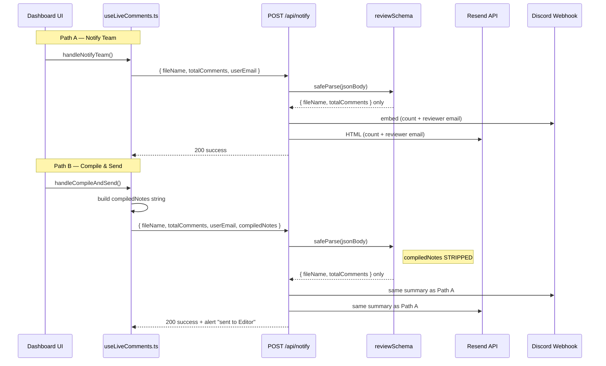

# compiledNotes / Notify Flow — Inspection Trace

**Created:** 2026-07-03  
**Updated:** 2026-07-03 (**Resolved — manually verified local**)  
**Type:** Inspection + implementation + verification record  
**Context:** **`compiledNotes` notify workflow verified locally (2026-07-03).** Compile & Send delivers timestamped author-labelled notes in email + Discord; Notify Team remains summary-only.

---

## Implementation status (2026-07-03)

| Item | Status |
|------|--------|
| `reviewSchema` accepts optional `compiledNotes` | **Resolved — manually verified (local, 2026-07-03)** |
| Email includes escaped notes block when present | **Resolved — manually verified (local, 2026-07-03)** |
| Discord includes notes field (truncated at 1000 chars) | **Resolved — manually verified (local, 2026-07-03)** |
| Notify Team (no `compiledNotes`) unchanged | **Resolved — manually verified (local, 2026-07-03)** |
| Frontend compile includes author display name | **Resolved — manually verified (local, 2026-07-03)** |
| HTML escaping in email | **Resolved — manually verified (local, 2026-07-03)** |
| Manual verify local | **Done (2026-07-03)** |
| Production verify | **Pending** |

**Files changed:** `rendorax-frontend/app/api/notify/route.ts`, `rendorax-frontend/hooks/useLiveComments.ts`

### Manual verification checklist (local, 2026-07-03)

- [x] Compile & Send sends `compiledNotes` in request body
- [x] Email contains **Feedback Notes** section
- [x] Email contains timestamps (`[M:SS]`)
- [x] Email contains reviewer/author names
- [x] Discord contains **📝 Compiled Notes** field
- [x] Notify Team sends summary-only (no notes block)
- [x] HTML escaping verified
- [x] `npm run build` passing

---

## Root cause (historical — fixed 2026-07-03)

The frontend **did** send `compiledNotes` on **Compile & Send**, but `/api/notify` previously defined a Zod `reviewSchema` with only `fileName` and `totalComments`. Zod **stripped** unknown keys during `safeParse`, and templates never referenced notes. **Fix:** optional `compiledNotes` in schema + email/Discord sections.

---

## End-to-end flow diagram



---

## 1. Frontend trigger

### Path A — Notify Team

| Item | Detail |
|------|--------|
| **Function** | `handleNotifyTeam` in `rendorax-frontend/hooks/useLiveComments.ts` |
| **UI** | `CommentsPanel.tsx` — button **Notify Team ({n} Notes)** in comments sidebar footer |
| **Wiring** | `dashboard/page.tsx` passes `handleNotifyTeam` into `CommentsPanel` |
| **Visibility** | Shown when `comments.length > 0 && !disabled` (any video preview with comments sidebar) |
| **Payload** | See below — **no `compiledNotes`** |

```232:247:rendorax-frontend/hooks/useLiveComments.ts
  const handleNotifyTeam = async () => {
    if (!previewFile || !user || comments.length === 0 || isNotifying) return;
    setIsNotifying(true);
    try {
      const cleanFileName = previewFile.name.substring(
        previewFile.name.indexOf("_") + 1,
      );
      const res = await fetch("/api/notify", {
        method: "POST",
        headers: { "Content-Type": "application/json" },
        body: JSON.stringify({
          fileName: cleanFileName,
          totalComments: comments.length,
          userEmail: user.email,
        }),
      });
```

### Path B — Compile & Send (“Review Session Complete”)

| Item | Detail |
|------|--------|
| **Function** | `handleCompileAndSend` in `rendorax-frontend/hooks/useLiveComments.ts` |
| **UI** | `dashboard/page.tsx` — toolbar button **Send** next to **Report** |
| **Visibility** | Only when `previewFile.isVideo && !previewFile.isCdn` (vault/local video toolbar, **not** CDN preview bar) |
| **Payload** | Includes `compiledNotes` — see below |

```259:284:rendorax-frontend/hooks/useLiveComments.ts
  const handleCompileAndSend = async () => {
    // ...
      const compiledNotes = comments
        .map(
          (c) =>
            `[${Math.floor(c.time_stamp / 60)}:${("0" + Math.floor(c.time_stamp % 60)).slice(-2)}] ${c.comment_text}`,
        )
        .join("\n");
      const res = await fetch("/api/notify", {
        method: "POST",
        headers: { "Content-Type": "application/json" },
        body: JSON.stringify({
          fileName: cleanFileName,
          totalComments: comments.length,
          userEmail: user.email,
          compiledNotes: compiledNotes,
        }),
      });
```

### Path C — Report (download only, not notify)

| Item | Detail |
|------|--------|
| **Function** | `handleDownloadReport` in `useLiveComments.ts` |
| **UI** | Toolbar **Report** button (same vault toolbar as Send) |
| **Output** | Client-side `.txt` blob — **does not** call `/api/notify` |

### What `compiledNotes` contains (Path B only)

| Field | Included? | Format |
|-------|-----------|--------|
| Timestamp | **Yes** | `M:SS` or `MM:SS` from `time_stamp` (seconds, `Math.floor`; sub-second discarded) |
| Comment text | **Yes** | Raw `comment_text` |
| Commenter name | **No** | `author_display_name` exists on row but **not** appended to compile string |
| File name | **No** (in notes body) | Sent separately as `fileName` (stripped vault prefix) |
| Scene/thumbnail | **No** | Thumbnails are UI-only (`CommentSceneThumbnail`); not serialized |

### What `compiledNotes` does **not** include

- Author name / avatar (available in DB/UI via `getCommentDisplayName(comment)`)
- Full storage key (`previewFile.name` with user prefix) — only `cleanFileName` in `fileName`
- Thumbnail URLs or frame grabs
- Comment `id` or `user_id`

### `fileName` normalization

Both handlers use:

```ts
previewFile.name.substring(previewFile.name.indexOf("_") + 1)
```

If `previewFile.name` has **no** `_`, `indexOf` returns `-1`, so `substring(0)` returns the **full** name (no strip). This is consistent for both paths.

### `userEmail` in request body

Sent by frontend but **not used** by API (see §6). Server reads email from Supabase session — correct anti-spoofing pattern.

### Comment sort order

`fetchComments` loads with `.order("time_stamp", { ascending: true })`. In-memory list after inserts is also sorted by `time_stamp`. `compiledNotes` follows `comments` array order → **chronological by timecode**.

---

## 2. API route

| Item | Detail |
|------|--------|
| **File** | `rendorax-frontend/app/api/notify/route.ts` |
| **Method** | `POST` only |
| **Auth** | Supabase `getUser()` via cookies — 401 if missing |
| **Branch detection** | `isReviewComplete = "totalComments" in jsonBody` — both notify paths take **review branch** |

### Request schema / validation

```14:18:rendorax-frontend/app/api/notify/route.ts
const reviewSchema = z.object({
  fileName: z.string().min(1, "File name is required"),
  totalComments: z.number(),
});
```

| Field | In schema? | After `safeParse`? |
|-------|------------|-------------------|
| `fileName` | Yes | Yes |
| `totalComments` | Yes | Yes |
| `compiledNotes` | **No** | **Stripped** |
| `userEmail` | **No** | **Stripped** |

### Zod behavior (why notes disappear)

- `reviewSchema` is a plain `z.object({ ... })` without `.strict()`.
- Default Zod object mode is **strip**: unknown keys are **removed**, parse **succeeds** (no 400).
- Destructuring uses only parsed output:

```75:76:rendorax-frontend/app/api/notify/route.ts
      const { fileName, totalComments } = parsedBody.data;
      const safeFileName = escapeHtml(fileName);
```

`compiledNotes` is never read from `jsonBody` or `parsedBody.data`.

### Upload branch (unrelated)

If body lacks `totalComments`, `uploadSchema` handles upload notifications (`folderName`, `fileCount`). Not used by review flows.

---

## 3. Email output

| Item | Detail |
|------|--------|
| **Service** | [Resend](https://resend.com) — `import { Resend } from "resend"` |
| **Env var** | `RESEND_API_KEY` (server-only, **not** in `.env.example` but documented in checklist) |
| **From** | `"Client Vault <onboarding@resend.dev>"` (hardcoded) |
| **To** | `[CONTACT_EMAIL]` from `utils/contactEmail.ts` → `kachnamedia@gmail.com` (hardcoded constant) |
| **Subject** | `🎬 Review Completed for ${safeFileName}` |
| **Trigger** | Review branch only; skipped silently if `RESEND_API_KEY` unset (`try/catch`, no error to client) |

### Current HTML body (review)

- Heading: “Review Session Complete”
- Asset file name
- Total comment **count**
- Client email (from **session**, not request body)
- CTA link to `https://www.rendorax.com/admin`
- **No** `compiledNotes` block

### Can compiled notes be added safely?

**Yes**, with existing `escapeHtml()` utility already in the same file. Recommend:

- Wrap notes in `<pre>` with escaped content, or split into `<ul><li>` per line
- Cap length server-side (e.g. truncate with “…N more in dashboard”) to avoid Resend/size issues
- Optional: attach `.txt` via Resend attachments API (not implemented today)

### Local vs production

| Environment | `RESEND_API_KEY` | Verified |
|-------------|------------------|----------|
| Local | Present in `rendorax-frontend/.env` | Checklist: notify verified 2026-07-03 (summary only) |
| Production | Must be set in Vercel/host env | **Not re-tested** in this inspection |

---

## 4. Discord output

| Item | Detail |
|------|--------|
| **Mechanism** | Direct `fetch(DISCORD_WEBHOOK_URL, { method: "POST", ... })` |
| **Env var** | `DISCORD_WEBHOOK_URL` (in `.env.example`) |
| **Target** | Single webhook URL from env — **not** per-client or per-project |
| **Skipped if** | Env unset — silent `try/catch`, API still returns 200 |

### Current message format

- `content`: `🔥 **Rendorax Vault: Review Session Completed!**`
- One embed:
  - `title`: Project file name
  - `description`: generic “finished reviewing” text
  - `fields`: Total comments (inline), Reviewed By email (inline)
  - `timestamp`: ISO send time (not per-comment timecodes)

### Discord limits (relevant if adding `compiledNotes`)

| Limit | Value | Risk |
|-------|-------|------|
| `content` | 2000 chars | Low if notes go in embed |
| Embed `description` | 4096 chars | **Medium** — long review sessions exceed |
| Embed field `value` | 1024 chars per field | **High** — need split fields or truncation |
| Total embed chars | 6000 | **Medium** |
| Embeds per message | 10 | Can split notes across fields |

**Formatting:** Use code block in field value (`\`\`\``) for monospace timecodes; escape backticks in user comment text.

### Path A vs Path B on Discord

**Identical output** — Discord cannot distinguish Notify Team vs Compile & Send.

---

## 5. Data structure

### Comment row shape (`VideoCommentRow`)

From `utils/commentAuthor.ts` + Supabase `video_comments`:

| Field | Type | In notify payload? | In `compiledNotes`? |
|-------|------|--------------------|---------------------|
| `id` | uuid | No | No |
| `file_name` | text | No (separate `fileName`) | No |
| `user_id` | uuid | No | No |
| `time_stamp` | number (seconds, float in DB) | No | **Yes** (formatted `M:SS`) |
| `comment_text` | text | No | **Yes** |
| `author_display_name` | text? | No | **No** |
| `author_avatar_url` | text? | No | No |
| `created_at` | timestamptz? | No | No |

### Author fields availability

- Set on insert via `resolveCommentAuthor(user)` in `handleAddComment`
- Displayed in `CommentsPanel` via `getCommentDisplayName(comment)`
- **Not** passed to notify compile logic today

### Timestamp semantics

- Stored as **seconds** (`double precision`), e.g. `83.47`
- Formatted as `1:23` (minutes not zero-padded; seconds zero-padded to 2 digits)
- Fractional seconds **truncated** by `Math.floor` on seconds component only

### Sorting

- DB fetch: ascending `time_stamp`
- Compile: maps `comments` in array order → sorted by timecode

---

## 6. Security / privacy

| Topic | Finding |
|-------|---------|
| **Recipient email** | Fixed `CONTACT_EMAIL` constant — not user-configurable, not derived from client |
| **Reviewer identity in email** | From Supabase session `user.email` — **not** spoofable via request body |
| **`userEmail` in JSON body** | Ignored by design (good) |
| **Discord webhook** | Single env URL — all review notifications go to same channel |
| **Client data in Discord/email** | Comment **text** would expose client feedback to studio inbox + Discord — intended for internal notify, but **no client-specific routing** |
| **XSS** | `escapeHtml()` used for `fileName` and session email; **`compiledNotes` would need same treatment** if added to HTML email |
| **Auth** | Unauthenticated requests get 401 — verified pattern |

### Leakage risks if notes are added without care

- Discord webhook URL in env → anyone with webhook can post; protect env secrets
- Long comments may include PII; same as dashboard visibility
- No per-client Discord channel — all clients’ notes land in one webhook

---

| Step | What happens (after fix) |
|------|----------------|
| 1 | User clicks **Send** → `handleCompileAndSend` builds multi-line `compiledNotes` |
| 2 | `fetch("/api/notify", { body: { ..., compiledNotes } })` |
| 3 | API detects review via `"totalComments" in jsonBody` |
| 4 | `reviewSchema.safeParse(jsonBody)` **includes** optional `compiledNotes` |
| 5 | `fileName`, `totalComments`, `compiledNotes` used in templates |
| 6 | Discord embed + Resend HTML include **Feedback Notes** when `compiledNotes` present |
| 7 | API returns `{ success: true }` → frontend success alert |

**Notify Team** still omits `compiledNotes` — summary-only by design.

---

## 8. Fix applied (2026-07-03)

See **Implementation status** at top. Before/after:

### Request payload (Compile & Send)

**Before:** `{ fileName, totalComments, userEmail, compiledNotes }` — `compiledNotes` stripped server-side.

**After:** Same payload; `compiledNotes` parsed as optional string (max 100k chars).

**Compile line format (after):** `[M:SS] Author: comment text` via `formatCompiledNoteLine()`.

### Email output

**Before:** File name, count, reviewer email only.

**After:** Same summary + `<pre>` block **Feedback Notes** when `compiledNotes` present (HTML-escaped).

### Discord output

**Before:** Embed fields: count + reviewer only.

**After:** Adds **📝 Compiled Notes** field when present; truncated at 1000 chars with HQ pointer.

### Notify Team (unchanged)

**Before/after:** `{ fileName, totalComments }` only — no notes block in email/Discord.

---

## 9. Minimal safe fix proposal (superseded — implemented)

### Scope assessment

**Implemented 2026-07-03** — schema + templates + optional author in compile string.

| Change needed | Status |
|---------------|--------|
| Extend `reviewSchema` with optional `compiledNotes` | Done |
| Read `compiledNotes` from `parsedBody.data` | Done |
| `escapeHtml(compiledNotes)` in email HTML | Done |
| Add Discord field with truncation | Done |
| Frontend compile include author name | Done |

### Test steps (local) — **verified 2026-07-03**

1. Start frontend + ensure `RESEND_API_KEY` and `DISCORD_WEBHOOK_URL` in `.env.local`.
2. Log in, open vault video, add 2+ comments at different timecodes.
3. **Path B:** Click **Send** → Network tab: confirm `compiledNotes` in request body. **Verified.**
4. Confirm email contains **Feedback Notes** with timecoded lines and author names. **Verified.**
5. Confirm Discord embed has **📝 Compiled Notes** field. **Verified.**
6. **Path A:** Click **Notify Team** → confirm summary only (no notes block). **Verified.**
7. Edge cases: HTML escaping in comment text. **Verified.**

---

## 10. Local vs production status

| Check | Local (2026-07-03) | Production |
|-------|-------------------|------------|
| Notify Team → 200 + Discord/email summary | **Resolved — manually verified** | Pending |
| Compile & Send → 200 + success alert | **Resolved — manually verified** | Pending |
| Email contains timestamped notes | **Resolved — manually verified** | Pending |
| Discord contains timestamped notes | **Resolved — manually verified** | Pending |
| `compiledNotes` in API parsed data | **Yes** | Pending deploy |

---

## Related files

| Role | Path |
|------|------|
| Notify handlers | `rendorax-frontend/hooks/useLiveComments.ts` |
| API route | `rendorax-frontend/app/api/notify/route.ts` |
| Notify Team UI | `rendorax-frontend/components/CommentsPanel.tsx` |
| Send / Report UI | `rendorax-frontend/app/dashboard/page.tsx` |
| Comment types | `rendorax-frontend/utils/commentAuthor.ts` |
| Inbox constant | `rendorax-frontend/utils/contactEmail.ts` |
| Prior map | `review-collaboration-layer-map.md` §5 |
| Workflow map | `comment-review-workflow-map.md` §6 |

---

*End of trace. **Resolved — manually verified (local, 2026-07-03).** Production verification pending.*
