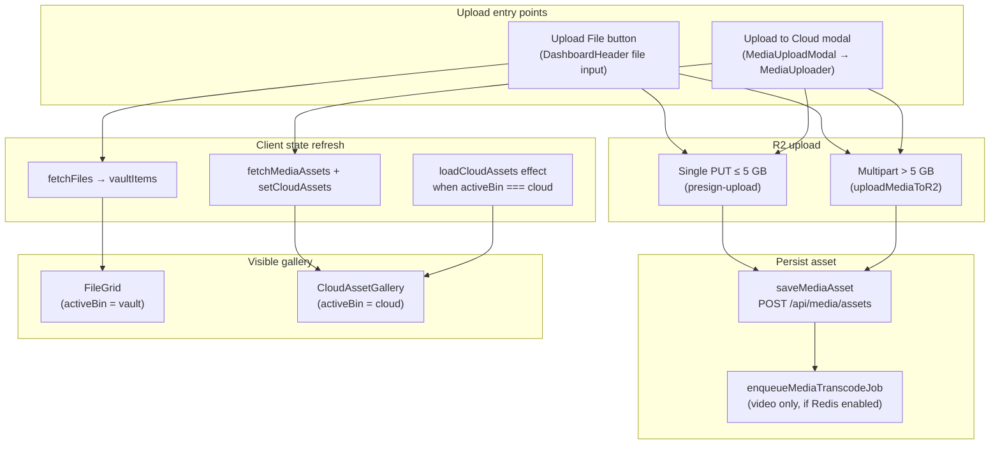

# Dashboard / Client Vault — QA Issue Map

**Inspection date:** 2026-07-03  
**Scope:** `rendorax-frontend` dashboard (`app/dashboard/page.tsx`) and related upload, asset list, CDN/R2, player, comments, and polling behavior.  
**Method:** Static code inspection only — no code changes, no runtime upload tests in this pass.

---

## Executive summary

The dashboard maintains **two parallel asset lists** for the same backend data (`MediaAsset` records via `GET /api/media/assets`):

| UI bin | Gallery component | React state | Refreshed by |
|--------|-------------------|-------------|--------------|
| **Cloud Delivery** | `CloudAssetGallery` | `cloudAssets` in `page.tsx` | `loadCloudAssets()`, `handleR2UploadSuccess()` |
| **Vault** | `FileGrid` | `vaultItems` / `vaultAssetsByName` via `useFileManager` | `fetchFiles()` in `useFileManager` |

Upload entry points refresh **only one** of these lists. That architecture directly explains the user-reported **missing auto-refresh** when the visible bin and upload path do not match.

**"FINALIZING..."** is intentional UI (`utils/mediaUploadStatus.ts`). Abnormal duration maps to the post-upload window where the client awaits `saveMediaAsset` (`POST /api/media/assets`), which is synchronous with DB insert and optional BullMQ transcode enqueue on the backend.

---

## Architecture (upload → list refresh)

---

## Recommended fix order

| Priority | Issue ID | Title | Rationale |
|----------|----------|-------|-----------|
| **P0** | QA-002 | Asset list does not refresh after upload | User-reported; blocks core workflow |
| **P0** | QA-001 | Abnormally long FINALIZING duration | User-reported; needs timing instrumentation before code changes |
| **P1** | QA-003 | Dual cloud/vault state divergence | Root cause of QA-002 and several secondary bugs |
| **P1** | QA-004 | Stale `loadCloudAssets` race (no abort) | Can overwrite fresh list after upload or folder change |
| **P2** | QA-005 | `processingStatus` null gap after save | Processing UI/polling may not start until worker runs |
| **P2** | QA-006 | Upload status bar only tracks vault upload path | Cloud modal uploads invisible in header status bar |
| **P2** | QA-007 | Processing poll only when assets already show active status | 8s poll does not help initial list insert |
| **P3** | QA-008 | Comment `file_name` inconsistency (vault vs cloud preview) | Cross-bin comment breakage |
| **P3** | QA-009 | Preview `isCdn` flag tied to `activeBin`, not storage | Misleading player/metadata behavior |
| **P3** | QA-010 | Video preview before transcode ready | Empty player / console errors |
| **P3** | QA-011 | Socket `connect_error` if backend URL wrong in prod | Live comments / sync degraded |
| **P4** | QA-012 | Vault CRUD does not refresh cloud list | Delete/rename from wrong bin shows stale sibling list |
| **P4** | QA-013 | Client Vault root blocks gallery | UX confusion after upload |
| **P4** | QA-014 | `/assets/logo.png` 404 in dev logs | Unrelated noise; low dashboard impact |

---

## User-reported issues (detailed)

### QA-001 — Abnormally long FINALIZING duration (~320 MB video)

| Field | Detail |
|-------|--------|
| **Observed behavior** | After R2 upload progress reaches 100%, UI shows **"FINALIZING..."** for an unusually long time on a ~320 MB file. The label itself is expected. |
| **Expected behavior** | FINALIZING should cover only the short window between bytes-on-R2 and successful `saveMediaAsset` response (typically seconds on a healthy backend). Total upload time for 320 MB is network-bound and shown as **"Uploading"** with a progress bar, not FINALIZING. |
| **Likely files / components** | `hooks/useFileManager.ts` (`reportUploadProgress`, `handleUpload` lines ~233–305), `components/MediaUploader.tsx` (`isFinalizing`, `reportProgress`, lines ~102–116), `utils/mediaUploadStatus.ts` (`resolveUploadDisplayStatus`, finalizing branch), `utils/mediaAssets.ts` (`saveMediaAsset`), `utils/r2Upload.ts` (`uploadFileWithProgress`, single PUT path for ≤ 5 GB), `rendorax-backend/src/routes/media.routes.ts` (POST `/assets`), `rendorax-backend/src/lib/mediaProcessing.ts`, `rendorax-backend/src/lib/mediaQueue.ts` |
| **Possible cause** | 1. **FINALIZING duration = `await saveMediaAsset(...)`** — not R2 upload. Backend POST creates Prisma row then `await enqueueMediaTranscodeJob`, which `await mediaTranscodeQueue.add(...)` when `MEDIA_QUEUE_ENABLED !== "false"`. If Redis is unreachable or slow, the HTTP request blocks and FINALIZING persists. 2. **Backend latency / cold start** — `backendFetch` to `NEXT_PUBLIC_BACKEND_URL` (default `localhost:4000` in dev; production URL must be set on Vercel). 3. **Auth header acquisition** — `getBackendAuthHeaders()` runs on every save; slow Supabase session refresh adds latency. 4. **User perception** — Very slow uplink makes total wall time long; only the post-100% segment should show FINALIZING. 5. **320 MB uses single PUT** (`SINGLE_PUT_MAX_BYTES` = 5 GB) — not multipart 99% cap; multipart stall is unlikely at this size. |
| **Risk level** | **Medium** — Workflow feels broken; may indicate Redis/backend misconfiguration in production. |
| **Suggested fix approach** | 1. Add client-side timing logs (upload end → save start → save end). 2. On backend, decouple enqueue from response (fire-and-forget with timeout, or set `processingStatus: "queued"` on asset at create time). 3. Verify `REDIS_URL`, `MEDIA_QUEUE_ENABLED`, and media worker are healthy in deployment. 4. Optionally split UI copy: "Saving to catalog..." vs "Processing video..." after save returns. **Do not remove FINALIZING state.** |
| **Could fixing break another area?** | Async enqueue changes error surfacing (asset saved but job not queued). Needs monitoring/alerting. UI copy changes are low risk if design tokens preserved. |
| **Recommended fix order** | **P0** (investigate/measure first, then fix backend blocking) |

---

### QA-002 — New upload not visible in asset list until manual page refresh

| Field | Detail |
|-------|--------|
| **Observed behavior** | After a successful video upload, the new file does not appear in the dashboard asset list until the user manually refreshes the page. |
| **Expected behavior** | The active gallery (Cloud or Vault) should include the new asset immediately after upload completes, without full page reload. |
| **Likely files / components** | `app/dashboard/page.tsx` (`handleR2UploadSuccess` ~879–905, `loadCloudAssets` ~938–961, `activeBin`, `monitoredAssets`), `hooks/useFileManager.ts` (`handleUpload` ~253–335, `fetchFiles` ~101–143), `components/DashboardHeader.tsx` (two upload buttons), `components/modals/MediaUploadModal.tsx`, `components/MediaUploader.tsx`, `components/dashboard/CloudAssetGallery.tsx`, `components/FileGrid.tsx` |
| **Possible cause** | 1. **Primary — split refresh paths:** `handleUpload` (Upload File) calls `fetchFiles` → updates **vault only**. `handleR2UploadSuccess` (Upload to Cloud) calls `setCloudAssets` → updates **cloud only**. If the user uploads via **Upload File** while **Cloud Delivery** is selected, `cloudAssets` stays stale until refresh. Reverse case: cloud modal upload while on Vault updates cloud and switches bin to cloud — usually works. 2. **Race — parallel fetches:** `handleR2UploadSuccess` calls `setActiveBin("cloud")` then `fetchMediaAssets`. The `useEffect` on `activeBin` also calls `loadCloudAssets()`. Two in-flight GETs with no request cancellation; a slower stale response could theoretically overwrite a newer list (see QA-004). 3. **No optimistic insert:** Neither path prepends `savedAsset` to the list; both depend on a full refetch succeeding. 4. **Folder scope:** `buildMediaAssetFetchParams(currentFolder, userId)` — asset saved and fetched with same folder; mismatch only if `currentFolder` changes mid-upload. 5. **Client Vault root:** `activeBin === "root"` shows empty placeholder — no list at all until user picks Cloud/Vault folder. |
| **Risk level** | **High** — Core vault workflow; erodes trust in upload success. |
| **Suggested fix approach** | 1. Introduce a single `refreshAssetsForCurrentContext()` that updates **both** `cloudAssets` and `vaultItems` (or one shared source of truth). 2. Call it from both upload handlers. 3. Optimistically prepend `savedAsset` to the active bin’s list, then reconcile on fetch. 4. Add abort/`requestId` to `loadCloudAssets` to prevent stale overwrites. Preserve existing UI components; only fix data flow. |
| **Could fixing break another area?** | Low if both lists stay in sync with the same API. Unified state refactor touches many handlers (rename/delete/poll) — regression-test CRUD on both bins. |
| **Recommended fix order** | **P0** |

---

## Systematic findings (additional workflow issues)

### QA-003 — Dual cloud/vault state for identical backend data

| Field | Detail |
|-------|--------|
| **Observed behavior** | Cloud and Vault galleries show the same `MediaAsset` rows from `GET /api/media/assets?folder=...` but maintain separate React state (`cloudAssets` vs `vaultItems`). |
| **Expected behavior** | One logical asset catalog per folder; any mutation should update whichever view is visible. |
| **Likely files** | `app/dashboard/page.tsx`, `hooks/useFileManager.ts`, `utils/mediaAssets.ts` |
| **Possible cause** | Historical split between "Cloud Delivery" branding and "Vault" FileGrid; both now backed by Prisma + R2, not separate storage. |
| **Risk level** | **High** (architectural) |
| **Suggested fix approach** | Lift asset list into shared hook/store, or always refresh both lists on any mutation. |
| **Breakage risk** | Medium — many call sites; test bin switching, search, bulk actions. |
| **Fix order** | **P1** |

---

### QA-004 — Stale `loadCloudAssets` fetch can overwrite newer data

| Field | Detail |
|-------|--------|
| **Observed behavior** | Rapid folder changes or upload during an in-flight load can leave the gallery showing an older folder’s assets or omit a just-uploaded file. |
| **Expected behavior** | Only the latest requested fetch should apply `setCloudAssets`. |
| **Likely files** | `app/dashboard/page.tsx` (`loadCloudAssets` ~938–955) |
| **Possible cause** | No `AbortController`, no monotonic request id; last response wins regardless of intent. |
| **Risk level** | **Medium** |
| **Suggested fix approach** | Track `loadGeneration` ref; ignore stale responses. Same pattern for `fetchFiles` if needed. |
| **Breakage risk** | Low |
| **Fix order** | **P1** |

---

### QA-005 — `processingStatus` not set at asset creation

| Field | Detail |
|-------|--------|
| **Observed behavior** | New video assets may list with `processingStatus: null` until the transcode worker starts and sets `probing`. Processing badges and 8s polling may not activate immediately after upload. |
| **Expected behavior** | Video assets should show `queued` (or equivalent) as soon as save returns, especially when a `processingJob` is created. |
| **Likely files** | `rendorax-backend/src/routes/media.routes.ts` (POST create), `rendorax-backend/src/lib/runMediaTranscodeJob.ts`, `hooks/useMediaProcessingPoll.ts`, `utils/mediaUploadStatus.ts` |
| **Possible cause** | POST creates `MediaProcessingJob` but does not set `asset.processingStatus` until worker runs. `shouldPollAssetsForProcessing` returns false for `null` status. |
| **Risk level** | **Medium** |
| **Suggested fix approach** | Set `processingStatus: "queued"` on asset create when video job enqueued; include status in POST 201 body (partially done via `processingJob` but not on asset row). |
| **Breakage risk** | Low |
| **Fix order** | **P2** |

---

### QA-006 — Header upload status bar only reflects vault upload path

| Field | Detail |
|-------|--------|
| **Observed behavior** | `UploadStatusBar` renders from `uploadSession` in `useFileManager`, updated only by `handleUpload` (Upload File). Cloud modal uploads show progress inside the modal only. |
| **Expected behavior** | Consistent upload feedback for both entry points (or documented intentional difference). |
| **Likely files** | `components/DashboardHeader.tsx`, `hooks/useFileManager.ts`, `components/MediaUploader.tsx` |
| **Possible cause** | Modal path bypasses `uploadSession` state. |
| **Risk level** | **Low–Medium** |
| **Suggested fix approach** | Bridge modal progress into shared upload session, or document that Cloud uploads use in-modal UI only. |
| **Breakage risk** | Low |
| **Fix order** | **P2** |

---

### QA-007 — Processing poll does not drive initial list appearance

| Field | Detail |
|-------|--------|
| **Observed behavior** | `useMediaProcessingPoll` refreshes every 8s only when listed assets already have active `processingStatus` (`queued` \| `probing` \| `transcoding` \| `uploading`). |
| **Expected behavior** | Polling is for status updates, not list insertion; list insert must happen in upload success handler (QA-002). |
| **Likely files** | `hooks/useMediaProcessingPoll.ts`, `app/dashboard/page.tsx` (`refreshMonitoredAssets` ~968–981) |
| **Possible cause** | By design; poll gated on `shouldPollAssetsForProcessing`. |
| **Risk level** | **Low** (dependency of QA-002) |
| **Suggested fix approach** | Fix upload refresh first; keep poll for processing transitions only. |
| **Breakage risk** | Low |
| **Fix order** | **P2** |

---

### QA-008 — Comment `file_name` key differs by preview path

| Field | Detail |
|-------|--------|
| **Observed behavior** | Vault preview uses `displayName` (stripped timestamp prefix). Cloud preview uses `asset.fileName`. Comments in Supabase `video_comments` are keyed by `previewFile.name` — switching bins or re-uploading with different naming can orphan comments. |
| **Expected behavior** | Stable comment key per asset (prefer `assetId` or canonical vault name). |
| **Likely files** | `hooks/useLiveComments.ts` (`fetchComments`, `handleAddComment`, socket room `previewFile?.name`), `app/dashboard/page.tsx` (`handlePreview`, `handleCloudAssetPreview`) |
| **Possible cause** | Legacy Supabase comment schema uses `file_name` string; cloud path never adds timestamp prefix. |
| **Risk level** | **Medium** |
| **Suggested fix approach** | Migrate comments to `asset_id` or always use vault-style `timestamp_filename` key. |
| **Breakage risk** | Medium — data migration |
| **Fix order** | **P3** |

---

### QA-009 — `isCdn` on preview tied to active bin, not asset origin

| Field | Detail |
|-------|--------|
| **Observed behavior** | `handlePreview` sets `isCdn: activeBin === "cloud"` even though vault assets are also served from R2 CDN URLs via `getMediaPlaybackUrl`. |
| **Expected behavior** | `isCdn` should reflect delivery mechanism or be deprecated for consistent player behavior. |
| **Likely files** | `app/dashboard/page.tsx` (`handlePreview` ~754–785, `handleCloudAssetPreview` ~907–936) |
| **Possible cause** | Leftover semantic from when vault used Supabase storage. |
| **Risk level** | **Low** |
| **Suggested fix approach** | Set `isCdn: true` for all R2-backed assets, or remove flag if unused. |
| **Breakage risk** | Low — verify player and compare mode |
| **Fix order** | **P3** |

---

### QA-010 — Video preview when processing not ready

| Field | Detail |
|-------|--------|
| **Observed behavior** | `handleCloudAssetPreview` allows preview when `isMediaAssetProcessing(asset)` even if `getMediaPlaybackUrl` returns empty; may log `"Cloud asset is missing a playback URL"`. |
| **Expected behavior** | Show processing placeholder/thumbnail until HLS/proxy ready; play mezzanine only if policy allows. |
| **Likely files** | `utils/mediaAssets.ts` (`getMediaPlaybackUrl`), `app/dashboard/page.tsx`, `components/dashboard/CloudAssetGallery.tsx` |
| **Possible cause** | Pipeline prefers HLS when `processingStatus` metadata exists; before `ready`, playback URL may be empty. |
| **Risk level** | **Medium** |
| **Suggested fix approach** | Fallback to mezzanine `publicUrl` during processing, or block play with clear processing UI. |
| **Breakage risk** | Low–medium — large mezzanine playback performance |
| **Fix order** | **P3** |

---

### QA-011 — Socket.io connection failures (live comments / sync)

| Field | Detail |
|-------|--------|
| **Observed behavior** | `useLiveComments` logs warning on `connect_error` if `NEXT_PUBLIC_BACKEND_URL` is wrong or backend down. `isLive` stays false; realtime comment sync and video transport events do not work. |
| **Expected behavior** | Socket connects in environments where live collaboration is required. |
| **Likely files** | `hooks/useLiveComments.ts`, `rendorax-backend/websocket/server.ts` (if mounted), env `NEXT_PUBLIC_BACKEND_URL` |
| **Possible cause** | Backend not deployed, CORS, or WebSocket blocked; REST comment fetch still works via Supabase. |
| **Risk level** | **Medium** in production collaboration scenarios |
| **Suggested fix approach** | Verify production backend URL and socket path; surface non-blocking connection indicator in UI (already partial via `isLive`). |
| **Breakage risk** | Low |
| **Fix order** | **P3** |

---

### QA-012 — Vault file delete/rename does not refresh cloud list

| Field | Detail |
|-------|--------|
| **Observed behavior** | `handleDeleteFile` / `handleRenameFile` call `fetchFiles` only. Cloud bin can still show deleted/renamed assets until manual refresh or `loadCloudAssets`. |
| **Expected behavior** | Both lists stay consistent after CRUD. |
| **Likely files** | `hooks/useFileManager.ts`, `app/dashboard/page.tsx` (cloud modals call `loadCloudAssets` but vault path does not) |
| **Possible cause** | Same dual-state issue as QA-003. |
| **Risk level** | **Medium** |
| **Suggested fix approach** | Unified refresh after any CRUD. |
| **Breakage risk** | Low |
| **Fix order** | **P4** |

---

### QA-013 — Client Vault root hides all assets

| Field | Detail |
|-------|--------|
| **Observed behavior** | When `activeBin === "root"`, main panel shows "Select a folder from the sidebar" — no asset list. Upload may succeed but nothing is visible until user navigates into Cloud/Vault folder. |
| **Expected behavior** | Either block upload at root with message, or auto-navigate to target bin/folder after upload. |
| **Likely files** | `app/dashboard/page.tsx` (`isClientVaultRootSelected` ~1013, ~1172–1181), `store/useDashboardStore.ts` (`activeBin` default `"root"`) |
| **Possible cause** | Intentional wayfinding UX. |
| **Risk level** | **Low–Medium** (confusion) |
| **Suggested fix approach** | After upload from root, call `setActiveBin("cloud")` and set folder; or disable upload buttons at root. |
| **Breakage risk** | Low |
| **Fix order** | **P4** |

---

### QA-014 — Missing `/assets/logo.png` (dev console noise)

| Field | Detail |
|-------|--------|
| **Observed behavior** | Next dev server logs repeated 404 for `/assets/logo.png` (dashboard uses `/assets/logo.svg`). |
| **Expected behavior** | No invalid image requests. |
| **Likely files** | Unknown reference (possibly metadata or another page); `components/DashboardHeader.tsx` uses `logo.svg`. |
| **Possible cause** | Stale reference elsewhere. |
| **Risk level** | **Low** |
| **Suggested fix approach** | Grep for `logo.png` and fix reference. |
| **Breakage risk** | None |
| **Fix order** | **P4** |

---

## Upload path reference (for QA reproduction)

| User action | Handler | R2 strategy (320 MB) | List refresh | Status UI |
|-------------|---------|----------------------|--------------|-----------|
| **Upload File** (gold button) | `useFileManager.handleUpload` | Single PUT via `requestPresignedUploadForKey` | `fetchFiles` → vault only | `UploadStatusBar` + FINALIZING |
| **Upload to Cloud** (modal) | `handleR2UploadSuccess` | Single PUT via `uploadMediaToR2` → `requestPresignedUpload` | `setCloudAssets` + `setActiveBin("cloud")` | In-modal progress + FINALIZING |

**Repro tip for QA-002:** Upload via **Upload File** while **Cloud Delivery** bin is selected — expect stale cloud list until page refresh.

---

## CDN / R2 / local vs cloud notes

- All dashboard assets inspected flow through **Prisma `MediaAsset`** + **R2** (`objectKey` under `uploads/...`). There is no separate “local only” database table for the vault FileGrid.
- Public URLs are normalized via `NEXT_PUBLIC_R2_PUBLIC_URL` (fallback `https://media.rendorax.com`) in `utils/mediaAssets.ts`.
- Video playback prefers HLS/proxy when `processingStatus === "ready"`; mezzanine URL used otherwise when allowed.
- No Next.js `/app/api/media/*` proxy — frontend calls backend directly via `backendFetch` (`utils/backendFetch.ts`).

---

## Polling / realtime summary

| Mechanism | Purpose | Interval / trigger | Asset list insert? |
|-----------|---------|-------------------|-------------------|
| `useMediaProcessingPoll` | Update processing badges / playback URLs | 8s when active processing statuses present | **No** |
| `useLiveComments` socket | Realtime comments, video play/pause/seek sync | On connect + room join | **No** |
| `useFileManager` `useEffect` | Load vault on `user` / `currentFolder` change | On dependency change | Yes for vault |
| `loadCloudAssets` `useEffect` | Load cloud when bin switches to cloud | On `activeBin === "cloud"` | Yes for cloud |

There is **no** socket event for “asset created” — list updates are entirely client-driven after upload handlers or polling.

---

## Console / network signals (from code and dev logs)

| Signal | Source | Implication |
|--------|--------|-------------|
| `[backendFetch] Network request failed` | `utils/backendFetch.ts` | `saveMediaAsset` / `fetchMediaAssets` failed — upload error or long FINALIZING |
| `[media] Transcode enqueue failed` | `media.routes.ts` | Asset saved but worker job missing |
| `[mediaProcessing] Queue disabled` | `mediaProcessing.ts` | Jobs recorded in DB only; no FFmpeg worker |
| `⚠️ [useLiveComments] Socket connection failed` | `useLiveComments.ts` | Live features degraded |
| `Cloud asset is missing a playback URL` | `page.tsx` | Preview before transcode ready |
| `GET /assets/logo.png 404` | dev terminal | Unrelated asset reference |
| BullMQ + missing Redis | `mediaQueue.ts` default `redis://localhost:6379` | POST `/assets` may hang on `queue.add` |

---

## Out of scope (this document)

- No code, UI, or design changes were made.
- No live upload benchmark was run; FINALIZING duration causes are inferred from code paths.
- Production env values (`NEXT_PUBLIC_BACKEND_URL`, `REDIS_URL`, worker deployment) need runtime verification per `rendorax-project-checklist.md` §14.

---

## Suggested verification checklist (post-fix)

1. Upload 320 MB video via **Upload File** on **Cloud** bin — asset appears without refresh.  
2. Same test via **Upload to Cloud** modal on **Vault** bin — asset appears after bin switch.  
3. Measure FINALIZING window (target: &lt; 3s on warm backend).  
4. Confirm `processingStatus` transitions `queued` → `ready` with poll updating badge.  
5. Delete/rename in one bin; other bin reflects change after navigation.  
6. Add comment on cloud asset; reload and confirm persistence.  
7. Socket `isLive` true when backend reachable.
