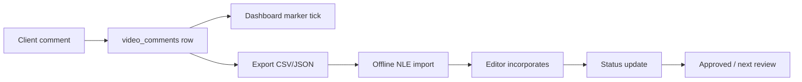

# Offline Editing Timeline Marker Export — Inspection & Implementation Plan

**Created:** 2026-07-03  
**Type:** Inspection + Phase 1 implementation  
**Context:** Dashboard timeline comment markers on `VideoTimelineScrubber`; offline NLE export Phase 1 shipped in vault toolbar.

**Goal:** Safe plan to export timestamped review comments as editing timeline markers for Adobe Premiere Pro, DaVinci Resolve, and generic CSV/JSON workflows.

**Status:** Resolved — manually verified (local, 2026-07-03)  
**Production:** Verification pending (§14)

---

## Executive summary

| Question | Answer |
|----------|--------|
| Can we export markers without DB changes? | **Yes (Phase 1)** — all required fields exist on `video_comments` + in-memory `comments` |
| Existing export today? | **Plain `.txt` only** (`handleDownloadReport`) — no CSV/JSON, no author, no SMPTE |
| Safest UI placement | **Vault preview toolbar** next to existing **Report** button (`!previewFile.isCdn`) |
| Premiere/Resolve native import | **Phase 2** — column mapping must be validated per NLE version; Phase 1 = generic CSV + JSON + import guide |
| FPS / timecode source | Dashboard hardcodes **24 fps** for SMPTE display; `MediaAsset.frameRate` exists in API but **not** wired to preview export today |

---

## 1. Current comment data

### Table: `video_comments` (Supabase)

From `supabase-p0-legacy-review-tables.sql` + `supabase-p1-comment-author-columns.sql`:

| Column | Type | Export use |
|--------|------|------------|
| `id` | uuid | Stable marker ID / dedupe |
| `file_name` | text | Tie-breaker; export metadata |
| `user_id` | uuid | Internal; optional in export (privacy) |
| `time_stamp` | double precision (seconds) | **Primary position** — `time_seconds` |
| `comment_text` | text | Marker note / description |
| `created_at` | timestamptz | Audit / sort tie-break |
| `author_display_name` | text (P1, nullable) | **Author** — via `getCommentDisplayName()` |
| `author_avatar_url` | text (P1, nullable) | Not needed for NLE export |

### In-app type

`VideoCommentRow` in `utils/commentAuthor.ts` — loaded by `useLiveComments.fetchComments` ordered by `time_stamp` ascending.

### Not in DB today

| Field | Needed for future workflow | Phase 1 |
|-------|---------------------------|---------|
| `status` (Open / In Progress / Done / Approved) | Yes | Omit or constant `"open"` in JSON only |
| `priority` | Optional | Omit |
| `assignee` (editor/colorist/audio/VFX) | Yes | Omit |
| `department` | Yes | Omit |
| `sequence_in` / `sequence_out` | Some NLE formats | Use point marker: `in === out` or out = in + 1 frame |
| `reel` / `tape` | Resolve-style | Derive from `file_name` string only |

---

## 2. Current review / report export

| Feature | Location | Format | Contents |
|---------|----------|--------|----------|
| **Report** | `handleDownloadReport` in `useLiveComments.ts` | Client `.txt` blob | Header + `- [M:SS] comment_text` per line |
| **Compile & Send** | `handleCompileAndSend` | Email/Discord via `/api/notify` | `[M:SS] Author: text` (not a file download) |
| **Notify Team** | `handleNotifyTeam` | API summary only | Count + file name |
| **Admin preview** | `app/admin/page.tsx` | No download | Jump-to-time only |

### Gaps vs offline editing

- No **CSV** or **JSON** download utilities in repo (grep: no `.csv` export helpers).
- Report uses **M:SS** (not SMPTE `HH:MM:SS:FF`).
- Report omits **author** and **comment id**.
- **CDN preview** (`previewFile.isCdn`) has no Report/Send toolbar (`page.tsx` gates `!previewFile.isCdn`).

### Reusable code for Phase 1

| Utility | Path | Use |
|---------|------|-----|
| `formatSMPTE(seconds, fps)` | `utils/timecode.ts` | NLE timecode column |
| `getCommentDisplayName(comment)` | `utils/commentAuthor.ts` | Author column |
| `formatCompiledNoteLine` pattern | `useLiveComments.ts` | Human-readable line format |
| Blob download pattern | `handleDownloadReport` | Same client-side download mechanism |

---

## 3. Timeline marker export formats

### Minimum data for offline editors

| Field | Source today | Notes |
|-------|--------------|-------|
| **time_seconds** | `time_stamp` | Authoritative in Rendorax |
| **timecode (SMPTE)** | Derive via `formatSMPTE(time_stamp, fps)` | **fps must be explicit in export metadata** |
| **comment** | `comment_text` | Marker body |
| **author** | `author_display_name` or `"Reviewer"` | |
| **file_name** | `file_name` / `previewFile.name` | |
| **created_at** | `created_at` | ISO string |
| **status** | — | **Future DB** |
| **priority** | — | **Future DB** |
| **assignee** | — | **Future DB** or agency `Task.assigneeId` linkage |

### What Phase 1 can support (no schema change)

- Generic **UTF-8 CSV** with header row
- Generic **JSON** document (versioned schema)
- Improved **TXT** (optional: extend Report or separate file in zip)
- Export metadata block: `fps`, `exported_at`, `asset_file_name`, `comment_count`, `rendorax_export_version`

### NLE-specific (Phase 2 — validate before claiming compatibility)

| Tool | Typical import path | Phase 1 stance |
|------|---------------------|----------------|
| **Adobe Premiere Pro** | Markers panel / import workflows vary by version; often CSV or `.csv` with Name, Comment, In, Duration | Ship **generic CSV** + documented column mapping; add `premiere_markers.csv` preset after manual NLE test |
| **DaVinci Resolve** | Timeline or clip markers via CSV in some versions (Reel, Timecode, Type, Notes) | Same — generic CSV first; `resolve_markers.csv` preset in Phase 2 |
| **Generic** | Any spreadsheet / script | **Primary Phase 1 deliverable** |

**Inspection note:** This repo does **not** contain Premiere/Resolve import templates or tested sample files. Do not label Phase 1 as “Premiere-compatible” until a manual import test passes.

---

## 4. Possible export options

### Option A — Generic CSV (recommended Phase 1)

**Columns (proposal):**

```csv
id,time_seconds,timecode_smpte,fps,author,comment,file_name,created_at
```

- Escape commas/quotes per RFC 4180.
- One row per comment; sorted by `time_stamp`.

### Option B — JSON review export (recommended Phase 1)

```json
{
  "export_version": "1.0",
  "exported_at": "2026-07-03T12:00:00.000Z",
  "asset": { "file_name": "...", "fps": 24 },
  "markers": [
    {
      "id": "uuid",
      "time_seconds": 32.5,
      "timecode_smpte": "00:00:32:12",
      "author": "Client Name",
      "comment": "Brighten shot",
      "created_at": "..."
    }
  ]
}
```

### Option C — Text report (exists; optional enhance)

Keep `Review_Report_*.txt`; optionally add author + SMPTE without breaking current users.

### Option D — Premiere-oriented CSV (Phase 2)

Example target columns (to be validated):

`Name, Description, In, Out, Duration`

- `In` = SMPTE at `time_stamp`
- `Name` = truncated comment or id
- `Description` = full comment + author

### Option E — Resolve-oriented CSV (Phase 2)

Example target columns (to be validated):

`Reel, Timecode, Type, Notes`

- `Reel` = sanitized `file_name`
- `Timecode` = SMPTE
- `Notes` = comment + author

### Option F — EDL / FCPXML markers

**Out of scope Phase 1** — high complexity; only if product requires automated sequence binding.

---

## 5. UI placement (no redesign)

### Current toolbar (vault video only)

```1450:1575:rendorax-frontend/app/dashboard/page.tsx
{previewFile.isVideo && !previewFile.isCdn && (
  ...
  <button onClick={handleDownloadReport}>Report</button>
  <button onClick={handleCompileAndSend}>Send</button>
)}
```

| Placement | Pros | Cons | Recommendation |
|-----------|------|------|----------------|
| **Next to Report** (same toolbar) | Same visibility rules; editor workflow; minimal layout change | Slightly more buttons | **Recommended Phase 1** |
| **CommentsPanel footer** | Near comment list | CDN users lack panel actions parity; clutters sidebar | Secondary |
| **Review Session Complete (Send)** | Tied to notify | Conflates team email with file export | **No** |
| **Dropdown under Report** | Single control | Requires small menu component | Phase 1.5 optional |

**Recommended control:** `Export Markers` button (or split button: CSV | JSON) adjacent to **Report**, same `!previewFile.isCdn && isVideo` gate.

**Phase 1.5:** Enable export for **CDN/R2** previews when comments exist (same `file_name` key) — may only need removing `!previewFile.isCdn` gate for export buttons.

---

## 6. Future workflow (roadmap)



| Stage | Today | Future |
|-------|-------|--------|
| Comment → Marker | Visual tick only | Export file |
| Assignee | None | Agency `Task` + role |
| Status | None | Column on comment or join table |
| Re-import / resolve | None | CSV round-trip or dashboard UI |
| Notify on export | None | Optional webhook |

Aligns with `review-collaboration-layer-map.md` §5–§6 and agency `Task` model.

---

## 7. Risks

| Risk | Severity | Mitigation |
|------|----------|------------|
| **FPS mismatch** (24 hardcoded vs 25/29.97/30 source) | **High** | Export `fps` in metadata; Phase 1.5 read `MediaAsset.frameRate` when `assetId` known; user-selectable fps in export dialog (Phase 2) |
| **Non-zero start timecode** (broadcast TC start) | **High** | Document that export is **player-relative 00:00:00:00**; Phase 2 add `sequence_start_offset` field |
| **HLS/proxy vs hero duration** | **Medium** | Export `time_seconds` as source of truth; note proxy drift in README |
| **Duplicate comments** | **Low** | Export all rows; include `id`; NLE may stack markers |
| **Client privacy** | **Medium** | Exports contain client notes — editor-only action; optional omit `user_id`; warn in UI |
| **NLE format rejection** | **Medium** | Phase 1 generic CSV; version-tested presets in Phase 2 |
| **Special characters in CSV** | **Low** | Proper escaping |
| **CDN path no export button** | **Medium** | Users on cloud bin cannot export today — extend gate when implementing |

---

## 8. Minimal safe Phase 1 proposal

### Scope

- **No** database, API, or backend changes.
- **Client-side only** — mirror `handleDownloadReport` pattern.
- **One new util** + **one handler** + **one toolbar button**.

### Files (future implementation)

| File | Change |
|------|--------|
| `rendorax-frontend/utils/exportReviewMarkers.ts` | **New** — `buildMarkersCsv()`, `buildMarkersJson()`, `downloadBlob()` |
| `rendorax-frontend/hooks/useLiveComments.ts` | `handleExportMarkers(format: 'csv' \| 'json')` |
| `rendorax-frontend/app/dashboard/page.tsx` | Wire button(s) next to Report |
| `offline-timeline-marker-export-plan.md` | Update status after implementation |

### Export contents (Phase 1)

Per marker:

- `time_seconds` ← `time_stamp`
- `timecode_smpte` ← `formatSMPTE(time_stamp, fps)` default **fps = 24** (match `useFrameAccurateVideo(videoRef, 24)`)
- `author` ← `getCommentDisplayName(c)`
- `comment` ← `comment_text`
- `file_name` ← `previewFile.name` or row `file_name`
- `id`, `created_at`

### Filename convention

```
Rendorax_Markers_{sanitizedBaseName}_{YYYYMMDD-HHmmss}.csv
Rendorax_Markers_{sanitizedBaseName}_{YYYYMMDD-HHmmss}.json
```

`sanitizedBaseName` = strip path/`userId_` prefix similar to notify `cleanFileName`.

### Manual import guidance (ship as comment in JSON + short `MARKERS_IMPORT.md` or tooltip)

1. Confirm sequence FPS matches export metadata (default 24).
2. Align sequence start at **00:00:00:00** unless offset documented.
3. **Premiere:** Import CSV via Markers workflow for your version (link to Adobe docs in Phase 2).
4. **Resolve:** Import markers CSV on timeline (version-specific).
5. **Fallback:** Open generic CSV in Excel/Google Sheets; manual marker entry using `timecode_smpte` + `comment`.

### Phase 2 (after Phase 1 verified)

- FPS from `MediaAsset.frameRate` when cloud asset selected
- Premiere + Resolve preset CSV columns (lab-tested)
- Optional `status` / `assignee` DB columns
- Export from `/admin` preview
- Zip bundle: `markers.csv` + `markers.json` + `report.txt`

---

## 9. Local vs production

| Item | Local | Production |
|------|-------|------------|
| Comment data | Available (P0 + P1 author) | Pending §14 |
| Scrubber markers | Implemented — pending manual verify | Pending |
| CSV/JSON export | **Resolved — manually verified (2026-07-03)** | Pending §14 |

---

## Related documents

- `timeline-comment-markers-plan.md` — on-player markers
- `compiled-notes-notify-trace.md` — compile format reference
- `comment-review-workflow-map.md` — comment workflow
- `review-collaboration-layer-map.md` — collaboration roadmap
- `utils/timecode.ts` — SMPTE helpers

---

*Phase 1 implemented 2026-07-03 — client-side CSV + JSON export via vault toolbar **Export Markers** button. **Resolved — manually verified (local, 2026-07-03).** Production verification pending.*

---

## Phase 1 implementation summary

| Item | Detail |
|------|--------|
| Util | `rendorax-frontend/utils/exportReviewMarkers.ts` |
| Handler | `handleExportMarkers()` in `useLiveComments.ts` |
| UI | Vault video toolbar — **Export Markers** between **Report** and **Send** (`isVideo && !isCdn`) |
| FPS | 24 (matches dashboard `useFrameAccurateVideo`) |
| Author | `getCommentDisplayName()` — no duplicated logic |
| Download | One click → CSV then JSON (150ms stagger) |

---

*End of plan.*
