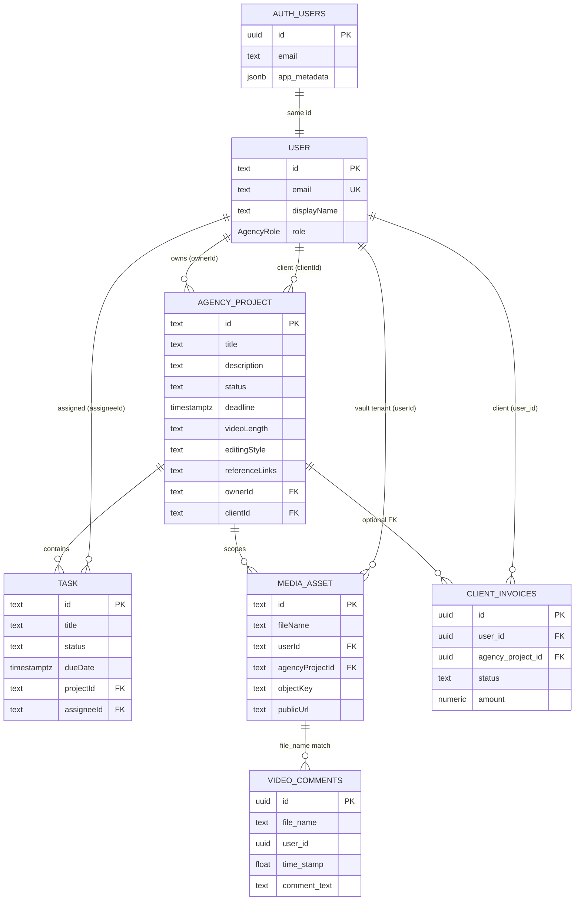

# Operations Core — Phase 1 Blueprint

**Created:** 2026-07-04  
**Type:** Inspection only — no implementation, no refactor, no deploy  
**Goal:** Define the **canonical project model** and entity relationships before Phase 1 implementation

**Prerequisites:** `operations-core-gap-analysis.md`, `legacy-supabase-tables-migration-plan.md`, `admin-client-discovery-migration-plan.md`

**Architecture preserved:** Supabase = auth + legacy metadata · Prisma = ops + media index · R2 = bytes

---

## Executive decision

| Question | Phase 1 answer |
|----------|----------------|
| **What is the source of truth for a production project?** | **`AgencyProject`** (Prisma) |
| **What is `project_status`?** | **Legacy satellite** — per-client pipeline row; migrate values into `AgencyProject`, then stop writing |
| **What is `MediaAsset.userId` grouping?** | **Client vault tenancy** — not a project; remains for R2 scope + admin discovery |
| **What is `Project` (Prisma)?** | **Marketing portfolio only** — out of scope for ops (already separated in schema comment) |

**Rationale (codebase evidence):**

- `AgencyProject` already models title, owner, client, status, tasks (`schema.prisma` L149–166).
- `Task.projectId` FK points only to `AgencyProject` — tasks cannot exist without it (`agency.routes.ts`).
- `project_status` is keyed by `user_id` with **one row per client** (`supabase-p1-admin-legacy-tables.sql` L38–42) — cannot represent multiple concurrent jobs per client.
- `MediaAsset` has no project FK today; `userId` is set at upload from JWT (`media.routes.ts` L229).
- Admin HQ already treats `selectedClient` as `userId` UUID while phase/billing use P1 tables scoped the same way (`admin/page.tsx`) — client scope is stable; **project scope is what is missing**.

---

## 1. Source-of-truth analysis

### 1.1 Candidates compared

| Candidate | Storage | Current key | Strengths | Weaknesses | Phase 1 role |
|-----------|---------|-------------|-----------|------------|--------------|
| **`AgencyProject`** | Prisma `public` | `id` UUID | Tasks already attached; owner + client; API exists | UI unwired; `status` is free text `"active"` | **Canonical project** |
| **`project_status`** | Supabase legacy | `user_id` | Admin UI wired; 6 pipeline labels | 1:1 with client not project; P1 tables often missing; no task/asset link | **Migrate → deprecate** |
| **`project_status_details`** | Supabase legacy | `user_id` | Brief fields exist | Same 1:1 client assumption; read-only in admin | **Migrate brief → project** |
| **`MediaAsset.userId` groupBy** | Prisma | `userId` | Working admin discovery (`GET /api/media/clients`) | Assets only; no status/tasks/brief | **Client index, not project** |
| **`MediaAsset.folder`** | Prisma | `userId` + `folder` | Virtual folders in dashboard | Informal; no ops metadata | **Optional sub-grouping inside project** |
| **Portfolio `Project`** | Prisma | `id` | Marketing site | No client/task/asset relation | **Exclude from ops** |

### 1.2 Verdict

```text
CLIENT (tenant)     →  User.id  (= auth.users.id, role client)
PROJECT (ops unit)  →  AgencyProject.id          ← SOURCE OF TRUTH
ASSET (media)       →  MediaAsset.id
TASK (work item)    →  Task.id
COMMENT (feedback)  →  video_comments.id         (Supabase legacy; linked logically to asset)
```

**`project_status` is not retired in Phase 1 day one** — it is demoted: new writes go to `AgencyProject`; admin reads prefer project row with fallback to legacy per-client row during transition.

**`MediaAsset.userId` is not replaced** — it remains the **authorization and vault tenancy key** (upload, list, admin asset fetch). Phase 1 adds `agencyProjectId` as a **secondary FK**, not a replacement for `userId`.

---

## 2. Entity relationship specification

### 2.1 Client

| Attribute | Source | Notes |
|-----------|--------|-------|
| Identity | `auth.users.id` | Supabase Auth |
| Ops profile | Prisma `User` | Upserted on agency API call (`ensureAgencyUser`) |
| Role | `app_metadata.role` → `User.role` | `client` for external reviewers / account holders |
| Discovery | `MediaAsset.userId` distinct | Admin sidebar Phase 1 (`fetchMediaClients`) |
| Display | `User.email`, `User.displayName` | Not shown in HQ today |

**Cardinality:** One client user → **many** `AgencyProject` rows (`clientId`).

**Phase 1 constraint:** A client may have zero `AgencyProject` rows (assets uploaded before project creation). Backfill script creates a default project per client with assets.

### 2.2 Project (`AgencyProject`)

| Field | Phase 1 use | Legacy source |
|-------|-------------|---------------|
| `id` | Primary key everywhere in ops UI | — |
| `title` | Project name in Admin HQ | `project_status_details.project_title` |
| `description` | Long-form notes | `project_status_details.instructions` (partial) |
| `status` | **Pipeline phase** (enum-like strings) | `project_status.status` |
| `ownerId` | Producer / studio lead | Creating admin/editor |
| `clientId` | Client user UUID | `MediaAsset.userId` / admin `selectedClient` |
| `createdAt` / `updatedAt` | Audit | — |

**Recommended Phase 1 `status` values** (match existing admin UI — `admin/page.tsx` L39–44):

```text
Awaiting Assets | Ingesting | Offline Edit | Color Grading | Audio & Master | Ready for Review
```

Add ops lifecycle values in Phase 2 (`approved`, `delivered`, `archived`). Phase 1 does **not** introduce a second status column — unify into `AgencyProject.status` only.

**Brief extension (Phase 1 schema addition — proposal only):**

| New `AgencyProject` column | Maps from |
|----------------------------|-----------|
| `deadline` | `project_status_details.deadline` |
| `videoLength` | `project_status_details.video_length` |
| `editingStyle` | `project_status_details.editing_style` |
| `referenceLinks` | `project_status_details.reference_links` |

Alternatively a single `briefJson` jsonb column — product choice at implementation; blueprint prefers explicit nullable columns to match existing P1 SQL.

### 2.3 Asset (`MediaAsset`)

| Relation | Cardinality | Phase 1 rule |
|----------|-------------|--------------|
| `MediaAsset.userId` → `User.id` (client) | N:1 | **Required** — vault tenancy; set at upload |
| `MediaAsset.agencyProjectId` → `AgencyProject.id` | N:1 | **Nullable → backfill → required for new uploads** |

**Comment link today:** `video_comments.file_name` = dashboard `previewFile.name` = typically `MediaAsset.fileName` (timestamp prefix pattern). **Weak string key** — sufficient for Phase 1 read path; optional `asset_id` on `video_comments` in Phase 1b.

**`video_metadata`:** Stays keyed by `file_name`; same asset resolution path as comments.

### 2.4 Task

| Relation | Rule |
|----------|------|
| `Task.projectId` → `AgencyProject.id` | Required (already in schema) |
| `Task.assigneeId` → `User.id` | Required on create (`agency.routes.ts` L115–118) |
| `Task.status` | `todo` \| `in_progress` \| `in_review` \| `done` |

Tasks are **project-scoped work**, not comment-scoped in Phase 1. Comment→task conversion is Phase 2.

### 2.5 Comment (`video_comments`)

| Relation | Phase 1 | Phase 2 |
|----------|---------|---------|
| → Asset | Via `file_name` ≈ `MediaAsset.fileName` | Optional `asset_id uuid` FK |
| → Project | Derived: `MediaAsset.agencyProjectId` | Optional `agency_project_id` denormalized |
| → Task | None | `task_id` nullable |

**Stays in Supabase** per `legacy-supabase-tables-migration-plan.md` — no Prisma model in Phase 1.

### 2.6 Billing (`client_invoices`)

| Phase 1 | Proposal |
|---------|----------|
| Keep Supabase table | Yes |
| Add `agency_project_id uuid` nullable | Link invoice to project |
| Keep `user_id` | Client scope + migration compatibility |

---

## 3. ERD (target Phase 1 state)

### 3.1 Mermaid ERD



**Legend:** Solid FK = Prisma-managed. Dashed logical = `file_name` string match (Supabase). `AUTH_USERS` = `auth.users` (Supabase, external to Prisma).

### 3.2 ASCII relationship map

```text
┌─────────────────────────────────────────────────────────────────────────────┐
│                         SUPABASE (auth + legacy metadata)                    │
│  auth.users ─────────────────────────────────────────────┐                │
│       │                                                     │                │
│       │ 1:1 id                                              │                │
│       ▼                                                     │                │
│  video_comments ◄── file_name ──► MediaAsset.fileName      │                │
│  video_metadata ◄── file_name ──► MediaAsset.fileName      │                │
│  project_status (LEGACY) ◄── migrate ──► AgencyProject.status               │
│  project_status_details (LEGACY) ◄── migrate ──► AgencyProject brief cols   │
│  client_invoices (+ agency_project_id) ◄── user_id ────────┘                │
└─────────────────────────────────────────────────────────────────────────────┘
                                        │
                          same PostgreSQL instance
                                        │
┌─────────────────────────────────────────────────────────────────────────────┐
│                         PRISMA public schema (ops + media)                   │
│                                                                              │
│   User (id = auth.users.id)                                                  │
│     ├── clientId ──► AgencyProject ◄── ownerId (producer/admin)             │
│     │                      │                                                 │
│     │                      ├── Task (assigneeId → User)                        │
│     │                      └── MediaAsset (agencyProjectId)                  │
│     └── userId ──► MediaAsset (vault tenancy)                                │
│                                                                              │
│   Project (portfolio) — ISOLATED — marketing site only                       │
└─────────────────────────────────────────────────────────────────────────────┘
                                        │
                                        ▼
                              Cloudflare R2 (objectKey / publicUrl)
```

### 3.3 Read path map (who queries what)

| UI surface | Primary entity | Query path (Phase 1 target) |
|------------|----------------|----------------------------|
| Admin — client list | Client | `GET /api/media/clients` + join `User` email |
| Admin — project picker | Project | `GET /api/agency/projects?clientId=` *(new)* |
| Admin — phase buttons | Project | `PATCH /api/agency/projects/:id` `status` |
| Admin — brief panel | Project | `GET /api/agency/projects/:id` brief fields |
| Admin — assets | Asset | `GET /api/media/assets?agencyProjectId=` *(new filter)* or `userId` + project filter |
| Admin — preview comments | Comment | `supabase.from('video_comments').eq('file_name', …)` |
| Admin — billing | Invoice | `client_invoices` by `agency_project_id` or `user_id` fallback |
| Dashboard — vault | Asset | `GET /api/media/assets?userId=session` + `agencyProjectId` when project context added |
| Dashboard — comments | Comment | `useLiveComments` unchanged |
| Agency tasks | Task | `GET /api/agency/tasks` filtered by role |

---

## 4. What is NOT the source of truth

| Artifact | Disposition |
|----------|-------------|
| `project_status` | Read fallback during migration; **stop writes** after backfill |
| `project_status_details` | Same — brief columns move to `AgencyProject` |
| `MediaAsset.userId` groupBy | Client **discovery index** only |
| `MediaAsset.folder` | UX organization; optional mirror of project slug — not authoritative |
| `AgencyProject.status = "active"` | Default in current API — **replace** with pipeline enum strings |
| Portfolio `Project` | Unrelated showcase model |
| Socket.io room IDs | Ephemeral review sessions — not in Phase 1 SoT |

---

## 5. Migration strategy

### 5.1 Principles

1. **Additive first** — new columns and APIs before removing legacy reads.
2. **No Prisma takeover of `video_comments`** — preserve Supabase REST + RLS path.
3. **One default project per legacy client** — clients with assets but no `AgencyProject` get `"Default — {clientId short}"` row.
4. **Dual-write window** — admin phase change writes `AgencyProject.status` **and** `project_status` until QA passes.
5. **Backfill is idempotent** — scripts keyed by `clientId` / `user_id`.

### 5.2 Migration phases

#### Phase 1a — Schema (Prisma migrate)

| Step | Change | Risk |
|------|--------|------|
| 1 | Add `MediaAsset.agencyProjectId` nullable FK → `AgencyProject` | Low |
| 2 | Add brief columns on `AgencyProject` (`deadline`, `videoLength`, `editingStyle`, `referenceLinks`) | Low |
| 3 | Document `status` allowed values (app-level enum; keep `String` in DB for now) | Low |
| 4 | Add `agency_project_id` nullable to `client_invoices` (Supabase SQL, not Prisma) | Low |

**Do not** add `video_comments` to Prisma in Phase 1.

#### Phase 1b — API surface

| Endpoint | Status today | Phase 1 action |
|----------|--------------|----------------|
| `POST /api/agency/projects` | Exists | Keep |
| `GET /api/agency/projects` | **Missing** | Add — filter by `clientId`, `ownerId`, role |
| `GET /api/agency/projects/:id` | **Missing** | Add — single project + brief |
| `PATCH /api/agency/projects/:id` | **Missing** | Add — `status`, brief fields |
| `GET /api/agency/tasks` | Exists | Keep |
| `POST /api/agency/tasks` | Exists | Keep |
| `PATCH /api/agency/tasks/:id` | **Missing** | Add — status, dueDate |
| `GET /api/media/assets` | Exists | Add optional `agencyProjectId` query param |
| `GET /api/media/clients` | Exists | Enrich with `User.email`, active project count |

#### Phase 1c — Data backfill (operator script)

```text
FOR EACH distinct MediaAsset.userId AS clientId:
  1. ensureAgencyUser for client (if auth user exists)
  2. IF no AgencyProject WHERE clientId = clientId:
       CREATE AgencyProject(
         title = COALESCE(project_status_details.project_title, 'Default Project'),
         status = COALESCE(project_status.status, 'Awaiting Assets'),
         clientId = clientId,
         ownerId = <studio admin user id>,
         deadline / brief fields from project_status_details
       )
  3. UPDATE MediaAsset SET agencyProjectId = <project id>
     WHERE userId = clientId AND agencyProjectId IS NULL
```

**Multi-project clients:** Phase 1 assigns all orphan assets to the **single backfill project**. Admin can split assets later (Phase 2 UI) — document as known limitation.

#### Phase 1d — Admin HQ wiring (implementation after approval)

| Panel | Before | After |
|-------|--------|-------|
| Sidebar | Client list (`userId`) | Client list unchanged |
| New: Project selector | — | Projects for `selectedClient` |
| Phase control | `project_status` upsert | `PATCH AgencyProject.status` + dual-write |
| Brief | `project_status_details` select | `GET AgencyProject` brief fields |
| Assets | `fetchMediaAssets({ userId })` | `fetchMediaAssets({ agencyProjectId })` with userId fallback |
| Tasks | None | List/create from agency API |
| Billing | `client_invoices` by `user_id` | Prefer `agency_project_id` when set |

#### Phase 1e — Deprecation

| Legacy | Condition to stop writes |
|--------|--------------------------|
| `project_status` | All active clients have `AgencyProject`; admin QA on phase buttons |
| `project_status_details` | Brief reads from `AgencyProject`; seed path documented |
| `client_invoices.user_id` only | `agency_project_id` populated on new invoices |

**Keep tables** for audit rollback — do not drop in Phase 1.

### 5.3 Migration dependency order

```text
[1] Apply P1 Supabase SQL (if not done) ──► unblocks legacy admin reads during transition
[2] Prisma schema additions (agencyProjectId, brief cols)
[3] GET/PATCH agency projects + task PATCH
[4] Backfill script (clients → default projects → link assets)
[5] Admin HQ project selector + dual-write status
[6] Asset upload sets agencyProjectId (session/context or default project)
[7] Remove dual-write; legacy read fallback only
```

### 5.4 Rollback plan

| If failure at | Rollback |
|---------------|----------|
| Schema migrate | `agencyProjectId` nullable — app ignores column |
| Admin wiring | Feature flag: `USE_AGENCY_PROJECT=false` → read `project_status` only |
| Backfill | Delete backfill-created `AgencyProject` rows where title prefix `Default —` |
| Dual-write | Stop writing `AgencyProject`; continue `project_status` only |

---

## 6. Authorization model (Phase 1)

| Actor | Project access | Asset access | Task access |
|-------|----------------|--------------|-------------|
| **admin** | All projects | All assets (`isAdminUser`) | All tasks |
| **editor** | Owned projects (`ownerId`) | Own `userId` vault | Assigned tasks |
| **client** | `clientId` match | Own `userId` vault | Assigned + project client tasks |

Enforcement stays in **backend** (`requireAuth`, `media.routes.ts` asset guard L63–64, `agency.routes.ts` role filters).

**Phase 1 does not add RLS on `AgencyProject`** — Prisma accessed only via authenticated backend, not browser direct.

---

## 7. Known limitations (explicit Phase 1 scope)

| Limitation | Deferred to |
|------------|-------------|
| Multiple projects per client with asset split UI | Phase 2 |
| Company / org entity | Phase 2 |
| Client invite flow | Phase 2 |
| Comment → Task | Phase 2 |
| `video_comments.asset_id` FK | Phase 1b optional / Phase 2 |
| Specialty roles (colorist, audio, VFX) | Phase 2 |
| Unified delivery lifecycle (`delivered`, `approved`) | Phase 2 |
| Review session persistence | Timeline Phase 3 |

---

## 8. Decision log

| ID | Decision | Alternatives rejected | Reason |
|----|----------|----------------------|--------|
| **OC-P1-01** | `AgencyProject` = canonical project | Keep `project_status` as SoT | 1:1 client model; no task/asset FK |
| **OC-P1-02** | Keep `MediaAsset.userId` as tenancy | Replace with project-only scope | Upload/auth already keyed by user; breaking change |
| **OC-P1-03** | Keep `video_comments` in Supabase | Move to Prisma | High regression; legacy plan explicitly rejects |
| **OC-P1-04** | Pipeline status on `AgencyProject.status` | Separate `pipelinePhase` + `opsStatus` | Minimize columns in Phase 1; admin already has 6 strings |
| **OC-P1-05** | Default one backfill project per client | Require manual project before assets | Unblocks existing 6 MediaAsset rows without manual ops |
| **OC-P1-06** | Dual-write `project_status` during transition | Big-bang cutover | Admin HQ currently depends on P1 tables |
| **OC-P1-07** | Portfolio `Project` stays isolated | Merge with `AgencyProject` | Schema comment already separates; marketing ≠ ops |

---

## 9. Implementation checklist (for approval gate)

**Not started — blueprint only.**

- [ ] Operator approves `AgencyProject` as canonical SoT
- [ ] Operator approves dual-write migration window
- [ ] P1 Supabase SQL applied (`project_status`, `project_status_details`, `client_invoices`)
- [ ] Prisma migration: `MediaAsset.agencyProjectId` + brief columns
- [ ] Supabase SQL: `client_invoices.agency_project_id`
- [ ] API: `GET` / `PATCH` agency projects; `PATCH` tasks
- [ ] Backfill script run + verified counts
- [ ] Admin HQ: project selector + wired panels
- [ ] Upload path: set `agencyProjectId`
- [ ] QA: phase, assets, tasks, comments still load
- [ ] Dual-write removed; legacy tables read-only

---

## 10. File index

| File | Relevance |
|------|-----------|
| `rendorax-backend/prisma/schema.prisma` | Current `AgencyProject`, `MediaAsset`, `Task` |
| `rendorax-backend/src/routes/agency.routes.ts` | Project/task API surface |
| `rendorax-backend/src/routes/media.routes.ts` | Client discovery, asset CRUD |
| `rendorax-frontend/app/admin/page.tsx` | Legacy `project_status` consumer |
| `rendorax-frontend/hooks/useLiveComments.ts` | `video_comments` by `file_name` |
| `supabase-p1-admin-legacy-tables.sql` | Legacy admin table DDL |
| `legacy-supabase-tables-migration-plan.md` | P0/P1 Supabase policy |
| `operations-core-gap-analysis.md` | Gap register + roadmap |

---

**Blueprint complete. No code changed. Awaiting approval before Phase 1a schema migration.**
