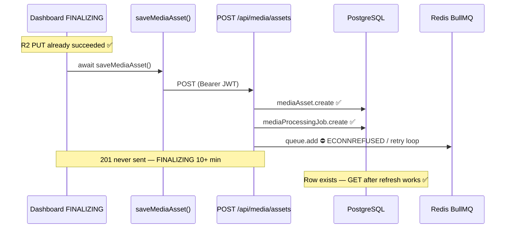
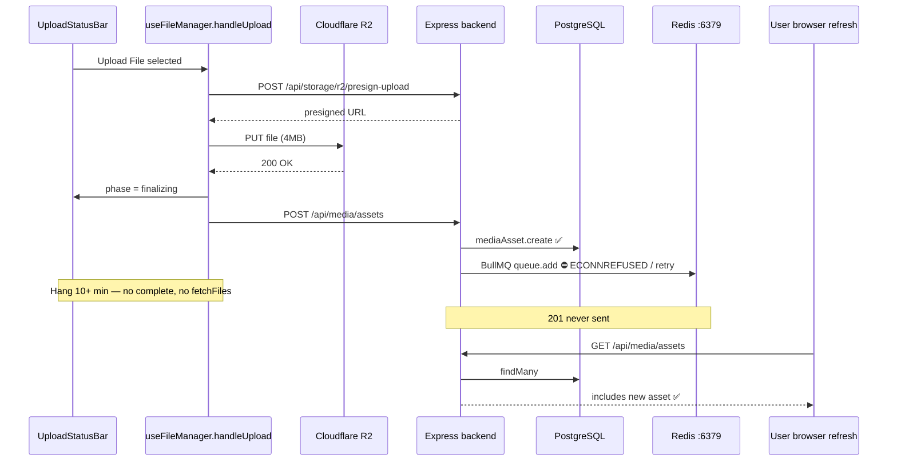

# QA-001 / QA-002 — FINALIZING Hang Trace Report

**Inspection date:** 2026-07-03  
**Resolution date:** 2026-07-03  
**Status:** **Resolved — manually verified (local dev, 2026-07-03)** — production not verified

**Trigger (historical):** Manual QA-002 test failed — 4 MB video stays on **"FINALIZING..."** for 10+ minutes; asset list does not update on Cloud or Vault until manual page refresh.

**Fix implemented:** Backend async enqueue (`media.routes.ts`, `mediaQueue.ts`, `mediaProcessing.ts`) + frontend cloud refresh (`page.tsx` QA-002 Change A + B).

**Manual verification (2026-07-03):** Upload completes without indefinite FINALIZING; asset list updates without page refresh on Cloud and Vault bins.

**Related docs:** `qa-002-upload-refresh-trace.md`, `dashboard-qa-issue-map.md`

---

## Confirmed fact (user-verified)

**R2 upload succeeds** — the mezzanine file is present in Cloudflare R2 before/during FINALIZING. The blocker is **not** presign, PUT, or CDN storage. Investigation below starts **after R2 completes**.

---

## Post-R2 focused analysis (7 inspection targets)

### 1. `POST /api/media/assets`

| Item | Detail |
|------|--------|
| **Route** | `rendorax-backend/src/routes/media.routes.ts` → `router.post("/assets", ...)` |
| **Mount** | `app.use("/api/media", mediaRouter)` in `index.ts` → full path **`POST {BACKEND_URL}/api/media/assets`** |
| **Auth** | `router.use(requireAuth)` on entire media router — JWT validated via Supabase `getUser(token)` before handler runs |
| **When called** | Immediately after R2 PUT completes; frontend sets `phase: "finalizing"` then issues this POST |

**Handler steps (in order, post-R2 only):**

```
requireAuth                    → fast (Supabase JWT verify)
validate body                  → sync
prisma.mediaAsset.create       → DB write #1  ✅ typically completes
enqueueMediaTranscodeJob       → DB write #2 + Redis (video only)  ⛔ hang here
res.status(201).json(...)      → ⛔ never sent while enqueue awaits
```

**No other backend route** registers dashboard upload metadata. `grep` shows a single `mediaAsset.create` in backend source (`media.routes.ts` only). Legacy `app/api/video-uploaded` (Next.js) is a Supabase-storage webhook → AWS MediaConvert — **not used** by current R2 dashboard flow.

---

### 2. `saveMediaAsset()` (frontend)

**File:** `rendorax-frontend/utils/mediaAssets.ts` (~407–427)

```typescript
export async function saveMediaAsset(input) {
  const headers = await getBackendAuthHeaders();     // step A
  const res = await backendFetch("/api/media/assets", {
    method: "POST",
    headers,
    body: JSON.stringify(input),
  });                                                // step B — blocks until POST responds
  if (!res.ok) throw new Error(...);
  return res.json();                                 // step C
}
```

**Callers (both post-R2):**

| Caller | File | When |
|--------|------|------|
| Upload File | `hooks/useFileManager.ts` ~287 | After R2 PUT in `handleUpload` |
| Upload to Cloud | `app/dashboard/page.tsx` ~901 | `handleR2UploadSuccess` after `uploadMediaToR2` |

**Payload sent** (from `handleUpload` example): `fileName`, `publicUrl`, `objectKey`, `mimeType`, `userId`, `folder`, `fileSize`. Backend **ignores** client `publicUrl` and rebuilds from `objectKey` via `buildPublicUrl()`.

**Blocking behavior:** `saveMediaAsset` is a single `await` with **no `AbortSignal`, no timeout, no retry**. While POST is pending, UI stays on FINALIZING.

---

### 3. Backend routes that save asset metadata (complete inventory)

| Route | Saves metadata? | Used by dashboard R2 upload? |
|-------|-----------------|------------------------------|
| **`POST /api/media/assets`** | Yes — `MediaAsset` row | **Yes — only path** |
| `POST /api/storage/r2/presign-upload` | No — returns presigned URL only | Pre-R2 (confirmed OK) |
| `PATCH /api/media/assets/:id` | Updates existing | No (rename/move) |
| `POST /api/upload/*` | Legacy upload router | Not used by current flow |
| Next.js `POST /api/video-uploaded` | Triggers MediaConvert | Legacy Supabase webhook |

**Conclusion:** All post-R2 metadata persistence goes through **`POST /api/media/assets`** only.

---

### 4. Prisma DB writes after upload (inside POST handler)

For a **video** file, up to **two** Prisma writes run before HTTP response:

| # | Operation | File | Table | Blocks response? |
|---|-----------|------|-------|------------------|
| 1 | `prisma.mediaAsset.create` | `media.routes.ts` ~222 | `MediaAsset` | Awaited; usually **fast** |
| 2 | `prisma.mediaProcessingJob.findFirst` | `mediaProcessing.ts` ~30 | `MediaProcessingJob` | Awaited; usually fast |
| 3 | `prisma.mediaProcessingJob.create` | `mediaProcessing.ts` ~47 | `MediaProcessingJob` | Awaited; usually fast |

**Not set on create:** `processingStatus` on `MediaAsset` (stays `null` until worker runs).

**User-refresh symptom explained:** Write **#1** commits before Redis enqueue. `GET /api/media/assets` after page refresh returns the row even when POST never returned `201`.

**DB hang unlikely** if refresh shows asset — implies `mediaAsset.create` succeeded. Slow pool/adapter would block before enqueue; less consistent with “file in R2 + row in DB + refresh works.”

---

### 5. BullMQ / Redis queue call after DB save

**File:** `rendorax-backend/src/lib/mediaProcessing.ts`

```typescript
// After MediaProcessingJob row created in Postgres:
if (!isMediaQueueEnabled()) return job;   // only if MEDIA_QUEUE_ENABLED=false

await mediaTranscodeQueue.add("transcode", payload, { jobId: job.id });  // ⛔ BLOCKING
```

| Config | Value | Effect |
|--------|-------|--------|
| `isMediaQueueEnabled()` | `MEDIA_QUEUE_ENABLED !== "false"` | Unset in `.env.local` → **enabled** |
| `REDIS_URL` | defaults `redis://localhost:6379` | Redis not running locally |
| `maxRetriesPerRequest` | `null` in `getBullMqConnection()` | ioredis **retries indefinitely** on `ECONNREFUSED` |
| `try/catch` in `media.routes.ts` | wraps enqueue | Only helps if `queue.add` **throws** — not if it **hangs retrying** |

**Runtime:** Backend terminal shows continuous `ECONNREFUSED :6379` while `npm run start:dev` runs — consistent with Worker + Queue both targeting dead Redis.

**For non-video (image):** `enqueueMediaTranscodeJob` returns `null` at mime check — **no Redis call**. Images should finalize quickly; video matches user report.

**This is the primary post-R2 blocking point** given R2 confirmed and DB row visible on refresh.

---

### 6. Response not returned to frontend

| Stage | Returned to client? |
|-------|---------------------|
| R2 PUT | N/A (direct to Cloudflare) — **confirmed success** |
| `POST /api/media/assets` | **No** — handler stuck before `return res.status(201)` |
| `saveMediaAsset()` promise | **Pending** — `fetch` has no body until response completes |
| `handleUpload` after save | **Not executed** — `fetchFiles`, QA-002 `fetchAndSetCloudAssets` never run |
| `setUploadSession(complete)` | **Not executed** — UI stuck FINALIZING |

**DevTools expectation:** Network tab shows `POST /api/media/assets` as **Pending** (not 201, not 500) for 10+ minutes.

**Backend log expectation:** No `[mediaProcessing] Enqueued transcode job` line for hung requests; possible `mediaAsset` row in DB anyway.

---

### 7. Missing timeout / error handling after R2 upload

| Layer | After R2 | Timeout? | On indefinite hang |
|-------|----------|----------|-------------------|
| `getBackendAuthHeaders` | before POST | No | Rare; would throw if no session |
| `backendFetch` | POST | **No** | Pending forever |
| `saveMediaAsset` | POST | **No** | Never resolves/rejects |
| `handleUpload` catch | after save throws | N/A | **Never runs** while fetch pending |
| `UploadStatusBar` | UI | No cancel | Shows FINALIZING indefinitely |
| `handleHeaderUpload` (QA-002) | after `handleUpload` | N/A | **Unreachable** |
| Backend `queue.add` | in POST | No timeout wrapper | HTTP thread blocked |
| Backend enqueue `catch` | in POST | N/A | **Unreachable** if add hangs vs throws |

**Gap:** There is **no fail-fast path** between successful R2 and user feedback when metadata save blocks. User has no signal that Postgres saved but HTTP is stuck on Redis.

---

## Post-R2 sequence (confirmed R2 success)



---

## Minimal fix (post-R2 scope only)

| Priority | Fix | File | What |
|----------|-----|------|------|
| **P0** | Return `201` before or without blocking on Redis | `media.routes.ts` | `void enqueueMediaTranscodeJob(...).catch(...)` or move enqueue after `res.json()` |
| **P0** | Fail-fast producer Redis | `mediaQueue.ts` | Separate Queue connection: low `maxRetriesPerRequest`, `enableOfflineQueue: false` |
| **P1** | POST timeout + failed phase | `mediaAssets.ts` / `backendFetch.ts` | `AbortSignal.timeout(30_000)` on save only |
| **Verify** | Local dev | `.env.local` | `MEDIA_QUEUE_ENABLED=false` or start Redis |

**QA-002:** Keep — applies after POST returns.

**Do not revert QA-002.**

---

## Executive summary

**R2 upload confirmed successful** — the hang is entirely **post-R2** (metadata save / backend processing).

The observed behavior is **not primarily a list-refresh bug**. Upload completion handlers (`fetchFiles`, `fetchAndSetCloudAssets`) sit **after** `await saveMediaAsset(...)`, which blocks until `POST /api/media/assets` returns. That POST handler **awaits `mediaTranscodeQueue.add()`** for video files while **Redis is not running locally**.

**Runtime evidence:** Backend dev terminal (`rendorax-backend`, `npm run start:dev`) shows repeated:

```
ECONNREFUSED 127.0.0.1:6379
ECONNREFUSED ::1:6379
```

`MEDIA_QUEUE_ENABLED` is not set in `rendorax-backend/.env.local` → queue defaults to **enabled**. `REDIS_URL` defaults to `redis://localhost:6379` per `mediaQueue.ts`.

**Why manual refresh “fixes” the list:** `prisma.mediaAsset.create()` runs **before** the blocking `queue.add()`. The asset is often **already in the database** while the HTTP response is stuck. Page refresh runs `GET /api/media/assets`, which succeeds independently of the hung POST.

**QA-002 frontend fix (Change A + B):** Correct in design but **unreachable during the hang** because it runs only after `handleUpload` resolves. **Do not revert** — it addresses a real secondary bug once save completes.

---

## 1. Where "FINALIZING..." starts and where it should end

### Label source

`utils/mediaUploadStatus.ts` — `resolveUploadDisplayStatus()`:

```150:161:rendorax-frontend/utils/mediaUploadStatus.ts
  if (
    session.phase === "finalizing" ||
    (session.phase === "uploading" && session.progress >= 100)
  ) {
    return {
      key: "uploading",
      label: "Finalizing...",
      ...
    };
  }
```

### Upload File path (`useFileManager.handleUpload`)

| Step | Phase | UI label |
|------|-------|----------|
| R2 bytes uploading | `uploading` (progress 0–99) | **Uploading** + bar |
| `reportUploadProgress(100)` during XHR | `finalizing` | **Finalizing...** |
| Explicit `setUploadSession({ phase: "finalizing" })` before save | `finalizing` | **Finalizing...** |
| `await saveMediaAsset(...)` **in progress** | `finalizing` | **Finalizing...** ← **hang observed here** |
| After save returns | `complete` | **Upload Complete** |
| After 1.75s (no active processing) | `null` / dismissed | bar hidden |

**FINALIZING should end** when `saveMediaAsset` resolves (success → `complete`, failure → `failed` + alert).

### Upload to Cloud modal path (`MediaUploader`)

Uses local `isFinalizing` + `progress >= 100` with the same **Finalizing...** label (`components/MediaUploader.tsx` ~102–106, ~156–162). Finalizing ends when `onUploadSuccess` (`handleR2UploadSuccess`) completes — same blocking `saveMediaAsset` call.

### Display component

`components/dashboard/UploadStatusBar.tsx` — reads `uploadSession` from header **Upload File** path only (modal has in-modal status).

---

## 2. Which async function is awaited during FINALIZING

### Upload File — exact await chain inside `handleUpload`

```271:306:rendorax-frontend/hooks/useFileManager.ts
        const result = await /* R2 presign + PUT */;

        setUploadSession({ ..., phase: "finalizing" });

        const savedAsset = await saveMediaAsset({ ... });   // ← BLOCKS UI HERE

        setUploadSession({ ..., phase: "complete", savedAsset });
        ...
        await fetchFiles(user.id, currentFolder);           // ← NEVER REACHED while save hangs
        await fetchAllFolders();
```

### `saveMediaAsset` internals

```407:427:rendorax-frontend/utils/mediaAssets.ts
export async function saveMediaAsset(...) {
  const headers = await getBackendAuthHeaders();   // supabase.auth.getSession()
  const res = await backendFetch(`/api/media/assets`, {
    method: "POST",
    ...
  });
  ...
  return res.json();
}
```

### QA-002 wrapper (also blocked)

```921:927:rendorax-frontend/app/dashboard/page.tsx
  const handleHeaderUpload = useCallback(async (files) => {
    await handleUpload(files);                        // blocks until saveMediaAsset returns
    if (user?.id && activeBin === "cloud") {
      await fetchAndSetCloudAssets();                 // unreachable during hang
    }
  }, ...);
```

**During FINALIZING, the awaited call is:** `saveMediaAsset` → `backendFetch(POST /api/media/assets)` with **no timeout**.

---

## 3. Is `saveMediaAsset` / `POST /api/media/assets` hanging?

**Yes — from the browser’s perspective the POST does not complete** for video uploads when Redis is unreachable and the queue enqueue blocks.

The handler does not return `201` until `enqueueMediaTranscodeJob` finishes (or throws). If `queue.add` retries indefinitely, the fetch promise never settles.

---

## 4. Does the backend receive the request?

**Inferred: yes**, when `rendorax-backend` is running on port 4000 (terminal shows `npm run start:dev` active).

Evidence chain:

1. User reaches **FINALIZING** → R2 presign (`POST /api/storage/r2/presign-upload`) and R2 `PUT` already succeeded (those run before finalizing).
2. Presign and media routes both use the same backend (`NEXT_PUBLIC_BACKEND_URL` default `http://localhost:4000`).
3. FINALIZING means the client has started `POST /api/media/assets`.

**Not independently packet-captured in this pass** — recommend confirming in DevTools Network: POST `/api/media/assets` shows **Pending** for 10+ minutes.

If backend were **not** running, presign would likely fail earlier (unless cached). A pending POST with no response is consistent with backend received + handler blocked.

---

## 5. Does the backend respond?

**No — not until enqueue unblocks or throws.**

Handler sequence in `rendorax-backend/src/routes/media.routes.ts`:

```222:260:rendorax-backend/src/routes/media.routes.ts
    const asset = await prisma.mediaAsset.create({ ... });   // ✅ usually completes

    let processingJob = null;
    try {
      processingJob = await enqueueMediaTranscodeJob(prisma, { ... });  // ⛔ can block
    } catch (enqueueError) {
      console.warn("[media] Transcode enqueue failed (asset saved):", ...);
    }

    return res.status(201).json({ ... });   // ⛔ not reached while await above hangs
```

**Important:** DB row may exist **before** any HTTP response is sent.

---

## 6. Is Redis / BullMQ `queue.add` blocking?

**Yes — this is the likely blocking point.**

### Code path

`enqueueMediaTranscodeJob` (`src/lib/mediaProcessing.ts`):

1. Skip if not `video/*`
2. `prisma.mediaProcessingJob.create` (fast DB write)
3. If `isMediaQueueEnabled()` → **`await mediaTranscodeQueue.add(...)`**

`isMediaQueueEnabled()` (`src/lib/mediaQueue.ts`):

```41:43:rendorax-backend/src/lib/mediaQueue.ts
export function isMediaQueueEnabled(): boolean {
  return process.env.MEDIA_QUEUE_ENABLED !== "false";
}
```

Unset → **enabled**.

### Connection config

```12:38:rendorax-backend/src/lib/mediaQueue.ts
export function getBullMqConnection() {
  const redisUrl = process.env.REDIS_URL || "redis://localhost:6379";
  ...
  return {
    ...
    maxRetriesPerRequest: null,   // retry commands indefinitely
  };
}

export const mediaTranscodeQueue = new Queue(..., { connection: getBullMqConnection() });
```

BullMQ docs: producers (HTTP handlers) should **fail fast** when Redis is down; `maxRetriesPerRequest: null` causes **indefinite retry** — matches 10+ minute hang.

### Worker amplifies Redis noise

`index.ts` starts `startMediaTranscodeWorker(prisma)` which also connects to Redis. Terminal floods with `ECONNREFUSED :6379` — Redis not running on localhost.

### Enqueue error handling gap

`media.routes.ts` wraps enqueue in `try/catch`, but **`catch` only runs if `queue.add` throws**. Indefinite retry **never throws** → no fallback → no `201` response.

---

## 7. Does R2 upload complete before FINALIZING?

**Yes — for the Upload File path on a 4 MB file.**

Flow for files ≤ 5 GB (`SINGLE_PUT_MAX_BYTES`):

1. `POST /api/storage/r2/presign-upload` (backend)
2. `PUT` to R2 presigned URL via `uploadFileWithProgress` (`utils/r2Upload.ts`)
3. XHR `upload.onprogress` hits 100% → `reportUploadProgress(100)` → phase `finalizing`
4. XHR `onload` resolves → then explicit `finalizing` → `saveMediaAsset`

FINALIZING is only shown **after** R2 byte upload reports 100% (or immediately before save). A 4 MB file on a normal connection should pass R2 in seconds; **10+ minutes in FINALIZING implicates post-R2 save**, not R2 throughput.

---

## 8. Frontend timeout / error handling for FINALIZING

| Layer | Timeout? | On hang |
|-------|----------|---------|
| `backendFetch` | **No** | `fetch` pending indefinitely |
| `saveMediaAsset` | **No** | never resolves |
| `getBackendAuthHeaders` | **No** | rare hang on `getSession()` |
| `uploadFileWithProgress` (R2 PUT) | **No** | would stay on Uploading, not Finalizing |
| `handleUpload` catch | Only if `saveMediaAsset` throws | no throw while pending |
| `UploadStatusBar` | **No** cancel / timeout UI | spinner forever |

**No user-facing recovery** during finalizing hang except closing the tab or waiting for browser/network limits.

---

## 9. Why a 4 MB file stays FINALIZING 10+ minutes

| Factor | Role |
|--------|------|
| File size | **Not the cause** — 4 MB uses single PUT; upload phase should be short |
| `POST /api/media/assets` blocked on `queue.add` | **Primary cause** when Redis down |
| `maxRetriesPerRequest: null` | Retries Redis connection without failing fast |
| No `MEDIA_QUEUE_ENABLED=false` in local env | Queue enqueue always attempted for video |
| No frontend POST timeout | UI stuck in `finalizing` with no error |
| Asset may already be in Postgres | Explains **refresh shows file** while UI still finalizing |

**Timeline (inferred):**

```
T+0s    R2 PUT completes → FINALIZING
T+0s    POST /api/media/assets → requireAuth → prisma.create ✅
T+0s    enqueueMediaTranscodeJob → queue.add → Redis ECONNREFUSED → retry loop
T+10m+  POST still pending; fetchFiles / QA-002 refresh never ran
        User refreshes page → GET /api/media/assets → asset visible
```

---

## 10. Is QA-002 frontend fix unreachable?

**Yes, while `saveMediaAsset` hangs.**

| Step | Runs during hang? |
|------|-------------------|
| `fetchFiles` (vault list) | **No** — inside `handleUpload` after save |
| `fetchAndSetCloudAssets` (QA-002 Change A) | **No** — after `await handleUpload` |
| `loadCloudAssets` stale guard (QA-002 Change B) | **No** — never triggered post-upload |

This explains failed manual tests on **both** Cloud and Vault bins with **Upload File** — same `handleUpload`, same blocked save.

After POST eventually returns (Redis fixed or enqueue throws), QA-002 Change A still helps Cloud-bin **Upload File** list sync. Change B still helps stale cloud fetch races.

---

## Request flow (Upload File, video, local dev)



---

## Files / functions involved

| Layer | File | Function / symbol |
|-------|------|-------------------|
| UI label | `utils/mediaUploadStatus.ts` | `resolveUploadDisplayStatus` |
| UI bar | `components/dashboard/UploadStatusBar.tsx` | renders `uploadSession` |
| Upload File | `hooks/useFileManager.ts` | `handleUpload`, `reportUploadProgress` |
| QA-002 wrapper | `app/dashboard/page.tsx` | `handleHeaderUpload`, `fetchAndSetCloudAssets` |
| Save client | `utils/mediaAssets.ts` | `saveMediaAsset`, `fetchMediaAssets` |
| HTTP client | `utils/backendFetch.ts` | `backendFetch` (no timeout) |
| Auth headers | `utils/backendAuth.ts` | `getBackendAuthHeaders` |
| R2 upload | `utils/r2Upload.ts` | `uploadFileWithProgress`, `requestPresignedUploadForKey` |
| Presign API | `rendorax-backend/src/routes/storage.routes.ts` | `POST /r2/presign-upload` |
| Save API | `rendorax-backend/src/routes/media.routes.ts` | `POST /assets` |
| Auth | `rendorax-backend/src/middleware/requireAuth.ts` | `requireAuth` |
| Enqueue | `rendorax-backend/src/lib/mediaProcessing.ts` | `enqueueMediaTranscodeJob` |
| Queue | `rendorax-backend/src/lib/mediaQueue.ts` | `mediaTranscodeQueue`, `isMediaQueueEnabled` |
| Worker | `rendorax-backend/src/workers/mediaTranscodeWorker.ts` | `startMediaTranscodeWorker` |
| Server boot | `rendorax-backend/index.ts` | mounts `/api/media`, starts worker |

---

## Likely blocking point (ranked)

| Rank | Blocker | Confidence |
|------|---------|------------|
| **1** | `await mediaTranscodeQueue.add(...)` with Redis down + `maxRetriesPerRequest: null` | **High** — matches code + terminal `ECONNREFUSED :6379` |
| 2 | `backendFetch` with backend down (no TCP response) | Medium — would also block; less likely if presign worked |
| 3 | `prisma.mediaAsset.create` / DB hang | Low — refresh shows asset implies create succeeded |
| 4 | QA-002 missing cloud refresh only | **Ruled out as primary** — vault also fails; both wait on same save |

---

## Minimal safe fix proposal (no implementation yet)

### Fix 1 — Backend: decouple HTTP response from queue enqueue (**recommended primary**)

**File:** `rendorax-backend/src/routes/media.routes.ts`  
**Change:** Return `201` immediately after `prisma.mediaAsset.create`. Enqueue in background with bounded timeout:

```typescript
// Pseudocode — not implemented
void enqueueMediaTranscodeJob(...).catch(err => console.warn(...));
return res.status(201).json(...);
```

Or inside `enqueueMediaTranscodeJob`: wrap `queue.add` in `Promise.race` with ~2–5s timeout; on failure log and return job row (asset already saved).

**Risk:** Low for upload UX. Job might not enter Redis until Redis is up — acceptable with retry/monitoring.  
**Scope:** Backend only; unblocks all clients.

### Fix 2 — Backend: fail-fast Redis for producers (**recommended hardening**)

**File:** `rendorax-backend/src/lib/mediaQueue.ts`  
**Change:** Use separate IORedis options for **Queue** (producer): `maxRetriesPerRequest: 1`, `enableOfflineQueue: false` per BullMQ “failing fast” pattern. Keep `null` only on **Worker** connection.

**Risk:** Low — enqueue fails fast → existing `try/catch` in `media.routes.ts` logs warning and still returns `201`.

### Fix 3 — Local dev ops (immediate verification, not code)

- Start Redis on `localhost:6379`, **or**
- Set `MEDIA_QUEUE_ENABLED=false` in `rendorax-backend/.env.local` for local dev (document in `.env.example`)

**Risk:** None for code; transcode worker won’t process until Redis enabled.

### Fix 4 — Frontend: POST timeout (**secondary UX**)

**File:** `utils/mediaAssets.ts` or `backendFetch.ts`  
**Change:** `AbortSignal.timeout(30_000)` on `saveMediaAsset`; surface `failed` phase + message instead of infinite FINALIZING.

**Risk:** Low — does not fix root cause but prevents 10+ minute silent hang.

### Fix priority

1. Fix 1 or Fix 2 (backend) — **required** for video upload completion  
2. Fix 3 — **verify** locally before further QA  
3. Fix 4 — optional UX safety net  
4. QA-002 Change A + B — **keep**; retest after Fix 1/2

---

## Should QA-002 frontend fix be reverted?

**No. Keep it.**

| Reason | Detail |
|--------|--------|
| Correct logic | Cloud bin + Upload File still needs `cloudAssets` sync after successful save |
| Not harmful during hang | Extra fetch simply never runs |
| Still needed after backend fix | Primary refresh gap remains once POST returns quickly |
| Change B | Stale `loadCloudAssets` guard remains valuable |

Revert would restore the original cloud/vault split bug after enqueue is fixed.

---

## Verification steps (after approved backend fix)

1. Ensure Redis running **or** `MEDIA_QUEUE_ENABLED=false` for local dev.  
2. Upload 4 MB video via **Upload File** on Cloud bin — FINALIZING &lt; 3s → Upload Complete → asset visible **without** page refresh.  
3. DevTools: `POST /api/media/assets` returns `201` in &lt; 5s.  
4. Backend logs: either `[mediaProcessing] Enqueued transcode job` or `[media] Transcode enqueue failed (asset saved)` — **not** indefinite silence.  
5. Repeat on Vault bin — `FileGrid` updates without refresh.  
6. Confirm QA-002 Change A path: cloud list updates on Upload File without manual refresh.

---

## Approval gate

| Item | Status |
|------|--------|
| Inspection | ✅ Complete |
| Root cause | Redis-blocking enqueue on `POST /api/media/assets` |
| QA-002 unreachable during hang | ✅ Confirmed (historical) |
| Implementation | ✅ Complete (backend enqueue fix) |
| Manual verification | ✅ **Resolved — manually verified** (2026-07-03, local) |

**QA-001 and QA-002 are closed.** Production upload behavior not re-tested in this verification pass — see `rendorax-project-checklist.md` §14.
