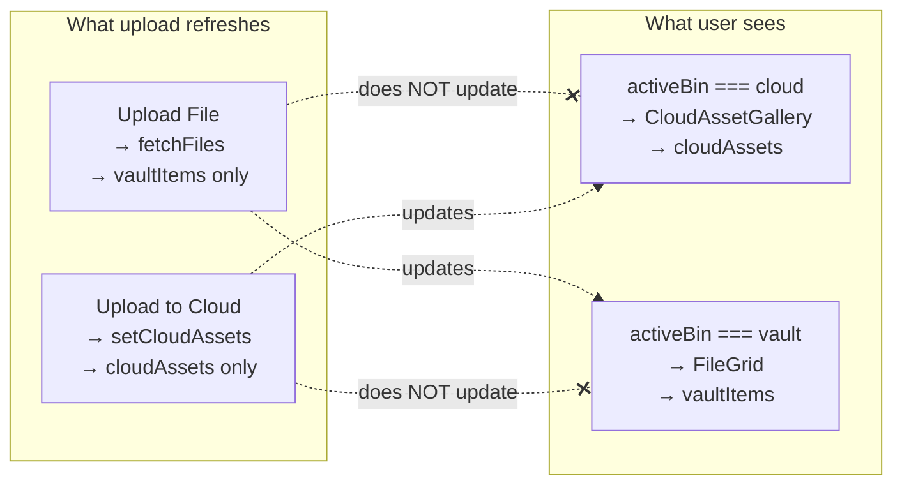

# QA-002 — Upload Refresh Trace Report

**Issue:** After uploading a new video, the uploaded file does not appear in the **currently visible** asset list until manual page refresh.

**Inspection date:** 2026-07-03  
**Resolution date:** 2026-07-03  
**Status:** **Resolved — manually verified (local dev, 2026-07-03)** — production not verified

**Implementation:** Change A + B in `rendorax-frontend/app/dashboard/page.tsx` (`handleHeaderUpload`, `fetchAndSetCloudAssets`, `cloudAssetsLoadGenRef`). Depends on QA-001 backend fix for `POST /api/media/assets` to return promptly.

**Manual verification (2026-07-03):** Cloud Delivery + Upload File — asset appears without refresh. Vault bin + Upload File — asset appears without refresh.

---

## 1. Upload File flow

### Trigger (UI)

| Element | File | Lines |
|---------|------|-------|
| Gold **"Upload File"** button (desktop) | `components/DashboardHeader.tsx` | ~243–248 |
| Mobile upload icon (same handler) | `components/DashboardHeader.tsx` | ~250–267 |
| Hidden `<input type="file" multiple>` | `components/DashboardHeader.tsx` | ~269–276 |

The file input’s `onChange` calls `handleUpload(e.target.files)`.

`DashboardHeader` receives `handleUpload` from `app/dashboard/page.tsx` (~1078–1081), which passes through the hook function unchanged.

### Handler chain

```
DashboardHeader (file input onChange)
  → handleUpload                    [hooks/useFileManager.ts ~253–335]
    → R2 upload (presign + PUT or multipart)
    → saveMediaAsset(...)
    → fetchFiles(user.id, currentFolder)
    → fetchAllFolders()
```

### API routes called (in order)

| Step | Method | Endpoint | Called from |
|------|--------|----------|-------------|
| 1a | `POST` | `{BACKEND}/api/storage/r2/presign-upload` | `requestPresignedUploadForKey` in `utils/r2Upload.ts` (files ≤ 5 GB) |
| 1b | `POST` | `{BACKEND}/api/storage/r2/multipart/*` | `uploadMediaToR2` in `utils/r2Upload.ts` (files > 5 GB only) |
| 2 | `PUT` | R2 presigned URL (direct to CDN storage) | `uploadFileWithProgress` |
| 3 | `POST` | `{BACKEND}/api/media/assets` | `saveMediaAsset` in `utils/mediaAssets.ts` |
| 4 | `GET` | `{BACKEND}/api/media/assets?userId=…&folder=…` | `fetchMediaAssets` inside `fetchFiles` |
| 5 | `GET` | `{BACKEND}/api/media/assets?userId=…` + `{BACKEND}/api/media/folders` | `fetchAllFolderPaths` inside `fetchAllFolders` |

All backend calls use `backendFetch` → `NEXT_PUBLIC_BACKEND_URL` (no Next.js `/app/api` proxy). No explicit HTTP cache headers or SWR/React Query — plain `fetch`.

### React state updated after successful upload

| State | Setter | Updated? |
|-------|--------|----------|
| `vaultItems` | `setVaultItems` in `fetchFiles` | **Yes** |
| `vaultAssetsByName` | `setVaultAssetsByName` | **Yes** |
| `fileUrls` | `setFileUrls` | **Yes** |
| `thumbnailUrls` | `setThumbnailUrls` | **Yes** |
| `allFolders` | `setAllFolders` via `fetchAllFolders` | **Yes** |
| `uploadSession` / `uploading` | `setUploadSession`, `setUploading` | **Yes** |
| **`cloudAssets`** | `setCloudAssets` | **No** |
| `activeBin` | `setActiveBin` | **No** (unchanged) |

Relevant post-upload code in `useFileManager.ts`:

```305:306:rendorax-frontend/hooks/useFileManager.ts
        await fetchFiles(user.id, currentFolder);
        await fetchAllFolders();
```

---

## 2. Upload to Cloud flow

### Trigger (UI)

| Element | File | Lines |
|---------|------|-------|
| **"Upload to Cloud"** button | `components/DashboardHeader.tsx` | ~203–221 |
| Mobile cloud upload icon | `components/DashboardHeader.tsx` | ~223–241 |
| Opens `MediaUploadModal` | `components/DashboardHeader.tsx` | ~84–88 |
| Drag/drop or browse in modal | `components/MediaUploader.tsx` → `startUpload` | ~84–126 |

Modal wires `onUploadSuccess={onR2UploadSuccess}` which is `handleR2UploadSuccess` from `page.tsx`.

### Handler chain

```
DashboardHeader → MediaUploadModal → MediaUploader.startUpload
  → uploadMediaToR2(file, reportProgress)     [utils/r2Upload.ts]
  → onUploadSuccess(result, file)
      → handleR2UploadSuccess                 [app/dashboard/page.tsx ~879–905]
        → saveMediaAsset(...)
        → setActiveBin("cloud")
        → fetchMediaAssets(...) + setCloudAssets(data)
        → fetchAllFolders()
```

### API routes called (in order)

| Step | Method | Endpoint | Notes |
|------|--------|----------|-------|
| 1 | `POST` | `{BACKEND}/api/storage/r2/presign-upload` | `requestPresignedUpload` (≤ 5 GB; default for typical videos) |
| 2 | `PUT` | R2 presigned URL | |
| 3 | `POST` | `{BACKEND}/api/media/assets` | `saveMediaAsset` |
| 4 | `GET` | `{BACKEND}/api/media/assets?userId=…&folder=…` | Full list refetch |
| 5 | `GET` | folders (via `fetchAllFolders`) | Sidebar tree only |

### React state updated after successful upload

| State | Setter | Updated? |
|-------|--------|----------|
| **`cloudAssets`** | `setCloudAssets(data)` | **Yes** |
| `activeBin` | `setActiveBin("cloud")` | **Yes** (forced to cloud) |
| `allFolders` | `fetchAllFolders` | **Yes** |
| `vaultItems` / `vaultAssetsByName` | via `fetchFiles` | **No** |
| `uploadSession` (header bar) | — | **No** (modal has its own UI state) |

Relevant code in `page.tsx`:

```879:905:rendorax-frontend/app/dashboard/page.tsx
  const handleR2UploadSuccess = useCallback(
    async (result, file) => {
      ...
      const savedAsset = await saveMediaAsset({ ... });

      setActiveBin("cloud");

      const params = buildMediaAssetFetchParams(currentFolder, user.id);
      const data = await fetchMediaAssets(params);
      setCloudAssets(data);
      await fetchAllFolders();

      return savedAsset;
    },
    [user, currentFolder, setActiveBin, fetchAllFolders],
  );
```

---

## 3. Asset list rendering

### Which state powers which view

`activeBin` lives in `store/useDashboardStore.ts` (`"root" | "cloud" | "vault"`). The main gallery area branches on it in `page.tsx` (~1172–1233).

| Visible UI | `activeBin` condition | State prop | Component |
|------------|----------------------|------------|-----------|
| **Client Vault root placeholder** | `activeBin === "root"` | *(none — empty state)* | Inline placeholder ~1172–1181 |
| **CDN / Cloud Assets** | `activeBin === "cloud"` | `cloudAssets` | `CloudAssetGallery` ~1201–1208 |
| **Vault / Local Storage** | `activeBin === "vault"` | `vaultItems` → `filteredFiles` | `FileGrid` ~1221–1231 |

### State derivation

```252:255:rendorax-frontend/app/dashboard/page.tsx
  const vaultAssetsList = useMemo(
    () => Object.values(vaultAssetsByName),
    [vaultAssetsByName],
  );
```

```1038:1046:rendorax-frontend/app/dashboard/page.tsx
  const files = (vaultItems || []).filter((item) => item?.metadata);
  const filteredFiles = (files || []).filter((item) => {
    ...
    return originalName.includes((searchQuery || "").toLowerCase());
  });
```

`CloudAssetGallery` applies its own `searchQuery` filter internally (`components/dashboard/CloudAssetGallery.tsx` ~99+).

### Important architectural fact

Both Cloud and Vault galleries read the **same backend table** (`GET /api/media/assets` filtered by `folder`). They are not different storage systems — they are **two independent React copies** of the same API response.

---

## 4. Refresh logic

### Functions that reload assets

| Function | Location | Updates | When invoked |
|----------|----------|---------|--------------|
| `fetchFiles` | `hooks/useFileManager.ts` ~101–143 | `vaultItems`, `vaultAssetsByName`, `fileUrls`, `thumbnailUrls` | On `user`/`currentFolder` change; after **Upload File**; vault delete/rename; processing poll when `activeBin !== "cloud"` |
| `loadCloudAssets` | `page.tsx` ~938–955 | `cloudAssets` (+ `cloudAssetsLoading`) | `useEffect` when `activeBin === "cloud"`; processing poll when `activeBin === "cloud"`; cloud rename/delete modals |
| Inline fetch in `handleR2UploadSuccess` | `page.tsx` ~897–899 | `cloudAssets` | After **Upload to Cloud** only |
| `refreshMonitoredAssets` | `page.tsx` ~968–975 | One of the above based on `activeBin` | `useMediaProcessingPoll` every 8s **only if** assets already have active `processingStatus` |

### Does refresh update one state or both?

**Always one — never both.**

| Event | Vault state | Cloud state |
|-------|-------------|-------------|
| Upload File completes | Refreshed | **Not touched** |
| Upload to Cloud completes | **Not touched** | Refreshed |
| Page load / folder change (vault hook effect) | Refreshed | Unchanged unless cloud effect also runs |
| `activeBin` → `"cloud"` | Still refreshed in background by `fetchFiles` effect | `loadCloudAssets` runs |
| Processing poll | Active bin only | Active bin only |

### Cache / stale fetch overwrite risk

- **No browser HTTP cache** in code paths inspected (`fetch` with no `cache:` option defaults to standard behavior; no service worker found for assets API).
- **Stale in-flight request risk exists** for `cloudAssets`:
  - `loadCloudAssets` has **no abort controller** and **no request generation id**.
  - If request A starts (e.g. folder navigation or `activeBin` effect), then upload completes and `handleR2UploadSuccess` calls `setCloudAssets` with fresh data, then request A completes later, it can **overwrite** the fresh list with an older snapshot (missing the new file).
  - This is **timing-dependent** (secondary cause), not the primary deterministic bug.

```938:955:rendorax-frontend/app/dashboard/page.tsx
  const loadCloudAssets = useCallback(async () => {
    ...
    const data = await fetchMediaAssets(params);
    setCloudAssets(data);   // last writer wins — no staleness guard
    ...
  }, [user?.id, currentFolder]);
```

---

## 5. Root cause

### Primary cause (deterministic)

**The visible gallery reads state that the completed upload path does not update.**



**Reproduction (high confidence):**

1. Open dashboard → sidebar → **Cloud Delivery** → pick a folder (`activeBin === "cloud"`).
2. Click gold **Upload File** (not the cloud modal).
3. Upload completes successfully (`UploadStatusBar` shows complete).
4. **Cloud Asset list unchanged** — `cloudAssets` was never refetched.
5. Full page refresh runs `loadCloudAssets` → file appears.

`fetchFiles` **did** run and **did** update `vaultItems` in the background. The user simply cannot see that state while the Cloud bin is selected.

### Secondary cause (intermittent)

**Stale `loadCloudAssets` response can clobber a fresh post-upload list** when:

- An earlier `loadCloudAssets` request is still in flight during/after **Upload to Cloud**, and
- It completes **after** `handleR2UploadSuccess`’s `setCloudAssets`, with data fetched **before** `saveMediaAsset` committed.

This can affect the cloud modal path even when bin/upload paths match.

### Not the root cause (ruled out)

| Hypothesis | Verdict |
|------------|---------|
| `FINALIZING` UI bug | Unrelated — list refresh happens after save, not during FINALIZING label |
| Backend not persisting asset | Manual refresh would also fail; user reports refresh fixes it |
| Folder mismatch on save vs fetch | Both paths use `mediaFolderForSave(currentFolder)` and `buildMediaAssetFetchParams(currentFolder, userId)` — same normalization |
| Processing poll should insert asset | Poll only runs for assets with active `processingStatus`; does not run for list insertion |
| HTTP caching of GET assets | No caching layer in client code |

### Edge case: Client Vault root

When `activeBin === "root"`, no asset list is rendered at all (placeholder only). Upload can succeed but nothing is visible until the user opens Cloud or Vault — separate UX issue, same underlying split-state pattern.

---

## 6. Minimal safe fix proposal

### Recommended approach: **post-upload refresh of the visible bin’s state** (single file, ~10 lines)

Do **not** refactor to unified state yet. Add a thin coordination layer in `page.tsx` so whichever upload path runs also refreshes the **currently displayed** list.

### Change A — **Required** (fixes primary bug)

**File:** `rendorax-frontend/app/dashboard/page.tsx`

**Add** a wrapper around `handleUpload`:

```typescript
const handleHeaderUpload = useCallback(
  async (files: FileList | null) => {
    await handleUpload(files);
    // Upload File only refreshes vault state; sync cloud list if that's what's visible.
    if (user?.id && activeBin === "cloud") {
      const params = buildMediaAssetFetchParams(currentFolder, user.id);
      const data = await fetchMediaAssets(params);
      setCloudAssets(data);
    }
  },
  [handleUpload, user?.id, activeBin, currentFolder],
);
```

**Modify** `DashboardHeader` prop: `handleUpload={handleHeaderUpload}` instead of `handleUpload={handleUpload}`.

**Why this is minimal:**

- One file touched.
- No hook signature changes.
- No UI/design changes.
- Reuses existing `fetchMediaAssets` + `setCloudAssets` pattern already in `handleR2UploadSuccess`.
- Does not set `cloudAssetsLoading` (avoids gallery spinner flash mid-upload).

### Change B — **Optional but recommended** (fixes secondary stale-fetch race)

**File:** `rendorax-frontend/app/dashboard/page.tsx`

Add a `useRef` request generation counter shared by `loadCloudAssets` and `handleR2UploadSuccess`:

```typescript
const cloudAssetsLoadGenRef = useRef(0);

// At start of each cloud fetch:
const gen = ++cloudAssetsLoadGenRef.current;
const data = await fetchMediaAssets(params);
if (gen === cloudAssetsLoadGenRef.current) {
  setCloudAssets(data);
}
```

Apply inside both `loadCloudAssets` and the cloud refresh paths (`handleR2UploadSuccess` and `handleHeaderUpload`).

**Scope:** ~15 additional lines in the same file. No UI change.

### Change C — **Not required for QA-002** (symmetry / future-proofing)

Call `fetchFiles(user.id, currentFolder)` at the end of `handleR2UploadSuccess` so vault state stays in sync when user switches back to Vault. The modal already forces `activeBin` to `"cloud"`, so this is **not** needed to fix the reported symptom.

### What we explicitly avoid

- Merging `cloudAssets` and `vaultItems` into one store (larger refactor).
- Moving upload logic between hooks/components.
- Optimistic UI prepend (more logic; unnecessary if refetch is reliable).
- Env/deployment changes.

---

## 7. Risk assessment

| Item | Level | Notes |
|------|-------|-------|
| Change A (header upload wrapper) | **Low** | Additive; only runs extra GET when cloud bin visible |
| Change B (stale fetch guard) | **Low** | Standard pattern; prevents rare overwrite |
| Regression: vault upload on vault bin | **None** | Wrapper extra branch skipped when `activeBin !== "cloud"` |
| Regression: cloud modal upload | **None** without B; **Low** with B | Modal path already refreshes cloud |
| Extra API load | **Negligible** | One additional GET per Upload File while on cloud bin |
| UI/design impact | **None** | No component or style changes |

---

## 8. Regression test steps (post-implementation)

### Must pass (QA-002 core)

1. **Cloud visible + Upload File**  
   - Select Cloud Delivery + folder.  
   - Use gold **Upload File**.  
   - **Expect:** new video in `CloudAssetGallery` immediately, no page refresh.

2. **Vault visible + Upload File**  
   - Select Vault + folder.  
   - Use **Upload File**.  
   - **Expect:** new video in `FileGrid` immediately (existing behavior).

3. **Cloud visible + Upload to Cloud modal**  
   - Use **Upload to Cloud** modal.  
   - **Expect:** new video in cloud list immediately (existing behavior, verify no regression).

4. **Vault visible + Upload to Cloud modal**  
   - **Expect:** bin switches to cloud; new video visible (existing behavior).

### Should pass (related)

5. **Search filter** — upload file whose name matches current `searchQuery`; asset visible.  
6. **Wrong folder** — upload in folder A while viewing folder B; asset must **not** appear (correct folder scoping).  
7. **Rapid folder switch during upload** (with Change B) — no disappearance of asset after upload completes on cloud.  
8. **Client Vault root** — upload still succeeds; navigating to correct folder shows asset (known UX limitation if root).

### Network verification (DevTools)

- After **Upload File** on cloud bin: confirm extra `GET /api/media/assets?userId&folder` after `POST /api/media/assets`.  
- Response body includes new asset `id` before UI update.

---

## 9. Approval gate

| Step | Status |
|------|--------|
| Inspect | ✅ Complete |
| Report | ✅ `qa-002-upload-refresh-trace.md` |
| Approval | ✅ Approved (Change A + B) |
| Implement | ✅ Complete (`app/dashboard/page.tsx`) |
| Manual test | ✅ **Resolved — manually verified** (2026-07-03, local) |

**Implemented scope:** Change A + Change B (recommended).

**Closed.** Production upload refresh not re-tested in this verification pass — see `rendorax-project-checklist.md` §14.
