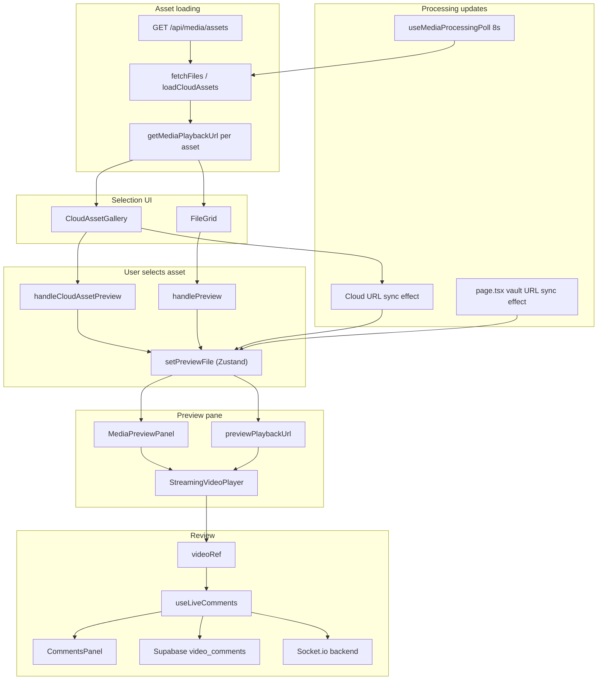
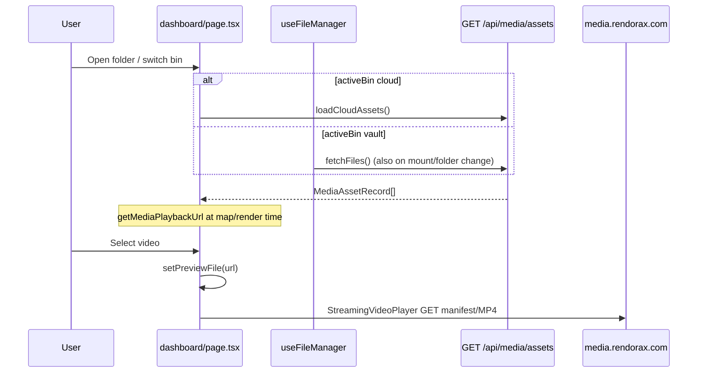

# R2 Playback & Review Workflow Map

**Inspection date:** 2026-07-03  
**Scope:** Dashboard client vault — uploaded R2 asset → gallery → player → review/comments  
**Method:** Static code inspection only — no code, deploy, or runtime changes

**Prerequisite:** R2 upload and `POST /api/media/assets` metadata save are confirmed working (QA-001 / QA-002 resolved locally).

---

## Executive summary

Playback is **client-side URL resolution** over **public CDN URLs** (`media.rendorax.com` / `NEXT_PUBLIC_R2_PUBLIC_URL`), with optional **HLS** after FFmpeg transcode. There is **no streaming proxy** and **no signed URL for playback** — presigned URLs are used only for **downloads**.

The player (`StreamingVideoPlayer`) loads the resolved URL directly in the browser (progressive MP4 or HLS via `hls.js`). Review/comments use **Supabase `video_comments`** keyed by `previewFile.name`, plus optional **Socket.io** sync for live collaboration.

---

## Component flow



---

## API flow

| Step | Method | Endpoint | Purpose | Auth |
|------|--------|----------|---------|------|
| 1 | `GET` | `{BACKEND}/api/media/assets?userId&folder` | List `MediaAsset` rows for gallery | Bearer JWT |
| 2 | *(none for playback)* | — | URLs built client-side from `objectKey` + pipeline fields | — |
| 3 | `GET` | `{BACKEND}/api/storage/r2/download?key&fileName` | **Download only** — presigned GET URL | Bearer JWT |
| 4 | `GET/POST` | Supabase `video_comments` | Comment CRUD | Supabase session |
| 5 | WebSocket | `{BACKEND}` Socket.io | Live comment fan-out, play/pause/seek sync | Connection only |
| 6 | `POST` | `/api/notify` | Email compiled review to team | Next.js route |
| 7 | `POST` | `/api/picture-lock` | Picture lock + integrity hash | Next.js route |
| 8 | `GET` | Supabase `video_metadata` | Lock status on vault preview | Supabase session |

**Not used for dashboard playback:** `GET /api/storage/r2/list`, Next.js `POST /api/video-uploaded` (legacy Supabase webhook).

---

## Data flow (uploaded asset → player URL)

### 1. Persisted asset (backend)

On `POST /api/media/assets`, Prisma stores:

- `objectKey` (e.g. `uploads/{timestamp}_{fileName}`)
- `publicUrl` (rebuilt on read via `buildPublicUrl`)
- `mimeType`, `folder`, `userId`, etc.
- After transcode worker: `playbackObjectKey`, `playbackFormat: "hls"`, `processingStatus: "ready"`

`serializeMediaAsset()` (`media.routes.ts`) on **GET** adds:

- Normalized `publicUrl` from `objectKey`
- `playbackUrl` when `processingStatus === "ready"` && `playbackFormat === "hls"`

### 2. Client URL resolution (`utils/mediaAssets.ts`)

**`getMediaOriginalUrl(asset)`** — mezzanine / progressive:

```
https://{R2_PUBLIC_BASE}/{objectKey}
```

Default base: `NEXT_PUBLIC_R2_PUBLIC_URL` → fallback `https://media.rendorax.com`

**`getMediaPlaybackUrl(asset)`** — dashboard playback:

| Condition | URL returned |
|-----------|----------------|
| Non-video | `getMediaOriginalUrl` |
| Video, no pipeline metadata (`processingStatus` etc. all null) | **Mezzanine CDN** (direct R2 public) |
| Video, `processingStatus` in active states (`queued`…`uploading`) | **`""` (empty)** |
| Video, `processingStatus === "ready"` | `playbackUrl` or `{cdnBase}/{playbackObjectKey}` (HLS master `.m3u8`) |
| Video, `processingStatus === "failed"` | Mezzanine CDN (fallback) |

### 3. Gallery maps URLs at fetch time

`useFileManager.fetchFiles` (`hooks/useFileManager.ts` ~101–132):

- `GET /api/media/assets` → for each row: `playbackUrl = getMediaPlaybackUrl(asset)`
- Stored in `fileUrls[vaultFileName]`, `vaultAssetsByName`

Cloud bin: `cloudAssets` array holds raw `MediaAssetRecord[]`; `getMediaPlaybackUrl` called at render/preview time.

### 4. Preview state (`store/useDashboardStore.ts`)

```typescript
interface FileData {
  name: string;        // display fileName (no timestamp prefix on cloud)
  url: string;
  publicUrl?: string;
  isVideo?: boolean;
  isCdn?: boolean;     // true for cloud path; vault uses activeBin (misleading)
  assetId?: string;
  previewKey?: string;
}
```

### 5. Player input (`app/dashboard/page.tsx`)

```typescript
previewPlaybackUrl = sanitizeAbsoluteMediaUrl(previewFile.url ?? previewFile.publicUrl ?? "")
```

Passed to `StreamingVideoPlayer` as `src={previewPlaybackUrl}`.

---

## Playback URL types (inspection answers)

| Mechanism | Used for playback? | Used for download? | Where |
|-----------|-------------------|-------------------|--------|
| **Direct R2 / CDN public URL** | **Yes** (primary mezzanine) | Share link uses same public URL | `getMediaOriginalUrl`, `buildPublicUrl` |
| **HLS on CDN** (`.m3u8`) | **Yes** when transcode `ready` | No | `playbackObjectKey`, `hls.js` in player |
| **Signed URL** | **No** | **Yes** (`fetchR2DownloadUrl`) | `GET /api/storage/r2/download` |
| **Backend proxy stream** | **No** | No | Not implemented |
| **Supabase Storage signed URL** | **No** (legacy) | No in current R2 flow | — |

**Note:** `getSignedUrl` in `useFileManager` is a **misnomer** — it returns the precomputed CDN URL from `fileUrls`, not a time-limited signature.

---

## 1. How the dashboard selects a video

### Cloud Delivery (`activeBin === "cloud"`)

| Action | Handler chain |
|--------|---------------|
| Card / list click | `CloudAssetGallery.handleCardPointerSelect` → `handleAssetPreview` |
| Play overlay button | `handleAssetPreview` |
| | → `getMediaPlaybackUrl(asset)` |
| | → `onPreviewAsset` → `page.tsx` `handleCloudAssetPreview` |
| | → `setPreviewFile({ name: asset.fileName, url, assetId, isCdn: true, ... })` |

Re-click same video: `handleCloudAssetPreview` calls `handleTogglePlay()` instead of resetting preview.

### Vault (`activeBin === "vault"`)

| Action | Handler chain |
|--------|---------------|
| Grid/list click | `FileGrid` → `onPreview(item.name)` → `handlePreview(fileName)` |
| | → `getVaultAssetRecord` / `getSignedUrl(fileName)` → `fileUrls[name]` |
| | → `setPreviewFile({ name: displayName, url, isCdn: activeBin === "cloud", ... })` |

Vault `displayName` strips `{timestamp}_` prefix from vault file name.

### Compare mode (vault only, feature flag)

`handleSelectCompare` loads second URL from `fileUrls` into `compareFile`. Disabled for `previewFile.isCdn`.

---

## 2. How the player receives the asset URL

```
previewFile (Zustand)
  → previewPlaybackUrl (useMemo, sanitized)
  → MediaPreviewPanel (video branch passes through children)
  → StreamingVideoPlayer src={previewPlaybackUrl}
  → sanitizeAbsoluteMediaUrl(src) internally
  → <video> or hls.js attachMedia
```

**Remount key:** `buildPreviewPlayerKey(previewFile)` = `{cdn|vault}-{assetId|name}-{playbackUrl}` — forces new player instance when URL or asset changes.

**Autoplay:** `page.tsx` effect (~614–660) attempts `video.play()` when `previewPlayerKey` changes (may be blocked by browser policy).

---

## 3. Asset loading lifecycle



| Stage | Loading UI | Data |
|-------|------------|------|
| Initial dashboard | Page `loading` gate | User auth |
| Cloud gallery fetch | `cloudAssetsLoading` spinner | `cloudAssets` |
| Vault gallery fetch | Implicit (no global spinner) | `vaultItems`, `fileUrls` |
| Thumbnail cell | `AssetGridMedia` or spinner if no `fileUrl` | Poster / metadata frame |
| Processing video | `AssetProcessingBadge` on card | `processingStatus` from API |
| Player | `StreamingVideoPlayer` buffering overlay | Direct CDN fetch |

**Processing poll:** `useMediaProcessingPoll` — 8s refresh of active bin list while any asset has active `processingStatus`. When transcode completes, URL sync effects update preview if same asset is open.

---

## 4. Video preview lifecycle

| Phase | Behavior |
|-------|----------|
| **No selection** | Placeholder: “Select an asset to preview” |
| **Select while processing** | `getMediaPlaybackUrl` → `""`; preview may still open (`isProcessing` allows); player shows **“Preparing optimized stream…”** |
| **Select ready (mezzanine)** | Progressive MP4/WebM from CDN; `crossOrigin="anonymous"` |
| **Select ready (HLS)** | `isHlsPlaybackUrl` → native Safari or `hls.js` dynamic import |
| **Transcode completes while previewing** | `CloudAssetGallery` effect (cloud) or `page.tsx` vault effect updates `previewFile.url` |
| **Error** | Player overlay: “Unable to load video” + CORS/Range hint |
| **Bin switch** | `activeBin` change clears `previewFile` |

---

## 5. Error handling

| Layer | On failure | User-visible? |
|-------|------------|---------------|
| `fetchFiles` / `loadCloudAssets` | `console.error`, empty list | Empty gallery state |
| Missing URL on preview (not processing) | `console.error`, early `return` | **Silent** — no preview change |
| `StreamingVideoPlayer` `onError` | `hasError=true` | **Yes** — error overlay |
| HLS fatal error | Same overlay | **Yes** |
| `saveMediaAsset` / upload | Alert (upload path) | N/A for playback |
| Supabase comment insert | `console.error` | **Silent** |
| Socket `connect_error` | `console.warn`, `isLive=false` | “Offline” badge in comments |
| Download / ZIP | `showToast` | **Yes** |

---

## 6. Missing asset handling

| Scenario | Behavior |
|----------|----------|
| Empty folder | Cloud/Vault empty-state components |
| `fileUrl` missing in vault grid | Spinner in thumbnail cell |
| Preview with empty `src` | Player buffering label “Preparing optimized stream…” |
| Asset deleted while previewing | No automatic clear until user action or bin change |
| `GET /api/media/assets` 401 | Fetch catch → empty lists |

---

## 7. Loading state handling

| UI | Trigger | Component |
|----|---------|-----------|
| Gallery loading | `cloudAssetsLoading` | `CloudAssetGallery` spinner |
| Thumbnail loading | No URL yet | `FileGrid` border spinner |
| Player buffering | `waiting`/`stalled`/`loadstart` (400ms debounce) | `StreamingVideoPlayer` overlay |
| Player initial mount | `remountKey` change | Buffering true until `canplay`/`playing` |
| Upload | `uploadSession` phases | `UploadStatusBar` (header) |

---

## 8. Comment / timestamp integration

### Storage

- Table: **`video_comments`** (Supabase)
- Key: **`file_name`** = `previewFile.name` at insert/fetch time
- Fields: `time_stamp` (seconds), `comment_text`, `user_id`

### Load

`useLiveComments` → `fetchComments(previewFile.name)` when `previewFile.isVideo` changes.

### Add comment

1. Read `videoRef.current.currentTime`
2. Pause video
3. Insert Supabase row with `file_name: previewFile.name`
4. Emit `socket.emit("new-comment", { fileId: previewFile.name, ... })`

### Jump to timestamp

`jumpToTime(time)` → set `video.currentTime`, play, emit `video-seek` + `video-play` on socket.

### Socket room

`previewFile?.name || currentFolder || "global-lobby"` — joined on preview/folder change.

### **Critical naming inconsistency**

| Bin | `previewFile.name` | `video_comments.file_name` match |
|-----|-------------------|----------------------------------|
| **Cloud** | `asset.fileName` (e.g. `clip.mp4`) | Cloud comments |
| **Vault** | `displayName` without timestamp (e.g. `clip.mp4`) | Vault comments |
| **Vault lock lookup** | Uses full `fileName` with timestamp in `handlePreview` | `video_metadata.file_name` |

Cloud vs vault comments for the **same underlying asset** may **not unify** if naming differs. Notify/compile strips timestamp with `indexOf("_")` heuristic.

### Comment thumbnails

`CommentsPanel` → `CommentSceneThumbnail` uses `playbackUrl` prop from `previewPlaybackUrl`.

---

## 9. Review workflow integration

| Feature | Integration | Depends on playback |
|---------|-------------|---------------------|
| **Comments panel** | Right sidebar `CommentsPanel` | Video selected (`playerControlsDisabled` when not video) |
| **Live sync** | Socket.io play/pause/seek | `previewFile.name` room + backend WS |
| **Notify team** | `POST /api/notify` | Comments exist |
| **Compile & send** | Same + `compiledNotes` body | Comments exist |
| **Download report** | Client-side `.txt` blob | Comments exist |
| **Picture lock** | `POST /api/picture-lock`, `video_metadata` | Vault preview only in current code path |
| **Compare mode** | Second `StreamingVideoPlayer` | Vault, non-CDN flag, feature flag |
| **Frame timecode** | `useFrameAccurateVideo` on `videoRef` | Fixed 24fps assumption in lock API |
| **Timeline scrubber** | `VideoTimelineScrubber` | `videoRef` |
| **Screen share / live session** | `TimelineShareWidget`, separate stream | Orthogonal to asset URL |
| **Bulk download** | `assetDownload.ts` — presigned for cloud | Not playback path |
| **Share link** | `copyShareLink(publicUrl)` | Public CDN URL |

---

## Key files reference

| Area | File |
|------|------|
| URL resolution | `rendorax-frontend/utils/mediaAssets.ts` |
| R2/CDN detection | `rendorax-frontend/utils/videoStreaming.ts` |
| Player | `rendorax-frontend/components/dashboard/StreamingVideoPlayer.tsx` |
| Preview shell | `rendorax-frontend/components/dashboard/MediaPreviewPanel.tsx` |
| Dashboard orchestration | `rendorax-frontend/app/dashboard/page.tsx` |
| Cloud gallery | `rendorax-frontend/components/dashboard/CloudAssetGallery.tsx` |
| Vault gallery | `rendorax-frontend/components/dashboard/FileGrid.tsx` |
| Vault fetch / URLs | `rendorax-frontend/hooks/useFileManager.ts` |
| Processing poll | `rendorax-frontend/hooks/useMediaProcessingPoll.ts` |
| Comments | `rendorax-frontend/hooks/useLiveComments.ts`, `components/CommentsPanel.tsx` |
| Downloads (signed) | `rendorax-frontend/utils/assetDownload.ts` |
| API serialize | `rendorax-backend/src/routes/media.routes.ts` |
| CDN URL build | `rendorax-backend/src/lib/r2.ts` |
| Transcode output | `rendorax-backend/src/lib/runMediaTranscodeJob.ts` |
| Presigned download | `rendorax-backend/src/routes/storage.routes.ts` |

---

## Potential bottlenecks

| Bottleneck | Impact | When |
|------------|--------|------|
| **Large mezzanine progressive play** | Slow start, high bandwidth | Before transcode `ready`; no HLS yet |
| **Transcode worker / Redis down** | Stuck on mezzanine or empty URL during “processing” | `processingStatus` null or active indefinitely |
| **HLS first segment fetch** | Buffering overlay | After transcode ready |
| **CDN CORS / Range headers** | Player error overlay | Misconfigured R2 public bucket |
| **8s processing poll only** | Delay up to 8s before HLS URL appears in UI | After transcode completes |
| **hls.js lazy import** | Small delay on first HLS play | First HLS asset in session |
| **Gallery video poster** | Per-cell `GET` metadata to CDN | Large folders |
| **No playback proxy** | Browser must reach CDN directly | Corporate networks blocking CDN |

---

## Potential user-facing issues

| Issue | Cause | Risk |
|-------|-------|------|
| **“Preparing optimized stream…” indefinitely** | `processingStatus` active but worker not running; `getMediaPlaybackUrl` returns `""` | **High** |
| **Play click does nothing (processing)** | Preview opens with empty `src`; no blocking UI message | **Medium** |
| **Play click silent fail** | Missing URL, not processing → `console.error` only | **Medium** |
| **Comments missing after bin switch** | `file_name` key differs (cloud `fileName` vs vault display name) | **Medium** |
| **HLS works in Safari, fails in Chrome** | `hls.js` / CORS on segments | **Medium** |
| **CORS error on mezzanine** | `crossOrigin="anonymous"` without CDN CORS | **High** |
| **Autoplay blocked** | Browser policy; user must press play | **Low** |
| **Compare mode unavailable on cloud** | `!previewFile.isCdn` guard | **Low** (by design) |
| **Picture lock only on vault path** | `handlePreview` queries `video_metadata` with timestamp name; cloud path skips | **Medium** |
| **Live sync shows Offline** | Backend socket unreachable | **Medium** |
| **Stale preview URL after processing** | Mitigated by URL sync effects; race if poll slow | **Low** |

---

## Risk levels (summary)

| Area | Risk | Notes |
|------|------|-------|
| Mezzanine CDN playback | **Medium** | Works if CORS + Range OK; heavy for large files |
| HLS playback | **Medium** | Requires transcode pipeline + Redis worker |
| Processing → ready transition | **High** | Empty URL window; worker dependency |
| Comment identity | **Medium** | Cross-bin / rename fragility |
| Download (signed) | **Low** | Separate path from playback |
| Live collaboration | **Medium** | Socket + Supabase dual path |

---

## Recommended validation order

Manual / staging checks — **no implementation required**.

### P0 — Core playback

1. Upload video → wait for list entry → select from **Cloud** bin → confirm video plays (mezzanine or HLS).
2. Repeat from **Vault** bin — same file plays.
3. DevTools Network: player requests go to **`media.rendorax.com`** (or configured `NEXT_PUBLIC_R2_PUBLIC_URL`), **not** `/api/storage` proxy.
4. Confirm **no signed URL** on `<video src>` — only on download action.

### P1 — Processing pipeline

5. With transcode worker running: after `processingStatus: ready`, confirm URL switches to **`.m3u8`** (HLS) in player without manual re-select.
6. With worker **stopped**: confirm behavior during processing (empty URL / “Preparing optimized stream…”).
7. Verify processing badge clears within one poll interval (≤8s) after ready.

### P2 — Errors & edge cases

8. Break CDN CORS intentionally (or wrong URL) → confirm player error overlay appears.
9. Select image / audio / document → confirm `MediaPreviewPanel` non-video branches.
10. Delete asset while previewing → observe behavior.

### P3 — Review workflow

11. Add comment at timestamp → refresh page → comment persists for **same bin/path** used to create it.
12. Click comment → `jumpToTime` seeks player.
13. Switch Cloud ↔ Vault on same logical file → check whether comments appear (known naming risk).
14. **Notify team** / **Compile** with comments → verify `/api/notify` response.
15. Socket: two sessions same room → live comment appears (if backend up).

### P4 — Downloads (orthogonal)

16. Cloud asset download → `GET /api/storage/r2/download` → presigned URL → file saves.

---

## Related documentation

| Doc | Topic |
|-----|--------|
| `qa-001-finalizing-hang-trace.md` | Metadata save / FINALIZING (resolved) |
| `qa-002-upload-refresh-trace.md` | Gallery refresh after upload (resolved) |
| `dashboard-qa-issue-map.md` | Broader dashboard QA backlog |
| `rendorax-project-checklist.md` | Project status |

---

**Inspection only — no code changes in this pass.**
