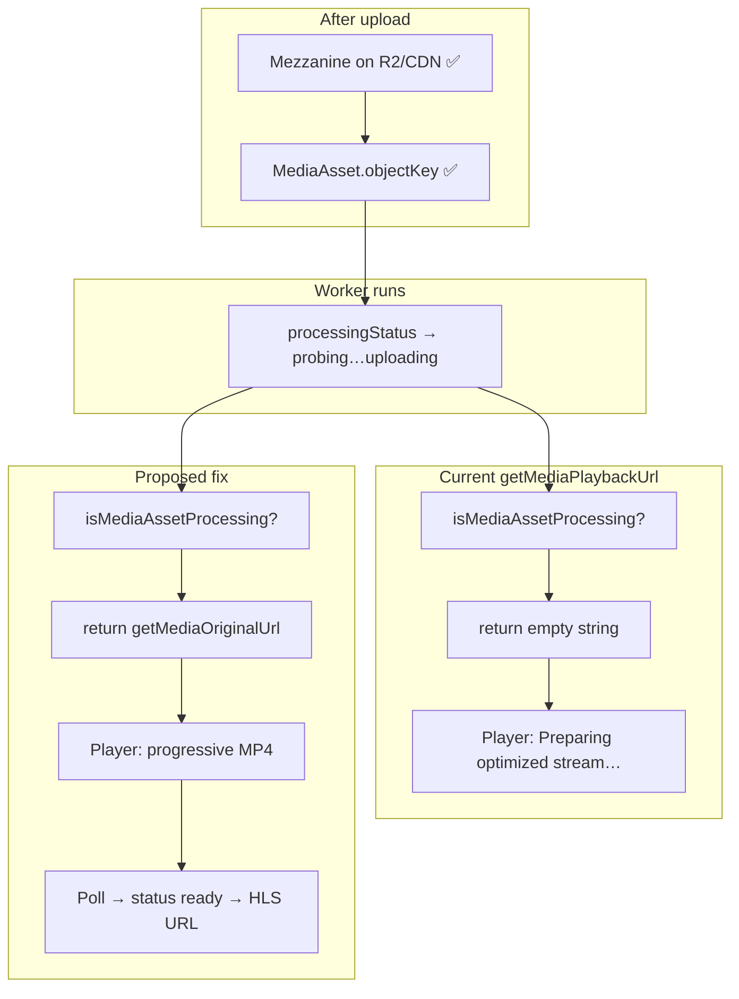

# R2 Playback — Processing Gap Trace

**Inspection date:** 2026-07-03  
**Target:** Original MP4 exists on R2/CDN after upload, but dashboard player may show **“Preparing optimized stream…”** because `getMediaPlaybackUrl()` returns `""` while HLS transcode is in progress.  
**Status:** **Resolved — manually verified (local dev, 2026-07-03)** — production transcode/playback not verified

**Verification:** Original MP4 playback works during active processing; HLS takeover works after `ready` status.

**Related:** `r2-playback-review-map.md`, `qa-001-finalizing-hang-trace.md`

---

## Executive summary

The processing gap is caused by an **explicit branch** in `getMediaPlaybackUrl()`:

```163:165:rendorax-frontend/utils/mediaAssets.ts
    if (isMediaAssetProcessing(asset)) {
      return "";
    }
```

When `MediaAsset.processingStatus` is any **active** pipeline state (`queued`, `probing`, `transcoding`, `uploading`), the function returns an empty string even though `objectKey` and the mezzanine CDN URL are already valid.

**Smallest safe fix:** In that branch, return `getMediaOriginalUrl(asset)` instead of `""` (single-function change in `utils/mediaAssets.ts`). Existing URL-sync effects already upgrade the player to HLS when `processingStatus` becomes `ready`.

---

## 1. `getMediaPlaybackUrl()`

### File path

`rendorax-frontend/utils/mediaAssets.ts` — lines ~117–173

### Supporting symbols (same file)

| Symbol | Purpose |
|--------|---------|
| `ACTIVE_PROCESSING_STATUSES` | `queued`, `probing`, `transcoding`, `uploading` |
| `isMediaAssetProcessing()` | `true` when `processingStatus` is in that set |
| `getMediaOriginalUrl()` | Mezzanine CDN URL from `objectKey` or stored `publicUrl` |
| `getNormalizedR2PublicBase()` | `NEXT_PUBLIC_R2_PUBLIC_URL` or `https://media.rendorax.com` |

### Current logic (decision tree)

Applies when `asset.mimeType?.startsWith("video/")`.

```
hasPipelineMetadata =
  playbackUrl != null
  OR playbackObjectKey != null
  OR playbackFormat != null
  OR processingStatus != null

IF video AND hasPipelineMetadata:
  IF processingStatus === "ready":
    → return playbackUrl (serialized) OR {cdnBase}/{playbackObjectKey}   [HLS .m3u8]
  IF isMediaAssetProcessing(asset):   // queued | probing | transcoding | uploading
    → return ""                                                      [GAP — blocks playback]
  IF processingStatus === "failed":
    → return getMediaOriginalUrl(asset)                              [CDN MP4/mezzanine]
ELSE (non-video OR no pipeline metadata):
  → return getMediaOriginalUrl(asset)                                [CDN MP4/mezzanine]
```

### When it returns CDN MP4 (mezzanine)

| Condition | Result |
|-----------|--------|
| Non-video asset | `getMediaOriginalUrl` |
| Video, **all** pipeline fields null (`processingStatus` null, no playback keys) | `getMediaOriginalUrl` — **common immediately after upload before worker touches asset** |
| Video, `processingStatus === "failed"` | `getMediaOriginalUrl` |
| Video, `processingStatus === "ready"` but HLS fields missing | Falls through active check; if not active → **not reached**; if ready without keys, returns nothing from ready block then hits active? No - ready block doesn't return if keys missing - would fall to active check or failed. Edge case. |

### When it returns HLS

| Condition | Result |
|-----------|--------|
| `processingStatus === "ready"` AND (`playbackUrl` OR `playbackObjectKey`) | HLS master URL on CDN |

Backend sets `playbackObjectKey`, `playbackFormat: "hls"`, `processingStatus: "ready"` in `runMediaTranscodeJob.ts` on success. `serializeMediaAsset()` adds `playbackUrl` when `ready` + `hls`.

### When it returns empty string `""`

| Condition | Result |
|-----------|--------|
| Video + `hasPipelineMetadata` + `isMediaAssetProcessing(asset)` === true | **`""`** — **this is the processing gap** |

**Exact blocking condition:**

```typescript
isVideo
&& (processingStatus != null || playbackUrl != null || playbackObjectKey != null || playbackFormat != null)
&& processingStatus ∈ { queued, probing, transcoding, uploading }
```

Once the transcode worker sets `processingStatus` to `"probing"` (first asset update), `hasPipelineMetadata` becomes true and playback is blocked until `"ready"`.

### Truth table (video assets)

| `processingStatus` | Worker state | `getMediaPlaybackUrl()` | User experience |
|--------------------|--------------|-------------------------|-----------------|
| `null` | Job queued in DB, worker not started | **Mezzanine CDN** | Can play original MP4 |
| `queued` | Rare on asset row; job row default | **`""`** if set on asset | Gap |
| `probing` | Worker started | **`""`** | Gap — “Preparing optimized stream…” |
| `transcoding` | FFmpeg running | **`""`** | Gap |
| `uploading` | Uploading HLS segments to R2 | **`""`** | Gap |
| `ready` | Complete | **HLS `.m3u8`** | Optimized stream |
| `failed` | Transcode failed | **Mezzanine CDN** | Fallback MP4 |

**Note:** `POST /api/media/assets` does **not** set `processingStatus` on create. Gap typically starts when `runMediaTranscodeJob` sets `probing` (~first worker tick after Redis/worker available).

---

## 2. Processing status logic

### Enum (Prisma)

`rendorax-backend/prisma/schema.prisma` — `MediaProcessingStatus`:

| Status | Meaning (asset row) |
|--------|---------------------|
| `queued` | Job created; worker may not have started |
| `probing` | FFprobe / metadata extraction |
| `transcoding` | FFmpeg HLS + proxy generation |
| `uploading` | Uploading derivative files to R2 |
| `ready` | **HLS ready for playback** |
| `failed` | Transcode failed |

### Which status means “HLS ready”

**`ready`** — with `playbackFormat === "hls"` and `playbackObjectKey` pointing at master playlist (e.g. `proxies/{assetId}/v1/master.m3u8`).

### Which status means “original MP4 exists but optimized stream not ready”

**All active statuses:** `queued`, `probing`, `transcoding`, `uploading`

Plus the **pre-worker window** where `processingStatus` is `null` but:

- `objectKey` is set (mezzanine on R2)
- `MediaProcessingJob` may exist with `status: queued`

In the `null` window, `hasPipelineMetadata` is false → **mezzanine plays today**. The gap appears once status becomes non-null active.

### Frontend active set

```117:122:rendorax-frontend/utils/mediaAssets.ts
const ACTIVE_PROCESSING_STATUSES = new Set([
  "queued",
  "probing",
  "transcoding",
  "uploading",
]);
```

Matches backend job progression (except asset may not get `queued` on row — worker jumps to `probing`).

### UI labels (badges)

`utils/mediaUploadStatus.ts` maps statuses to labels (“Queued”, “Extracting Metadata”, “Processing”, “Uploading Derivatives”, “Ready”). Badges still show during gap; they are independent of playback URL.

---

## 3. Player selection flow

### Cloud — `handleCloudAssetPreview`

**File:** `app/dashboard/page.tsx` ~931–959

```
getMediaPlaybackUrl(asset)  → may be ""
isMediaAssetProcessing(asset) → true during gap

if (!playbackUrl && !isProcessing) → console.error, return  // block
else → setPreviewFile({ url: playbackUrl, ... })            // allows url: ""
```

During processing, preview **opens with empty URL** (allowed intentionally).

### Cloud — `CloudAssetGallery.handleAssetPreview`

**File:** `components/dashboard/CloudAssetGallery.tsx` ~127–141

Same guard: allows preview when `isProcessing` even if `resolvedUrl === ""`.

### Vault — `handlePreview`

**File:** `app/dashboard/page.tsx` ~755–776

```
url = await getSignedUrl(fileName)  // fileUrls[name] from fetchFiles
if (!url) → console.error, return   // blocks preview
```

**File:** `hooks/useFileManager.ts` ~111–116

```
playbackUrl = getMediaPlaybackUrl(asset)
if (playbackUrl) { urlMap[item.name] = playbackUrl }  // skips empty string
```

**Vault asymmetry:** During active processing, `fileUrls` has **no entry** → `handlePreview` **fails silently** (console only). User cannot open preview from Vault bin at all during transcode.

### `previewPlaybackUrl`

**File:** `app/dashboard/page.tsx` ~131–138

```typescript
previewPlaybackUrl = sanitize(previewFile.url ?? previewFile.publicUrl ?? "")
```

If preview opened with `url: ""` → `previewPlaybackUrl === ""`.

### `StreamingVideoPlayer`

**File:** `components/dashboard/StreamingVideoPlayer.tsx`

| `src` | Behavior |
|-------|----------|
| Empty `sanitizedSrc` | `video.removeAttribute("src")`; buffering overlay label **“Preparing optimized stream…”** (line 329) |
| Non-empty CDN MP4 | `video.src = url`; progressive playback |
| `.m3u8` | Native HLS or `hls.js` |

```324:332:rendorax-frontend/components/dashboard/StreamingVideoPlayer.tsx
        {showLoadingOverlay && isBuffering && !hasError && (
          <LoadingOverlay
            label={
              sanitizedSrc
                ? loadingLabel
                : "Preparing optimized stream…"
            }
```

**The message is shown whenever `src` is empty**, not only when transcode is running — but in practice the gap ties empty `src` to active processing.

### URL upgrade when HLS becomes ready

**Cloud:** `CloudAssetGallery` effect ~108–125 — when `assets` poll updates and `getMediaPlaybackUrl` returns HLS URL, `setPreviewFile` updates `url`/`publicUrl`.

**Vault:** `page.tsx` effect ~1026–1043 — when `fileUrls` gains new URL after poll, syncs `previewFile`.

**Player remount:** `buildPreviewPlayerKey()` includes playback URL → MP4 → HLS switch remounts player (`utils/previewAssetKey.ts`).

---

## 4. Original MP4 fallback analysis

### Can the player safely use CDN MP4 while HLS is processing?

**Yes, technically:**

- Mezzanine is already uploaded to R2 before transcode runs.
- `StreamingVideoPlayer` supports progressive CDN URLs (`video.src = url`, `crossOrigin="anonymous"`).
- Same player path used for `failed` status and pre-pipeline assets today.

### Is `objectKey` available at that stage?

**Yes.** Set on `POST /api/media/assets` at upload finalization. Persists through all processing states. `getMediaOriginalUrl` builds:

```
{cdnBase}/{objectKey}   // e.g. https://media.rendorax.com/uploads/1730..._clip.mp4
```

Backend `serializeMediaAsset` also normalizes `publicUrl` from `objectKey` on every GET.

### Is MIME/type available?

**Yes.** `mimeType` stored at asset create (from browser `file.type` on upload). `getMediaPlaybackUrl` uses `mimeType?.startsWith("video/")` for pipeline branch.

### Is CDN URL valid?

**Yes** (user-confirmed R2 upload). URL is public CDN — not signed. Requires CORS + Range headers on bucket (already required for current `failed`/pre-pipeline playback).

### What changes if fallback is enabled

| Area | Before gap fix | After mezzanine fallback |
|------|----------------|--------------------------|
| Cloud preview during transcode | Empty `src`, spinner only | Plays original MP4 |
| Vault preview during transcode | Blocked (no `fileUrls`) | Would work via `fetchFiles` populating URL |
| Gallery thumbnails | May lack `playbackUrl` for poster | `AssetGridMedia` could show metadata frame from mezzanine |
| When `ready` | HLS via sync effect | Same — URL updates, player remounts |

---

## 5. Risk analysis

### Could MP4 fallback break HLS playback later?

| Risk | Level | Mitigation already in code |
|------|-------|----------------------------|
| Player stuck on MP4 after HLS ready | **Low** | `buildPreviewPlayerKey` includes URL; cloud/vault sync effects push HLS URL into `previewFile` on poll |
| Wrong URL precedence when `ready` | **Low** | `ready` branch runs **before** active branch; HLS still preferred when status is `ready` |
| hls.js vs MP4 race on transition | **Low** | `remountKey` change destroys prior instance |

### Could it cause huge file playback issues?

| Risk | Level | Notes |
|------|-------|-------|
| High bandwidth / slow start on large mezzanine | **Medium** | Expected — user trades instant review vs optimized HLS; same as today for failed/null-status assets |
| Browser memory on very large MP4 | **Low–Medium** | Progressive play; not new risk vs playing mezzanine before worker starts |
| Mobile data usage | **Medium** | Product/UX consideration, not a regression |

### Could it affect comments/timestamps?

| Risk | Level | Notes |
|------|-------|-------|
| Timestamp drift MP4 → HLS | **Low** | Comments stored as `time_stamp` seconds on `videoRef`; seek uses same element; remount resets position — user may need to re-seek after HLS swap |
| Comment key / file name | **None** | Unaffected by URL type |
| `jumpToTime` / socket sync | **None** | Uses `videoRef.currentTime` |

### Could it affect download/signed URL logic?

| Risk | Level | Notes |
|------|-------|-------|
| Download path | **None** | `utils/assetDownload.ts` uses `objectKey` + `GET /api/storage/r2/download` — independent of `getMediaPlaybackUrl` |
| Share link | **None** | Uses public CDN URL from asset |

### Processing badge accuracy

| Risk | Level | Notes |
|------|-------|-------|
| User plays MP4 while badge says “Processing” | **Low** | Correct — still processing; badge remains truthful |

---

## 6. Minimal safe fix proposal

### Recommended change (single location)

**File:** `rendorax-frontend/utils/mediaAssets.ts`  
**Function:** `getMediaPlaybackUrl`

**Replace:**

```typescript
if (isMediaAssetProcessing(asset)) {
  return "";
}
```

**With:**

```typescript
if (isMediaAssetProcessing(asset)) {
  return getMediaOriginalUrl(asset);
}
```

### Why this is smallest

- One branch, ~1 line effective change.
- No UI/design changes.
- No new API routes or env flags.
- Fixes Cloud empty-`src` gap **and** Vault `fileUrls` omission (downstream of same function).
- Preserves HLS preference when `processingStatus === "ready"`.
- Preserves existing `failed` → mezzanine behavior.
- Existing poll + URL sync effects handle MP4 → HLS transition without further edits.

### Optional hardening (not required for minimal fix)

| Addition | Purpose |
|----------|---------|
| Guard: only fallback if `objectKey` or `publicUrl` present | Avoid empty mezzanine URL; `getMediaOriginalUrl` may return `""` if both missing |
| Unit tests for `getMediaPlaybackUrl` status matrix | Prevent regression |

### Feature flag vs status-based?

**Recommend status-based only** — no feature flag.

- Behavior is already status-driven; the empty string is the anomaly.
- Flag adds config surface without clear rollback need.
- When `ready`, HLS path unchanged.

### Files that do **not** need changes (if only `getMediaPlaybackUrl` is fixed)

| File | Reason |
|------|--------|
| `StreamingVideoPlayer.tsx` | Already plays any non-empty `src` |
| `handleCloudAssetPreview` | Already allows processing preview |
| `handlePreview` | Will work once `fileUrls` populated |
| Backend / Prisma | No schema change |

### Alternative fixes (larger scope — not minimal)

| Approach | Scope | Why larger |
|----------|-------|------------|
| Set `processingStatus` only when HLS available | Backend | Changes pipeline semantics |
| Separate `getMediaReviewUrl` vs `getMediaPlaybackUrl` | Multiple call sites | Duplication |
| Player-level fallback | `StreamingVideoPlayer` | Misses vault `fileUrls` / gallery thumbnails |
| Feature flag `ENABLE_MEZZANINE_DURING_PROCESSING` | Env + branch | Unnecessary |

---

## Flow diagram (current vs proposed)



---

## Regression test steps (post-implementation)

### P0 — Processing gap closed

1. Upload video → confirm mezzanine on R2.
2. Before transcode completes (`processingStatus` active in API response):
   - **Cloud:** Select video → player **plays MP4** from CDN (not infinite “Preparing optimized stream…”).
   - **Vault:** Select same asset → preview **opens and plays** (no console “missing playback URL”).
3. DevTools: `<video>` or network shows request to `media.rendorax.com/uploads/...mp4` (not `.m3u8`).

### P1 — HLS still preferred when ready

4. Wait for `processingStatus: ready` (worker + Redis running).
5. Without re-selecting asset (or after poll ≤8s), player should switch to **`.m3u8`** (check `previewPlayerKey` / network).
6. Playback continues or remounts cleanly; no permanent MP4 lock-in.

### P2 — Unchanged paths

7. **Failed** transcode asset → still plays mezzanine.
8. **New upload** with `processingStatus: null` (worker not started) → still plays mezzanine (no regression).
9. **Image** asset → unchanged preview.
10. **Download** cloud asset → presigned download still works.

### P3 — Comments / review

11. Add comment during MP4 fallback playback → timestamp saved.
12. After HLS ready, add second comment → both retrievable.
13. `jumpToTime` works on MP4 playback.

---

## Approval gate

| Step | Status |
|------|--------|
| Inspection | ✅ Complete |
| Root cause | `getMediaPlaybackUrl` returned `""` for active processing |
| Minimal fix identified | ✅ `getMediaOriginalUrl` fallback in active branch |
| Implementation | ✅ **Done** — `rendorax-frontend/utils/mediaAssets.ts` (2026-07-03) |
| Manual verification | ✅ **Resolved — manually verified (local, 2026-07-03)** |
| Production transcode | Not verified in this pass |

### Manual verification (local, 2026-07-03)

- Original MP4 playback works during active processing (`queued` / `probing` / `transcoding` / `uploading`).
- HLS takeover works after `processingStatus` becomes `ready`.

### Implementation diff

**File:** `rendorax-frontend/utils/mediaAssets.ts` — `getMediaPlaybackUrl()`

```diff
     if (isMediaAssetProcessing(asset)) {
-      return "";
+      return getMediaOriginalUrl(asset);
     }
```

**Unchanged:** `ready` → HLS branch; `failed` → mezzanine; non-video → `getMediaOriginalUrl`; download/signed URL paths.
