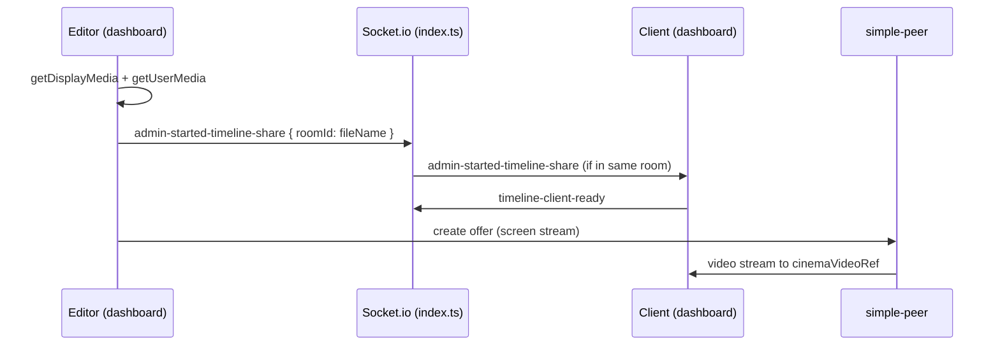

# Review Collaboration Layer — Full Inspection Map

**Created:** 2026-07-03  
**Updated:** 2026-07-03 (compiledNotes verified; AI roadmap added)  
**Type:** Inspection map + living roadmap (docs only unless noted)  
**Branch context:** `monorepo-stabilization-2026-07-03` (commit `402e2cb`)

**Stabilized (local, manually verified 2026-07-03):** Auth, Upload, R2 playback, Comments, Review session notify (summary + **compiledNotes** on Compile & Send), Compare workflow, Reviewer identity/avatar.

**Architecture preserved:** Next.js dashboard structure, Supabase auth + legacy tables, R2/Prisma media pipeline, Express + Socket.io backend on port 4000.

---

## Executive summary

| # | Feature area | Status (local) | Status (production) | Risk |
|---|--------------|----------------|---------------------|------|
| 1 | Client team invitation / participation | **Missing** | **Unknown** | High |
| 2 | Live meeting / preview session | **Partial** | **Unknown** | Medium |
| 3 | Live video call + chat + translation | **Partial** | **Unknown** | High |
| 4 | Admin team management | **Partial** (API only) | **Unknown** | High |
| 5 | Feedback routing | **Partial** (compiledNotes **resolved** local) | **Unknown** | Medium |
| 6 | Feedback incorporation / status / report | **Partial** | **Unknown** | Medium |
| 7 | Editing timeline sharing | **Broken / Partial** | **Unknown** | High |
| 8 | AI Quality Check & suggestions | **Missing** | **Unknown** | Medium |

**Cross-cutting blockers**

- No client-side team invite flow; multi-reviewer works only if multiple Supabase accounts can access the same asset namespace (`file_name` on comments).
- Three parallel realtime stacks: `useLiveComments` socket, `GlobalLiveWidget` socket, timeline WebRTC — weak room coupling and duplicate connections on `/dashboard`.
- Agency roles limited to `admin` | `editor` | `client`; specialty roles (colorist, VFX, audio, reviewer) **not modeled**.
- ~~`compiledNotes` stripped by `/api/notify`~~ **Resolved (local, 2026-07-03)** — see `compiled-notes-notify-trace.md`; per-person/department routing still missing.
- Orphan `rendorax-backend/websocket/server.ts` (port 3001, Redis adapter, `video_${fileId}` rooms) is **not** started by `index.ts` — legacy drift vs active server.

---

## 1. Client team invitation / participation

### Answers

| Question | Finding |
|----------|---------|
| How can a client invite/add team members? | **They cannot** in-app. No invite UI, API, or email flow for client orgs. |
| Existing UI/API for client-side team invite? | **None** found in `rendorax-frontend/` or `rendorax-backend/`. |
| Can multiple client reviewers join same project/session? | **Partially** — multiple authenticated users can comment on the same `file_name` (Supabase RLS: all authenticated users can `SELECT` all comments). No project membership or invite token. Live session uses a single global room (`global-lobby`), not per-client project. |
| Roles for client team members? | Supabase `app_metadata.role`: effectively `client` (default for non-admin/editor). No sub-roles (e.g. client PM vs client reviewer). |

### Current status: **Missing** (invite) / **Partial** (multi-reviewer via shared asset key)

| Layer | Detail |
|-------|--------|
| **Files** | `rendorax-frontend/app/access/page.tsx` (login only, no signup/invite), `rendorax-frontend/hooks/useLiveComments.ts`, `supabase-p0-legacy-review-tables.sql`, `comment-author-avatar-plan.md` |
| **Data models** | `video_comments` (`file_name`, `user_id`, `time_stamp`, `author_display_name`, `author_avatar_url`) — no `project_id` or `team_id` |
| **API routes** | None for invites |
| **UI entry points** | `/access` — password login only; `/dashboard` — comments panel (any authenticated user with vault access) |
| **Blockers** | No org/project membership model tied to Supabase auth; admin client list is storage-folder names, not auth users |
| **Risk** | **High** — clients cannot self-serve team expansion; compliance/audit of “who reviewed” is per-comment `user_id` only |
| **Minimal safe next step** | Document intended client-team model (invite link vs shared vault account); do **not** wire UI until schema approved |
| **Implementation order** | After §4 admin team model; before §2 live session per-project rooms |

---

## 2. Live meeting / preview session

### Answers

| Question | Finding |
|----------|---------|
| Feature implemented? | **Partial** — floating live session widget + optional screen-share “cinema mode” on dashboard. |
| Controlling files/APIs | `GlobalLiveWidget.tsx`, `LiveSessionWidget.tsx`, `LiveSessionToolbar.tsx`, `dashboard/page.tsx` (screen share), `rendorax-backend/index.ts` (Socket.io) |
| How does a user join? | Log in → bottom-left **Start Live Session** (`GlobalLiveWidget`) → join call in `LiveSessionWidget` (`join-call` with `roomId="global-lobby"`). Screen-share viewers: must be on `/dashboard` with same Socket.io video room as editor (`previewFile.name` via `join-video-room`). |
| Session link sharing? | **No** — no shareable URL, token, or deep link. |
| Admin/editor/client roles? | **Partial** — `isEditor` from `app_metadata.role` ∈ `{admin, editor}` controls “Go Live (Screen Share)” in `DashboardHeader`. Live call room is **not** role-scoped; all logged-in users share `global-lobby`. |

### Current status: **Partial**

| Layer | Detail |
|-------|--------|
| **Files** | `rendorax-frontend/components/GlobalLiveWidget.tsx`, `LiveSessionWidget.tsx`, `components/dashboard/LiveSessionToolbar.tsx`, `app/layout.tsx` (global mount), `components/VaultSidebar.tsx` (embedded `GlobalLiveWidget`), `app/dashboard/page.tsx`, `store/useGlobalStore.ts`, `store/useDashboardStore.ts`, `rendorax-backend/index.ts` |
| **Data models** | None persisted (ephemeral Socket.io rooms) |
| **API routes** | None — WebSocket only (`NEXT_PUBLIC_BACKEND_URL`, default `http://localhost:4000`) |
| **UI entry points** | Global fixed widget (all pages except dashboard desktop sidebar embed); dashboard header **Go Live (Screen Share)** for editors |
| **Blockers** | Duplicate `GlobalLiveWidget` on dashboard (`layout.tsx` + `VaultSidebar.tsx`) → duplicate Socket.io connections; live call room is global, not per asset/project; no invite/deep link; production requires `NEXT_PUBLIC_BACKEND_URL` + backend reachable |
| **Risk** | **Medium** — works in controlled local setup; fragile in multi-user / production without TURN and env alignment |
| **Minimal safe next step** | Deduplicate `GlobalLiveWidget` mount on `/dashboard` (inspection-only recommendation: single mount point) |
| **Implementation order** | After env/backend deploy verification; before per-project room redesign |

---

## 3. Live video call + live chat + local language translation

### Answers

| Question | Finding |
|----------|---------|
| Features in code? | **Yes** — WebRTC (`simple-peer`), Socket.io signaling, live chat, Gemini text translation, OpenAI Realtime audio multiplexer (backend). |
| WebRTC / Socket.io / translation files | See table below |
| Status | **Partial / not fully wired** — code paths exist; regression history (`match_log.txt`, June 2026 multilingual update); several events never emitted from UI |
| “Zero latency”? | **Not realistic** — comments in code say “zero-latency voice talkback”; actual path is WebRTC + STUN (+ optional TURN) + Gemini/OpenAI round-trips → **low-latency** at best |
| Required env/services | See env table |

### Component / file map

| Concern | Files | Status |
|---------|-------|--------|
| WebRTC peers | `LiveSessionWidget.tsx`, `dashboard/page.tsx` (timeline screen share), `utils/webrtcConfig.ts` | Partial |
| Socket.io server | `rendorax-backend/index.ts` | Working (local) if backend up |
| Orphan WS server | `rendorax-backend/websocket/server.ts` | **Not wired** — different room prefix (`video_${fileId}`), port 3001, Redis adapter |
| Live chat | `LiveSessionWidget.tsx` → `send-chat-message` / `receive-chat-message` | Partial — room `call_global-lobby` |
| Chat translation (client) | `utils/translateLiveChatMessage.ts` | Partial |
| Mic → Gemini (client STT) | `hooks/useLiveMicTranslation.ts` → `translate-speech` | Partial — client-only STT path |
| Gemini server translate | `index.ts` `translateWithGemini` → `receive-translated-speech` | Partial — **`io.emit` broadcasts globally**, not room-scoped |
| OpenAI Realtime mux | `index.ts` `audio-chunk`, `getOrInitOpenAIConnection` | Partial — needs `OPENAI_API_KEY`; backend `.env` shows placeholder |
| Timeline TTS/subtitles | `TimelineShareWidget.tsx` | Partial — editor hears `receive-translated-speech` |
| Video sync (play/pause/seek) | `useLiveComments.ts` listeners; `jumpToTime` emits seek/play only | **Partial** — `handleTogglePlay` in `page.tsx` does **not** emit `video-play` / `video-pause` |

### Environment / services (local vs production)

| Variable | Where | Purpose | Local | Production |
|----------|-------|---------|-------|------------|
| `NEXT_PUBLIC_BACKEND_URL` | frontend | Socket.io client | `http://localhost:4000` | Must point to deployed backend |
| `OPENAI_API_KEY` | backend | Realtime audio translation WS | Placeholder in `.env` | Required for audio mux |
| `GEMINI_API_KEY` | backend (+ frontend `.env.local`) | `translate-speech`, chat | Present locally | Required |
| `NEXT_PUBLIC_TURN_*` | frontend | NAT traversal for WebRTC | Optional | Recommended for production |
| `REDIS_URL` | backend | Only orphan `websocket/server.ts` | In `.env.example` | Not used by active `index.ts` |
| Backend process | — | Socket.io on PORT 4000 | `npm run dev` in backend | Separate deploy from Vercel frontend |

### Current status: **Partial**

| **Blockers** | Historical regression after multilingual/Zustand work; global `translate-speech` broadcast; OpenAI key often unset; dual socket clients; no E2E proof in this inspection pass |
| **Risk** | **High** — marketing claims vs actual latency; production WebRTC often fails without TURN |
| **Minimal safe next step** | Verify one path end-to-end locally: join live session → send chat → confirm `receive-chat-message`; document pass/fail |
| **Implementation order** | ~~Fix `compiledNotes`/notify first~~ **Done (local)**; then scope translation broadcasts to rooms; then TURN + production backend |

---

## 4. Admin team management

### Answers

| Question | Finding |
|----------|---------|
| How admin adds internal team? | **No in-app UI.** Today: create Supabase auth users + set `app_metadata.role` manually (SQL/dashboard). Admin portal lists **storage folders** in `client-vault`, not Prisma `User` records. |
| Roles: editor, colorist, gfx/vfx, audio, reviewer, client | **Only** `admin`, `editor`, `client` in Prisma `AgencyRole` and `mapSupabaseRoleToAgencyRole()`. Specialty roles **missing**. |
| User/team/project models | Prisma: `User`, `AgencyProject`, `Task` (`TaskStatus`: todo, in_progress, in_review, done). Legacy Supabase: `user_roles` listed in `prisma.config.ts` but **unused in app code**. |
| Prisma User seeding required? | **No seed file.** `ensureAgencyUser()` upserts on first authenticated agency API call. Empty `User` table until someone hits `/api/agency/*`. |

### Current status: **Partial** (backend API) / **Missing** (UI + specialty roles)

| Layer | Detail |
|-------|--------|
| **Files** | `rendorax-backend/prisma/schema.prisma`, `src/routes/agency.routes.ts`, `src/lib/agencyUsers.ts`, `src/middleware/requireAuth.ts`, `rendorax-frontend/utils/agencyBackend.ts`, `app/api/agency/projects/route.ts`, `app/api/agency/tasks/route.ts`, `app/admin/page.tsx` (legacy Supabase only) |
| **Data models** | `User`, `AgencyProject`, `Task`; Supabase `auth.users` + `app_metadata.role` |
| **API routes** | Backend: `POST /api/agency/projects`, `POST /api/agency/tasks`, `GET /api/agency/tasks` (role-filtered). Frontend proxy: `POST /api/agency/projects`, `GET|POST /api/agency/tasks`. **No** `GET /projects`, **no** user CRUD, **no** invite |
| **UI entry points** | `/admin` — client vault folders, status, invoices, comment read-only; **no** agency team UI |
| **Blockers** | Admin portal not connected to agency models; no role granularity; clients discovered via storage not auth |
| **Risk** | **High** — agency API is dead code from UX perspective |
| **Minimal safe next step** | Manual test: authenticated admin `POST /api/agency/tasks` via proxy; confirm `User` row created |
| **Implementation order** | **First** among collaboration gaps — defines roles before client invite and feedback routing |

---

## 5. Feedback routing

### Answers

| Question | Finding |
|----------|---------|
| Do client comments reach the responsible person? | **No per-person routing** — all notifications go to fixed `CONTACT_EMAIL` (+ optional Discord). No assignee, department, or editor mapping. |
| Task ownership? | Prisma `Task.assigneeId` exists but is **not** linked to `video_comments` or notify flow. |
| Routed by department/person? | **No** |
| Does Notify Team include timestamped notes? | **No** — `handleNotifyTeam` sends `fileName` + `totalComments` only (summary alert). |
| Does Compile & Send include timestamped notes in email/Discord? | **Yes (local verified 2026-07-03)** — `handleCompileAndSend` builds `compiledNotes`; `/api/notify` accepts optional field; email **Feedback Notes** + Discord **📝 Compiled Notes** (truncated at 1000 chars). Format: `[M:SS] Author: text`. |
| `compiledNotes` in API body? | **Resolved** — `reviewSchema` includes optional `compiledNotes`; HTML-escaped in email. Report: `compiled-notes-notify-trace.md`. |

### Current status: **Partial** (delivery resolved; routing not)

| Layer | Detail |
|-------|--------|
| **Files** | `hooks/useLiveComments.ts` (`handleNotifyTeam`, `handleCompileAndSend`, `formatCompiledNoteLine`), `components/CommentsPanel.tsx`, `app/api/notify/route.ts`, `utils/contactEmail.ts` |
| **Data models** | `video_comments` (source of truth for notes); no routing table |
| **API routes** | `POST /api/notify` (auth required; Resend + Discord) |
| **UI entry points** | Comments panel **Notify Team** (summary); preview toolbar **Send** (compiled notes); **Report** (client `.txt` only) |
| **Blockers** | Single inbox; no link to agency tasks or specialty roles; production notify not re-tested |
| **Risk** | **Low** for compiled delivery; **Medium** for ops routing at scale |
| **Minimal safe next step** | Production verify Resend/Discord with `compiledNotes`; then design assignee routing via `Task` + agency roles |
| **Implementation order** | compiledNotes **done**; next: agency task linkage or per-editor notify |

---

## 6. Feedback incorporation / status / report

### Answers

| Question | Finding |
|----------|---------|
| Workflow: received → assigned → in progress → incorporated → ready for review → approved | **Not implemented** for individual comments. Admin **project** status dropdown uses different labels (e.g. “Offline Edit”, “Ready for Review”) — client-level, not per-comment. |
| Status stored in DB? | **Project-level:** `project_status` (Supabase) — **P1 table, not created in new Supabase project** (per checklist). **Task-level:** Prisma `Task.status` — unused by dashboard. **Comment-level:** no status column on `video_comments`. |
| Report generation implemented? | **Partial** — client-side `.txt` download (`handleDownloadReport`); Compile & Send delivers compiled text via email/Discord (**local verified**); no PDF/server report |
| Files/tables | See below |

### Status label comparison

| Desired feedback state | Exists? | Where |
|------------------------|---------|-------|
| received | No | — |
| assigned | Partial | `Task.status` = `todo` (agency only) |
| in progress | Partial | `Task.status` = `in_progress`; admin `project_status` strings |
| incorporated | No | — |
| ready for review | Partial | Admin status option “Ready for Review” |
| approved | No | — |

### Current status: **Partial**

| Layer | Detail |
|-------|--------|
| **Files** | `app/admin/page.tsx`, `hooks/useLiveComments.ts`, `app/api/notify/route.ts`, `legacy-supabase-tables-migration-plan.md` |
| **Data models** | `video_comments`, `project_status`, `project_status_details`, `client_invoices` (P1), `Task`, `AgencyProject` |
| **API routes** | Supabase direct from admin UI; `POST /api/notify` for session summary |
| **UI entry points** | `/admin` status dropdown; dashboard **Report** / **Send** |
| **Blockers** | P1 Supabase tables missing in new project; no comment workflow; agency tasks disconnected |
| **Risk** | **Medium** |
| **Minimal safe next step** | Apply P1 SQL per `legacy-supabase-tables-migration-plan.md`; verify admin status save |
| **Implementation order** | Apply P1 SQL; then comment status column + UI; compiledNotes delivery **done** |

---

## 7. Editing timeline sharing

### Answers

| Question | Finding |
|----------|---------|
| Feature existed / now broken? | **Partial / Broken** — code present; `match_log.txt` documents June 2026 regression after multilingual update; not re-verified in this stabilization pass. |
| Code / APIs | Screen capture + WebRTC in `dashboard/page.tsx`; signaling in `index.ts`; display in `TimelineShareWidget.tsx` |
| Why broken / unwired? | Multiple causes (code inspection): (1) clients must share Socket.io room `previewFile.name` — same asset open; (2) `admin-started-timeline-share` relay uses `socket.to(roomId)` — viewers not in room miss event; (3) separate sockets (`useLiveComments` vs `GlobalLiveWidget`); (4) orphan `websocket/server.ts` uses different room naming; (5) editor local preview uses `cinemaVideoRef` self-view, clients need WebRTC peer path |
| Editors share timeline with clients/team? | **Intended** via **Go Live (Screen Share)** — shares display capture, not NLE timeline state / EDL |
| Timestamped comments on timeline markers? | **Partial** — comments have `time_stamp`; `jumpToTime` seeks player + emits socket seek/play; no visual markers on shared cinema stream; no sync of comment pins across users except via shared comment list |

### Flow (as implemented)

### Current status: **Broken / Partial**

| Layer | Detail |
|-------|--------|
| **Files** | `app/dashboard/page.tsx` (`startScreenShare`, `stopScreenShare`, WebRTC effect), `TimelineShareWidget.tsx`, `DashboardHeader.tsx`, `rendorax-backend/index.ts`, `utils/webrtcConfig.ts`, `rendorax-backend/match_log.txt` (regression context) |
| **Data models** | None (streaming only) |
| **API routes** | Socket events: `admin-started-timeline-share`, `admin-stopped-timeline-share`, `timeline-client-ready`, `timeline-webrtc-offer`, `timeline-webrtc-answer`, `timeline-user-disconnected` |
| **UI entry points** | Dashboard header **Go Live (Screen Share)** (editor only); full-workspace swap to `TimelineShareWidget` when `isLiveStreaming` |
| **Blockers** | Room coupling to `previewFile.name`; no session link; WebRTC/TURN; duplicate widgets; not production-tested |
| **Risk** | **High** |
| **Minimal safe next step** | Local two-browser test checklist: same asset selected both sides → editor Go Live → client sees cinema mode |
| **Implementation order** | After live session dedupe + env; consider explicit “join review room” UI |

---

## Recommended implementation order

| Priority | Item | Rationale | Depends on | Status |
|----------|------|-----------|------------|--------|
| ~~1~~ | ~~Fix `compiledNotes` in `/api/notify`~~ | ~~Unblocks real feedback delivery~~ | None | **Done — manually verified (local, 2026-07-03)** |
| 1 | Apply Supabase P1 tables (`project_status`, etc.) | Unblocks admin HQ in new project | SQL approval | Pending |
| 2 | Deduplicate `GlobalLiveWidget` on dashboard | Reduces socket confusion | None | Pending |
| 3 | Agency team UI + role expansion design | Foundation for routing and invites | Product decision | Pending |
| 4 | Client team invite flow | Requires membership model | §4 | Pending |
| 5 | Per-asset or per-project live rooms + share links | Fixes global-lobby limitation | §4, backend deploy | Pending |
| 6 | Timeline sharing hardening + TURN | High effort; needs E2E proof | §7 | Pending |
| 7 | Comment workflow states + task linkage | Full incorporation pipeline | §4, §5 | Pending |
| 8 | Scope translation broadcasts to rooms | Privacy + correctness | §3 stable | Pending |
| 9 | Retire or merge `websocket/server.ts` | Remove dead drift | Architecture decision | Pending |
| 10 | AI Quality Check & suggestions (§8) | Post-production QA assist | Media pipeline stable | **Not started** |

---

## Local vs production verification matrix

| Feature | Local dev (2026-07-03) | Production |
|---------|------------------------|------------|
| Comments + author | Verified | Pending §14 checklist |
| Review notify — Notify Team (summary) | Verified | Pending |
| Review notify — Compile & Send (`compiledNotes`) | **Resolved — manually verified** | Pending |
| Live session / WebRTC | Not verified this pass | Pending |
| Timeline screen share | Not verified this pass; regression reported Jun 2026 | Pending |
| Agency API | Not verified this pass | Pending |
| Admin `project_status` | Blocked if P1 tables missing | Pending |
| AI Quality Check | Not implemented | Pending |

---

## Related documents

- `rendorax-project-checklist.md` — §14 production verification
- `compiled-notes-notify-trace.md` — compiledNotes inspection, fix, local verification
- `comment-review-workflow-map.md` — comment + socket detail
- `legacy-supabase-tables-migration-plan.md` — P0/P1 SQL
- `comment-author-avatar-plan.md` — multi-reviewer identity
- `compare-workflow-regression-report.md` — stabilized compare (local)
- `AI_TEAM_PROTOCOL.md` — inspection → report → approval → implement

---

## 8. AI Quality Check & Improvement Suggestions — Roadmap

**Status:** **Missing** (no dedicated feature in codebase). **Not** part of stabilized local QA (2026-07-03).

**Related existing AI surface (general chat only):**

| Piece | Path | Role today |
|-------|------|------------|
| Marketing / vault chatbot | `components/ChatbotWidget.tsx` | User Q&A; not tied to `MediaAsset` or review |
| Chat API | `app/api/chat/route.ts` | Gemini `gemini-2.5-flash`; auth required; multilingual system prompt |
| Translation (live) | `app/api/translate-text/route.ts`, backend `translateWithGemini` | Live session / chat — not quality analysis |
| Media metadata | Prisma `MediaAsset` + `MediaProcessingJob` | Duration, resolution, processing status — no AI scoring |

### Product goal

Automated **broadcast post-production quality signals** and **actionable improvement suggestions** on uploaded or ready-for-review assets — adjacent to the comment/review workflow, without replacing human client notes.

### Proposed phases (inspection → approval → implement per `AI_TEAM_PROTOCOL.md`)

| Phase | Scope | Deliverable | Risk |
|-------|--------|-------------|------|
| **P0 — Design** | Define check categories (e.g. loudness/LUFS bands, black frames, resolution/bitrate vs delivery spec, duration sanity, audio silence gaps) | Written spec + pass/fail thresholds | Low |
| **P1 — Backend job** | After `MediaAsset` reaches `ready` (or on-demand), run FFmpeg probe + optional Gemini vision/audio summary on proxy/HLS | `POST /api/media/:id/quality-check` or BullMQ worker hook | Medium |
| **P2 — Persistence** | Store results (new Prisma table e.g. `MediaQualityReport` or Supabase legacy table — **schema decision required**) | `assetId`, `score`, `checks[]`, `suggestions[]`, `createdAt` | Medium |
| **P3 — Dashboard UI** | Panel in `/dashboard` preview toolbar or sidebar: **Quality** tab with badges + expandable suggestions | Read-only first; no auto-comments | Low |
| **P4 — Notify enrichment** | Optional appendix in `compiledNotes` or separate admin alert: “AI flagged 2 issues” | Extends `/api/notify` or admin only | Low |
| **P5 — Client-facing copy** | Toggle: show/hide AI suggestions to client reviewers | Policy + `app_metadata.role` | Medium |

### Suggested check categories (initial)

1. **Technical** — resolution, frame rate, codec, duration vs brief (if `project_status_details` exists).
2. **Audio** — reuse `useLUFSMeter` patterns; flag extreme LUFS or clipping (probe-based).
3. **Visual** — black frames / freeze detection (FFmpeg `blackdetect`, `freezedetect`).
4. **Delivery** — compare against Rendorax delivery checklist (`app/checklist/page.tsx` content as rules source).
5. **Narrative (LLM)** — Gemini summary: “potential issues for client review” from transcript/keyframes — **never** auto-publish as client comments without editor approval.

### Files likely touched (future implementation)

| Layer | Candidates |
|-------|------------|
| Backend | `rendorax-backend/src/routes/media.routes.ts`, new `qualityCheck.worker.ts`, `src/lib/ffmpegProbe.ts` (or extend transcode worker) |
| Prisma | New `MediaQualityReport` model (preferred) or external Supabase table |
| Frontend | `app/dashboard/page.tsx`, new `components/dashboard/QualityCheckPanel.tsx`, `utils/mediaAssets.ts` |
| API | `app/api/media/quality-check/route.ts` (proxy) or extend existing media routes |
| Env | `GEMINI_API_KEY` (already used); FFmpeg on backend host |

### Dependencies

- R2 playback + processing pipeline **stable locally** (verified 2026-07-03).
- Backend deployed with FFmpeg for production checks.
- P1 admin tables optional for brief-aware checks.
- **Does not block** collaboration items §1–§7; recommended **after** P1 admin tables + production media verify.

### Minimal safe next step

Write a one-page **AI Quality Check spec** (thresholds + UX mock, no code) → team approval → P1 backend probe-only job returning JSON (no UI).

### Implementation order placement

Priority **10** in table above — after core collaboration routing and production verification (§14).

---

*End of collaboration layer map. Last doc update: 2026-07-03. `compiledNotes` notify: **Resolved — manually verified (local)**. Production verification pending.*
