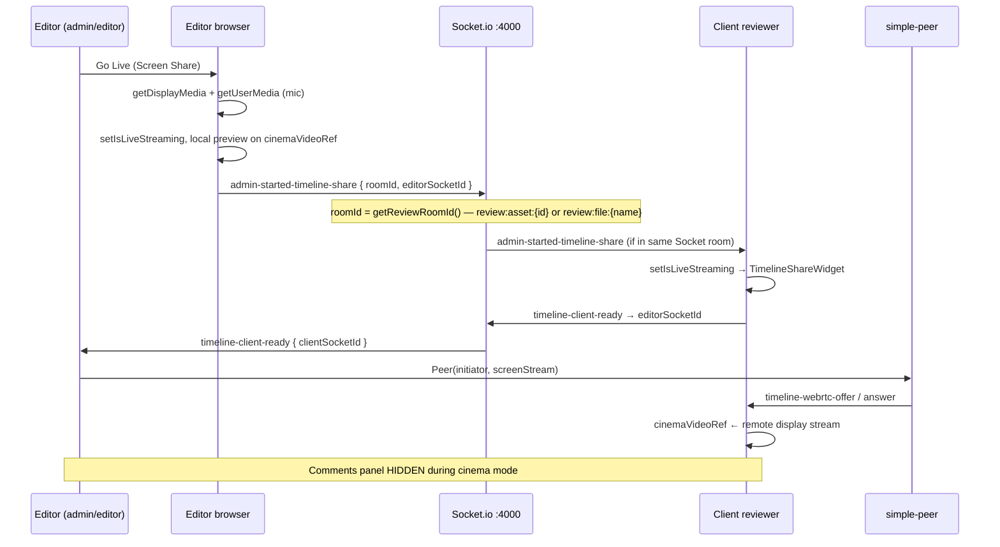

# Timeline Sharing Regression — Inspection Report

**Created:** 2026-07-03  
**Type:** Inspection + Phase 1 update (2026-07-04)  
**Branch:** `monorepo-stabilization-2026-07-03`  
**Related:** `review-collaboration-layer-map.md` §7, `rendorax-backend/match_log.txt`

---

## Executive summary

| Question | Answer (code evidence) |
|----------|------------------------|
| What did timeline sharing originally do? | **Over-the-shoulder (OTS) screen capture** of the editor’s display (NLE/desktop), not serialized NLE timeline/EDL state. Branded **“Cinema Mode: Live Editing Share”** in `TimelineShareWidget.tsx`. |
| How was it designed? | Editor (`admin`/`editor`) clicks **Go Live (Screen Share)** → `getDisplayMedia` + optional mic → Socket.io `admin-started-timeline-share` → clients in same video room swap UI to `TimelineShareWidget` → WebRTC (`simple-peer`) delivers screen stream to `cinemaVideoRef`. |
| Why it stopped working reliably? | **No single root cause in repo** — multiple **architectural fragilities** plus a **documented June 2026 regression** after the multilingual/Zustand/OpenAI multiplexer work (`match_log.txt`). Not re-verified in the 2026-07-03 stabilization pass. |
| What still exists? | Full UI + signaling + WebRTC path in `page.tsx`, `TimelineShareWidget.tsx`, `index.ts` (port 4000). |
| What is missing/broken? | Room coupling, playhead sync not wired from controls, cinema mode **hides comments UI**, no session links, orphan `websocket/server.ts` (port 3001) with **different room naming**, no automated tests (E2E skipped). *(Dashboard scrubber comment markers — **resolved** 2026-07-03; live cinema share unchanged.)* |
| Safest restoration path | **Phase 1:** fix join-room contract + two-browser local proof without redesign. **Phase 2:** playhead sync + TURN. **Phase 3:** review rooms. *(Scrubber marker UI — done; see `timeline-comment-markers-plan.md`.)* |

**Local status:** **Phase 1 stabilized — pending two-browser manual verify (local, 2026-07-04)**. OTS code + unified room helper (`utils/reviewRoom.ts`). See `timeline-sharing-restoration-blueprint.md`.  
**Dashboard scrubber comment markers:** **Resolved — manually verified (local, 2026-07-03)** — separate from live sharing; see `timeline-comment-markers-plan.md`.  
**Production status:** **Unknown** — requires backend URL, TURN, and live WebRTC test (§14 checklist).

---

## 1. Timeline sharing architecture

### 1.1 File inventory

| Role | Path | Notes |
|------|------|-------|
| **Main orchestration** | `rendorax-frontend/app/dashboard/page.tsx` | `startScreenShare`, `stopScreenShare`, WebRTC `useEffect` (~L308–543), `isLiveStreaming` layout gate (~L1236) |
| **Cinema UI** | `rendorax-frontend/components/TimelineShareWidget.tsx` | Full-screen `<video ref={cinemaVideoRef}>`, translation subtitles for editor only |
| **Header entry** | `rendorax-frontend/components/DashboardHeader.tsx` | **Go Live (Screen Share)** / **Stop Sharing** (`isEditor && onToggleScreenShare`) |
| **State** | `rendorax-frontend/store/useDashboardStore.ts` | `isLiveStreaming`, `isScreenSharing`, `isEditor` |
| **Socket (timeline path)** | `rendorax-frontend/hooks/useLiveComments.ts` | Creates Socket.io client; `join-video-room`; passes `socket` to page — **not** `GlobalLiveWidget` socket |
| **WebRTC config** | `rendorax-frontend/utils/webrtcConfig.ts` | STUN + optional TURN; `buildPeerOptions` (`trickle: false`) |
| **Backend signaling** | `rendorax-backend/index.ts` | `join-video-room`, timeline WebRTC events (~L76–79, L182–211) |
| **Orphan server** | `rendorax-backend/websocket/server.ts` | Port **3001**, `video_${fileId}` rooms, `sync-timecode` — **not imported** by `index.ts` |
| **Scrubber (review player)** | `rendorax-frontend/components/dashboard/VideoTimelineScrubber.tsx` | Comment marker ticks + `jumpToTime` on click — **verified local 2026-07-03**; local seek only (no socket emit from scrubber drag) |
| **SMPTE / frame step** | `rendorax-frontend/hooks/useFrameAccurateVideo.ts`, `utils/timecode.ts` | Local preview only during normal (non-cinema) layout |
| **Live session (separate)** | `GlobalLiveWidget.tsx`, `LiveSessionWidget.tsx` | `global-lobby` call room — **orthogonal** to timeline screen share |

### 1.2 Hooks

| Hook | Timeline role |
|------|----------------|
| `useLiveComments` | Socket connection + `join-video-room` via `getReviewRoomId(previewFile, currentFolder)` |
| `useFeatureFlags` | `enable_live_session` exists but **is not referenced** in `page.tsx` for screen share (only compare + picture lock use `flags`) |
| `useFrameAccurateVideo` | Not used in cinema mode layout |

**No dedicated `useTimelineShare` hook** — all logic inline in `page.tsx`.

### 1.3 API routes

| Type | Exists? |
|------|---------|
| REST `/api/timeline*` | **No** |
| Next.js route for timeline | **No** |
| Socket.io on backend `:4000` | **Yes** — only transport |

### 1.4 Database

| Table / model | Timeline session? |
|---------------|-------------------|
| `video_comments` | Comments only — keyed by `file_name`, not tied to share session |
| Prisma `MediaAsset`, etc. | No share/session fields |
| Any `timeline_*` table | **None found** |

Timeline sharing is **ephemeral** (in-memory refs + Socket.io rooms).

### 1.5 Socket.io events (active server — `index.ts`)

| Event | Direction | Handler behavior |
|-------|-----------|------------------|
| `join-video-room` | Client → server | `socket.join(room)` — **raw** `room` string (no prefix) |
| `admin-started-timeline-share` | Client → server → others in `roomId` | `socket.to(data.roomId).emit(...)` — **sender excluded** |
| `admin-stopped-timeline-share` | Same pattern | Stops cinema UI on clients |
| `timeline-client-ready` | Client → server → `targetSocketId` | Carries `clientSocketId` to editor |
| `timeline-webrtc-offer` | Bidirectional relay | SDP offer to target socket |
| `timeline-webrtc-answer` | Bidirectional relay | SDP answer to target socket |
| `timeline-user-disconnected` | Server on disconnect | Cleans peers map on editor |
| `video-play` / `video-pause` / `video-seek` | Relay by `data.room` | **Separate** from screen share; partial use (see §3) |
| `new-comment` / `comment-added` | Relay by `fileId` | Comment sync — works if same `file_name` room |

**Orphan server (`websocket/server.ts`)** uses `video_${fileId}` for `join-video-room` and exposes `sync-timecode` / `timecode-updated` — **no frontend references found** to `sync-timecode` or `timecode-updated`.

---

## 2. Original workflow (reconstructed from code)

### Intended user story (as implemented)

### What it was **not** (no code evidence for)

| Capability | Evidence |
|------------|----------|
| NLE timeline state / EDL XML sync | **Not present** |
| Shared playhead over socket during cinema mode | **Not wired** from play/pause/scrubber |
| Dedicated “Share Timeline” modal or invite URL | **Not present** |
| `sync-timecode` in active stack | Only in **orphan** `websocket/server.ts` |

### What it **was**

| Capability | Evidence |
|------------|----------|
| **Screen sharing** | `getDisplayMedia` in `startScreenShare` |
| **Voice talkback** | Editor mic on stream; client mic via reverse WebRTC audio; editor plays client audio via `new Audio()` |
| **Comment sync (parallel)** | Supabase `video_comments` + `new-comment` when **not** in cinema layout |
| **Jump-to-time sync (partial)** | `jumpToTime` emits `video-seek` + `video-play` — only when comments panel usable |
| **Translation overlay (editor)** | `TimelineShareWidget` listens `receive-translated-speech` (global backend broadcast — separate issue) |

---

## 3. Current status by subsystem

| Subsystem | Status | Evidence |
|-----------|--------|----------|
| **UI button (Go Live)** | **Partial** | Renders for `isEditor` only; always passed from `page.tsx`; not feature-flagged |
| **Modal / invite** | **Missing** | Full workspace swap; no link/token |
| **Session creation** | **Partial** | Local `getDisplayMedia`; socket emit if `socket` truthy |
| **Session join** | **Partial** | Requires same Socket.io room as `roomId` |
| **Socket connection** | **Partial** | `useLiveComments` socket; fails soft if `NEXT_PUBLIC_BACKEND_URL` down |
| **Timeline state broadcast** | **Missing** | No serialized state — screen pixels only |
| **Marker broadcast** | **Missing** | No marker model/events |
| **Playhead sync** | **Broken / Partial** | Listeners exist; **emitters missing** from `handleTogglePlay` and `VideoTimelineScrubber` |
| **Comment sync** | **Partial** | Works in normal layout; **unreachable in cinema mode** (comments UI not rendered) |
| **WebRTC video stream** | **Partial** | Signaling present; `trickle: false`, no `webrtc-ice-candidate` on timeline path; TURN optional |
| **WebRTC audio talkback** | **Partial** | Implemented; competes with `LiveSessionWidget` getUserMedia (comment in code: display audio false to avoid lock) |
| **Database persistence** | **N/A** | By design ephemeral |
| **E2E tests** | **Removed / disabled** | `e2e/websocket-sync.spec.ts` — `test.skip`; tests `video-play` not screen share |
| **Orphan WS :3001** | **Dead** | Not started by app entry |

### Cinema mode layout impact

When `isLiveStreaming === true`, `page.tsx` renders **only** `TimelineShareWidget` — **entire** sidebar, asset grid, preview player, `VideoTimelineScrubber`, and `CommentsPanel` are **unmounted** (inside `else` branch ~L1238–1817).

**User impact:** Client cannot leave timestamped feedback **during** live cinema session without stopping share (no split view in code).

---

## 4. Regression analysis

### 4.1 Documented regression (`match_log.txt`)

| Field | Content |
|-------|---------|
| **Date** | 2026-06-10 (user report in legacy `kachna-studio` context) |
| **Trigger** | “Multi-lingual Ecosystem” — Zustand, OpenAI Realtime multiplexer, API payload changes |
| **Symptoms reported** | “WebRTC Timeline, Live Chat, and AI Chatbot” stopped in **production** |
| **Repo evidence today** | Timeline events **exist** in `rendorax-backend/index.ts`; multilingual `translate-speech` uses `io.emit` (global). Regression may be **wiring/env/room** rather than deleted handlers |

**Cannot confirm** from this repo alone that the June fix was merged or that production ever ran the current `rendorax-studio` monorepo layout.

### 4.2 R2 / Cloud CDN migration

| Factor | Affects timeline share? | Evidence |
|--------|-------------------------|----------|
| R2 playback URLs / HLS | **Indirect** | Room key is `previewFile.name`, not URL; cloud vs vault **names** must match for room join |
| `StreamingVideoPlayer` / compare fixes | **Low direct impact** | Screen share bypasses asset player during cinema mode |
| CDN preview toolbar | **Partial** | Vault toolbar has Send/Report; screen share is in **header** (all preview types if editor) |

**No code path** ties timeline WebRTC to R2 transcode status.

### 4.3 Compare workflow changes

Compare mode lives inside **non-cinema** preview layout. `isLiveStreaming` replaces whole workspace — compare **not available** during share. No evidence compare refactor **broke** signaling; it **overlaps UX** (cannot compare while sharing).

### 4.4 Room / session ID fragility (high confidence)

| Issue | Severity | Evidence |
|-------|----------|----------|
| `roomId` = `getReviewRoomId()` — `review:asset:{assetId}` or `review:file:{normalized}` | **Mitigated Phase 1** | `utils/reviewRoom.ts`; both parties still need same asset context |
| Client without same asset open | **High** | Client joins `currentFolder` or `global-lobby` if no `previewFile` |
| Editor excluded from relay | **Expected** | `socket.to(roomId)` — editor relies on local `setIsLiveStreaming` |
| `timeline-${roomId}` in client-ready payload | **Low** | Backend **ignores** `roomId` on `timeline-client-ready` — cosmetic only |
| Legacy `video_${fileId}` prefix | **Medium** | Orphan server only; active server uses raw name — migration drift if old clients pointed at :3001 |

### 4.5 WebRTC signaling

| Issue | Evidence |
|-------|----------|
| Timeline path uses `timeline-webrtc-*` | `page.tsx` L426–481 |
| Live call path uses `webrtc-offer` + **ICE candidates** | `LiveSessionWidget.tsx`, `index.ts` L131–151 |
| Timeline path: **no ICE candidate exchange** | Only offer/answer with `trickle: false` |
| TURN optional | `webrtcConfig.ts` — production NAT failure → **Broken** without TURN |

### 4.6 Disabled / unreachable code

| Item | Status |
|------|--------|
| `websocket/server.ts` listen :3001 | Unreachable — not imported |
| `sync-timecode` / `timecode-updated` | No frontend consumers |
| `enable_live_session` flag | Defined, **unused** for screen share |
| E2E websocket sync | `test.skip` |

### 4.7 TODO / FIXME

**No** `TODO`/`FIXME` in timeline-specific files (grep 2026-07-03).

---

## 5. Timeline marker integration

### Existing data

| Source | Marker fields? |
|--------|----------------|
| `video_comments` | `time_stamp` (seconds), `comment_text`, `author_display_name` |
| `VideoTimelineScrubber` | Progress bar + **comment marker ticks** (`comments` prop, verified local 2026-07-03) |
| Prisma / other | **No** `marker` or `timeline_pin` table |

### Can `[00:32] Brighten shot` appear as timeline markers without redesign?

| Approach | Feasible? | Notes |
|----------|-----------|-------|
| **Comments list + jump** | **Yes (today)** | `CommentsPanel` shows timecode buttons; works outside cinema mode |
| **Pins on `VideoTimelineScrubber`** | **Yes — implemented** | `comments[]` ticks at `time_stamp/duration`; click → `jumpToTime` — **verified local 2026-07-03** (`timeline-comment-markers-plan.md`) |
| **Pins on shared cinema stream** | **No (today)** | Cinema view is WebRTC of editor screen, not dashboard scrubber |
| **Socket marker broadcast** | **Missing** | No events |

**Conclusion:** Timestamped notes as **markers on the dashboard scrubber** — **implemented and verified local (2026-07-03)**. **Markers on the live-shared NLE view** would still be **editor-screen pixels** unless editor overlays them in the NLE.

---

## 6. Collaboration integration

| System | Integration today | Gap |
|--------|-------------------|-----|
| **Comments** | Same `file_name` + socket `comment-added` | Hidden during cinema mode |
| **Compare** | Same dashboard | Disabled while `isLiveStreaming` |
| **Review Session Complete / Send** | Independent notify API | No tie to share session lifecycle |
| **Notify Team** | Independent | No “live session ended” hook |
| **Agency tasks** | No link | `Task` not tied to share or comments |
| **Editor assignments** | `isEditor` RBAC only | No per-project assignee |

---

## 7. Risk assessment

| Issue | Severity | User impact | Fix complexity | Dependencies |
|-------|----------|-------------|----------------|--------------|
| Room name mismatch | **Critical** | Client never enters cinema / no stream | **Low** | Explicit “join review” + shared room ID |
| Cinema mode hides comments | **High** | Cannot feedback during share | **Medium** | Layout change (split view) |
| Play/pause/scrub not broadcast | **High** | Desync vs editor NLE | **Low–Medium** | Emit from controls |
| WebRTC NAT (no TURN) | **High** | Works LAN, fails many prod networks | **Medium** | `NEXT_PUBLIC_TURN_*`, deploy |
| Dual socket stacks (live widget + comments) | **Medium** | Confusion, resource use | **Low** | Dedupe `GlobalLiveWidget` on dashboard |
| Orphan :3001 server | **Low** | Dev confusion | **Low** | Document or remove |
| No session URL | **Medium** | Manual coordination only | **High** | Auth + room tokens |
| June multilingual regression | **Medium** | Unknown in current branch | **Unknown** | Manual E2E proof |

---

## 8. Minimal safe restoration plan (do not implement)

### Phase 1 — Prove and stabilize join contract (lowest risk)

**Goal:** Two-browser local test: editor Go Live → client sees cinema stream.

| Action | Files | Risk |
|--------|-------|------|
| Document required preconditions: both users, **same** `previewFile.name` open, backend on :4000 | This report | None |
| Add logging / dev-only room indicator (optional) | `useLiveComments.ts`, `page.tsx` | Low |
| Verify `join-video-room` runs before `admin-started-timeline-share` | `useLiveComments.ts`, `startScreenShare` | Low |
| Consider emitting to `io.in(room)` including server-side join check | `index.ts` | Low |

**Exit criteria:** Reliable stream local with two accounts; failure modes documented.

### Phase 2 — Review workflow during share

| Action | Files | Risk |
|--------|-------|------|
| **Do not** full-screen-only cinema — keep `CommentsPanel` or floating comment entry | `page.tsx` layout | Medium UI |
| Emit `video-play` / `video-pause` / `video-seek` from `handleTogglePlay` + scrubber (if shared asset review) | `page.tsx`, `VideoTimelineScrubber.tsx` | Low |
| Configure TURN for production WebRTC | `webrtcConfig.ts`, env | Medium ops |
| Optional: comment ticks on scrubber | `VideoTimelineScrubber.tsx` | Low |

**Exit criteria:** Client can comment while watching; playhead jump from comment works for second viewer on **asset player** (not NLE pixels).

### Phase 3 — Product-grade collaboration

| Action | Files | Risk |
|--------|-------|------|
| Stable `reviewRoomId` (assetId-based, not raw filename) | `page.tsx`, `useLiveComments.ts`, `index.ts` | Medium |
| Shareable review link + auth | New route + token table | High |
| Hook share end → notify / agency task | `useLiveComments.ts`, agency API | Medium |
| Remove or merge `websocket/server.ts` | `rendorax-backend` | Low |

---

## 9. Future compatibility

| Planned feature | Compatibility with timeline restoration |
|-----------------|--------------------------------------|
| **Client team invite** | Needs **review room ID** + invite URL — replaces fragile `previewFile.name` coupling |
| **Admin team management** | Assignee routing after share end; no conflict with WebRTC path |
| **Live review rooms** | Merge `global-lobby` live call with per-asset rooms — avoid three socket stacks |
| **Feedback routing** | `compiledNotes` already verified — can append “session ended” summary |
| **AI Quality Check** | Orthogonal — runs on `MediaAsset`; could surface warnings beside scrubber markers |

---

## 10. Manual verification checklist (local — pending)

Use when implementing Phase 1 (not run in this inspection):

1. Backend `npm run dev` on port **4000**; frontend `NEXT_PUBLIC_BACKEND_URL` set.
2. User A (`admin`/`editor`) and User B (`client`) logged in.
3. **Both** open **same** vault/cloud video (`previewFile.name` identical).
4. User A: **Go Live (Screen Share)** → pick window/screen.
5. User B: UI switches to **Cinema Mode**; video shows A’s display (not black).
6. User B: stop share from A → returns to normal dashboard.
7. Repeat with User B on grid only (no preview) → **expect failure** (room mismatch).
8. Production: repeat with TURN — **separate** §14 verification.

---

## 11. Local vs production summary

| Check | Local (2026-07-03) | Production |
|-------|-------------------|------------|
| Timeline code present | **Yes** | Assumed same branch |
| Two-browser screen share | **Not verified** | **Unknown** |
| Socket.io backend | Works if :4000 up | **Unknown** |
| WebRTC without TURN | May work LAN | **Often fails** |
| Comments during cinema | **Broken UX** (UI hidden) | **Unknown** |
| Playhead sync | **Partial** | **Unknown** |

---

## Related documents

- `review-collaboration-layer-map.md` §7
- `comment-review-workflow-map.md` — play/pause sync gap
- `rendorax-project-checklist.md` §14
- `compiled-notes-notify-trace.md`
- `rendorax-backend/match_log.txt`

---

*End of inspection report. No code was modified.*
