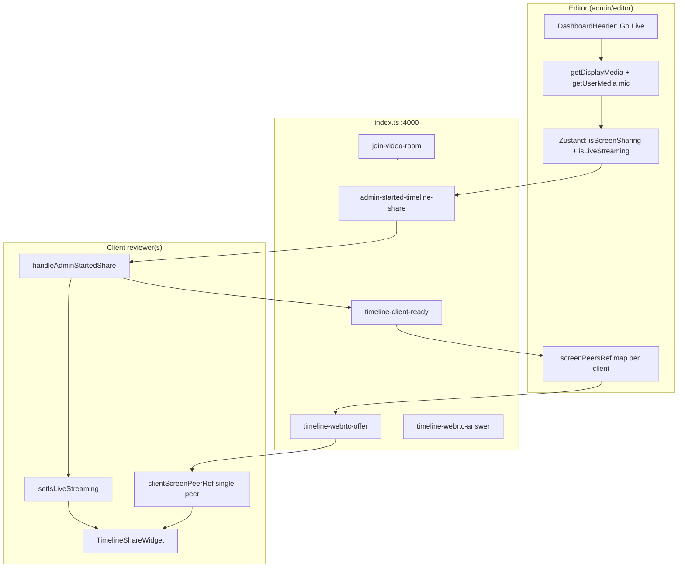

# Timeline Sharing Restoration — Deep Technical Blueprint

**Created:** 2026-07-04  
**Type:** Inspection + Phase 1 implementation  
**Priority:** Highest (unresolved collaboration feature)  
**Status:** Phase 1 implemented — pending manual verify (local)  
**Branch context:** `monorepo-stabilization-2026-07-03`

**Prerequisite (verified local 2026-07-03):** Auth, upload, R2 playback, comments, reviewer identity, notify/compile, compare, scrubber markers, CSV/JSON/Premiere XML export.

**Current feature status:** Timeline Sharing (OTS / **Cinema Mode: Live Editing Share**) — **Phase 1 stabilized — pending two-browser manual verify (local)**.

**Related prior reports:** `timeline-sharing-regression-report.md`, `review-collaboration-layer-map.md` §7, `comment-review-workflow-map.md`

---

## Executive summary

| Question | Answer (code evidence) |
|----------|------------------------|
| What is Timeline Sharing? | **Over-the-shoulder screen capture** of the editor’s display (NLE/desktop), **not** NLE timeline/EDL sync. |
| Transport | Socket.io signaling (`rendorax-backend/index.ts` :4000) + WebRTC (`simple-peer`) |
| Entry | Dashboard header **Go Live (Screen Share)** — `isEditor` only |
| Join | **Implicit** — any user in the same Socket.io room receives `admin-started-timeline-share` |
| #1 failure mode (pre-Phase 1) | **Room ID = `previewFile.name`** — fragile coupling |
| **Phase 1 fix** | **`getReviewRoomId()`** — `review:asset:{assetId}` or `review:file:{normalizedName}` |
| #2 failure mode | **Cinema mode unmounts** comments, scrubber, compare, asset player |
| #3 failure mode | **Play/pause/seek not emitted** from player controls (only `jumpToTime` emits) |
| Invite / share link | **None** |
| Recommended path | **Phase 1:** stable room contract + two-browser proof → **Phase 2:** split-view comments + playhead sync + TURN → **Phase 3:** review-session rooms + invites + agency integration |

---

## 1. Current timeline sharing flow (evidence map)

### 1.1 Architecture overview

Two **parallel** live stacks share backend `:4000` but use **different rooms and event namespaces**:

| Stack | Purpose | Socket source | Room key |
|-------|---------|---------------|----------|
| **A — OTS / Cinema** | Screen share of editor display | `useLiveComments` → passed to `page.tsx` | `previewFile?.name \|\| currentFolder \|\| "global-lobby"` |
| **B — Live video call** | Webcam/mic mesh call | `GlobalLiveWidget` / `LiveSessionWidget` | `call_global-lobby` (hardcoded) |

OTS restoration targets **Stack A** only. Stack B must not be conflated with timeline share.



### 1.2 Go Live (editor)

**File:** `rendorax-frontend/app/dashboard/page.tsx` **316–370**

| Step | Action | Evidence |
|------|--------|----------|
| 1 | `getDisplayMedia({ video: { frameRate: 30 }, audio: false })` | L318–321 — display audio off to avoid lock with `LiveSessionWidget` mic |
| 2 | Optional `getUserMedia` for editor mic | L332–337 |
| 3 | Merge tracks → `screenStreamRef` | L339–345 |
| 4 | `setIsScreenSharing(true)`, `setIsLiveStreaming(true)` | L346–347 |
| 5 | Local preview on `cinemaVideoRef` | L349–353 |
| 6 | `socket.emit("admin-started-timeline-share", { roomId, editorSocketId })` | L355–361 |
| 7 | Auto-stop on display track `onended` | L364–366 |

**Room ID at emit:**

```355:361:rendorax-frontend/app/dashboard/page.tsx
      const globalRoomId = previewFile?.name || currentFolder || "global-lobby";
      if (socket) {
        socket.emit("admin-started-timeline-share", { 
          roomId: globalRoomId,
          editorSocketId: socket.id 
        });
```

**RBAC:** `isEditor` from `user.app_metadata.role ∈ {admin, editor}` (`page.tsx` ~588) gates `DashboardHeader` Go Live (`DashboardHeader.tsx` ~168).

### 1.3 Join live session (client / reviewer)

**There is no explicit “Join Live Session” button for OTS.**

| Step | File | Lines | Behavior |
|------|------|-------|----------|
| Socket connect | `useLiveComments.ts` | 75–80 | `io(NEXT_PUBLIC_BACKEND_URL \|\| localhost:4000)` |
| Room join | `useLiveComments.ts` | 117–137 | `join-video-room(roomToJoin)` on connect / room change |
| Receive share | `page.tsx` | 393–398 | `setIsLiveStreaming(true)` |
| Signal ready | `page.tsx` | 395–398 | `timeline-client-ready` → `editorSocketId` |
| WebRTC answer | `page.tsx` | 451–512 | Client `Peer` answerer; stream → `cinemaVideoRef` |
| Layout swap | `page.tsx` | 1237–1238 | Full workspace → `TimelineShareWidget` only |

**Client handler:**

```393:398:rendorax-frontend/app/dashboard/page.tsx
    const handleAdminStartedShare = (data: { roomId: string; editorSocketId: string }) => {
      setIsLiveStreaming(true);
      socket.emit("timeline-client-ready", {
        targetSocketId: data.editorSocketId,
        roomId: `timeline-${data.roomId}`,
      });
```

**Note:** `timeline-${data.roomId}` in client-ready payload is **ignored by backend** (`index.ts` 192–196) — cosmetic only.

**Orthogonal:** `GlobalLiveWidget` “Start Live Session” / `LiveSessionToolbar` “Join Live Video Call” uses `join-call` + `global-lobby` — **not** OTS cinema mode.

### 1.4 WebRTC signaling

**Config:** `utils/webrtcConfig.ts` — STUN + optional TURN; `trickle: false` (SDP-embedded ICE, no `webrtc-ice-candidate` on OTS path).

| Role | Peer | Ref | Emit |
|------|------|-----|------|
| Editor | initiator + screen stream | `screenPeersRef[socketId]` | `timeline-webrtc-offer` |
| Client | answerer + optional mic | `clientScreenPeerRef` (single) | `timeline-webrtc-answer` |

**Backend relay:** `index.ts` **182–211**

**Editor hears client mic:** `peer.on("stream")` → `new Audio()` play (`page.tsx` ~433–437).

**Multiple clients:** Editor maintains **one peer per `clientSocketId`** in `screenPeersRef` — architecture supports **N reviewers** on OTS path.

### 1.5 Socket.io room lifecycle

**Join:**

```76:79:rendorax-backend/index.ts
  socket.on("join-video-room", (room) => {
    socket.join(room);
    console.log(`Client joined video room: ${room}`);
  });
```

**Room construction (must match exactly):**

| Location | Expression |
|----------|------------|
| `useLiveComments.ts:120` | `previewFile?.name \|\| currentFolder \|\| "global-lobby"` |
| `page.tsx:355,383` (share start/stop) | same |
| `useLiveComments.ts:394` (`jumpToTime`) | `previewFile.name` **only** |
| `useLiveComments.ts:211` (`new-comment`) | `fileId: previewFile.name` |

**Share relay:** `socket.to(data.roomId).emit(...)` — **sender excluded**; editor relies on local `setIsLiveStreaming`.

**Disconnect:** `index.ts` **355–381** — `timeline-user-disconnected` + `user-disconnected` emitted to all joined rooms.

### 1.6 Zustand state

**File:** `store/useDashboardStore.ts`

| Field | Set by | Effect |
|-------|--------|--------|
| `isEditor` | Auth metadata on load | Go Live visibility |
| `isScreenSharing` | Editor `startScreenShare` / `stopScreenShare` | Header button label |
| `isLiveStreaming` | Editor start/stop **or** client `handleAdminStartedShare` | **Layout gate** — cinema vs full dashboard |

**Asymmetry:** Clients get `isLiveStreaming=true` but `isScreenSharing` stays `false`.

### 1.7 Cinema mode layout impact

```1237:1238:rendorax-frontend/app/dashboard/page.tsx
        {isLiveStreaming ? (
          <TimelineShareWidget cinemaVideoRef={cinemaVideoRef} socket={socket} isEditor={isEditor} />
```

When `isLiveStreaming`, the **entire else branch (~1239–1827) is unmounted:**

- Vault sidebar, asset grid, cloud gallery
- `StreamingVideoPlayer`, compare player
- `VideoTimelineScrubber` + comment marker ticks
- Play/pause, frame step, LUFS, picture lock
- **`CommentsPanel`**
- Export Markers / Report / Send toolbar

**Only persists:** `Navbar`, `DashboardHeader`, `TimelineShareWidget`.

`TimelineShareWidget.tsx` — full-screen muted `<video>`; editor-only translation subtitles via global `receive-translated-speech`.

---

## 2. Exact failure points (ranked)

### 2.1 Critical

| ID | Failure | Evidence | Symptom |
|----|---------|----------|---------|
| **F1** | **Room = `previewFile.name` coupling** | `useLiveComments.ts:120`, `page.tsx:355` | Client on grid / different asset / `currentFolder` fallback → **never receives** `admin-started-timeline-share` |
| **F2** | **`jumpToTime` room inconsistency** | Join uses `previewFile?.name \|\| currentFolder \|\| global-lobby`; emit uses `previewFile.name` only (`useLiveComments.ts:393–395`) | Seek sync fails when preview not open |
| **F3** | **No explicit join / invite** | No route, token, or UI | Manual coordination; wrong room silent failure |

### 2.2 High

| ID | Failure | Evidence | Symptom |
|----|---------|----------|---------|
| **F4** | **Cinema mode hides comments** | `page.tsx:1237` layout gate | Cannot timestamp feedback during live share |
| **F5** | **Play/pause not emitted** | `handleTogglePlay` (`page.tsx:600–625`) — no socket | Listeners in `useLiveComments.ts:142–177` never fire from controls |
| **F6** | **`video-pause` never emitted** | Grep: zero frontend emitters | Pause sync dead |
| **F7** | **Scrubber seek not emitted** | `VideoTimelineScrubber` local seek only | Manual scrub desync |
| **F8** | **TURN optional / STUN-only default** | `webrtcConfig.ts` | Production NAT → black video / failed ICE |

### 2.3 Medium

| ID | Failure | Evidence | Symptom |
|----|---------|----------|---------|
| **F9** | **Dual socket stacks** | `useLiveComments` vs `GlobalLiveWidget` | Resource contention; user confusion |
| **F10** | **Non-sharing editor receives share event** | Any socket room member gets `admin-started-timeline-share` | Second editor enters cinema without stream |
| **F11** | **No Go Live mutex** | No server/editor lock | Two editors could share to same room |
| **F12** | **`receive-translated-speech` global broadcast** | `index.ts` ~346–349 `io.emit` | Translation leak across rooms |
| **F13** | **June 2026 regression context** | `match_log.txt` | Production may have env/wiring issues beyond this branch |

### 2.4 Low / dead code

| ID | Item | Evidence |
|----|------|----------|
| **F14** | Orphan `websocket/server.ts` :3001 | `video_${fileId}` prefix; not in `package.json` start script |
| **F15** | `sync-timecode` / `timecode-updated` | Orphan server only; no frontend consumers |
| **F16** | Legacy handlers `peer-signal`, `replaceTrack`, `user-joined` | `index.ts:156–177`; no frontend listeners |
| **F17** | `enable_live_session` flag | Defined in `useFeatureFlags.ts`; **unused** for OTS |
| **F18** | E2E `websocket-sync.spec.ts` | `test.skip` |

---

## 3. Multi-user review vision

### 3.1 Target roles

| Role | In schema today? | OTS architecture fit |
|------|------------------|----------------------|
| **Editor** | `AgencyRole.editor` + `isEditor` | **Go Live** initiator; `screenPeersRef` host |
| **Client reviewer** | `AgencyRole.client` | **Supported** — implicit join via socket room + WebRTC viewer |
| **Colorist / Audio / VFX** | **No dedicated role** | Map to `AgencyRole.editor` or extend enum; join as **viewers** same as client |
| **Admin** | `AgencyRole.admin` | Same as editor for Go Live |

**Prisma today** (`schema.prisma`):

- `User.role`: `admin | editor | client`
- `Task.assigneeId` + `TaskStatus` — **not wired** to live sessions or comments
- `AgencyProject` — **no** `reviewRoomId` or session fields

### 3.2 Can one room host all roles?

| Capability | Supported now? | Blocker |
|------------|--------------|---------|
| N viewers on one editor stream | **Yes (code)** | `screenPeersRef` map — one peer per client socket |
| N editors sharing simultaneously | **No guard** | No mutex |
| Role-specific UI | **Partial** | Only `isEditor` vs non-editor in cinema widget |
| Client + 3 specialists + editor | **Theoretically yes** | All must share **same socket room** + WebRTC succeeds |
| Department routing | **No** | No assignee → room mapping |

**Conclusion:** Architecture can support **1 editor broadcaster + N viewers** today **if room join is fixed**. Role-based assignment requires **Phase 3** agency/session layer.

---

## 4. Live review room design options (no implementation)

### 4.1 Option A — Asset-based room (current, fragile)

| Aspect | Detail |
|--------|--------|
| ID | `previewFile.name` (vault display name or cloud `fileName`) |
| Pros | Zero new infra; aligns with `video_comments.file_name` |
| Cons | Rename breaks room; vault `userId_` prefix drift; client must open same asset; cloud vs vault name mismatch |
| Verdict | **Keep as fallback only** |

### 4.2 Option B — Stable asset ID room

| Aspect | Detail |
|--------|--------|
| ID | `review:asset:{assetId}` or `MediaAsset.id` when cloud; vault needs `assetId` on all previews |
| Pros | Survives renames; matches R2 pipeline; one ID for comments if keyed to `file_name` mapping maintained |
| Cons | Vault files may lack `assetId`; comments still keyed by `file_name` — need mapping table or dual key |
| Verdict | **Recommended Phase 2** bridge |

### 4.3 Option C — Project-based room

| Aspect | Detail |
|--------|--------|
| ID | `review:project:{AgencyProject.id}` |
| Pros | Multi-asset review; aligns with agency model; natural client invite scope |
| Cons | Comments today are per `file_name` not project; requires project ↔ asset association UI |
| Verdict | **Phase 3** |

### 4.4 Option D — Review-session room (ephemeral UUID)

| Aspect | Detail |
|--------|--------|
| ID | `review:session:{uuid}` created on Go Live |
| Pros | Explicit session lifecycle; supports share link `?session=`; editor can switch assets within session |
| Cons | New DB or Redis record; join UX; session expiry |
| Verdict | **Phase 3 gold standard** |

### 4.5 Option E — Shareable link + token

| Aspect | Detail |
|--------|--------|
| ID | Signed JWT or opaque token → session room |
| Pros | Client invite without dashboard navigation; email/Slack friendly |
| Cons | Auth gate (Supabase magic link vs guest token); security review |
| Verdict | **Phase 3** — depends on Option D |

### 4.6 Comparison matrix

| Criterion | A filename | B assetId | C project | D session | E link |
|-----------|------------|-----------|-----------|-----------|--------|
| Implementation cost | None | Low | Medium | Medium | High |
| Rename-safe | No | Yes | Yes | Yes | Yes |
| Multi-asset session | No | No | Yes | Yes | Yes |
| Comment compatibility | Full | Partial | Needs mapping | Needs `session_id` optional | Needs mapping |
| Invite UX | Poor | Poor | Medium | Good | Best |
| **Phase fit** | Phase 1 doc only | Phase 2 | Phase 3 | Phase 3 | Phase 3 |

**Recommendation:** Phase 1 prove flow with **documented filename precondition** → Phase 2 migrate to **`review:asset:{assetId}`** with vault `assetId` always set → Phase 3 **`review:session:{uuid}`** + invite links.

---

## 5. Comment integration during live share

### 5.1 Current behavior

| Mode | Comments visible? | Add comment? | Realtime sync? |
|------|-------------------|--------------|----------------|
| Normal dashboard | Yes (`CommentsPanel`) | Yes | Supabase + `comment-added` |
| Cinema mode (`isLiveStreaming`) | **No** — panel unmounted | **No** | N/A |

**Socket path still works** if UI were mounted — `new-comment` / `comment-added` use `fileId: getReviewRoomId()` (Supabase `file_name` unchanged).

### 5.2 Restoration options (no redesign = minimal layout change)

| Option | Description | Complexity | Preserves dashboard structure? |
|--------|-------------|------------|-------------------------------|
| **5a — Split view** | Cinema video + narrow `CommentsPanel` column (resize existing pattern) | Medium | Yes — extend layout gate branch |
| **5b — Floating drawer** | Overlay comment entry + list on cinema | Medium | Yes |
| **5c — Stop share to comment** | Document workflow only | None | Yes (status quo) |
| **5d — Parallel asset player** | Small sync player under cinema for timestamped review | High | Borderline redesign |

**Recommended Phase 2:** **5a Split view** — reuse `CommentsPanel` + existing comment hook; pass `previewFile` into cinema branch or keep preview state in Zustand during share.

### 5.3 Comment ↔ room coupling during share

Comments should continue using **`video_comments.file_name`** (no DB change Phase 1–2). Room ID for socket should **derive from same stable key** as comments to keep `comment-added` delivery aligned.

---

## 6. Timeline marker & export integration

### 6.1 Verified foundations (local 2026-07-03)

| Feature | Status | File |
|---------|--------|------|
| Scrubber marker ticks | Resolved | `VideoTimelineScrubber.tsx` |
| `jumpToTime` + socket seek/play | Works **outside** cinema | `useLiveComments.ts:389–397` |
| CSV / JSON / Premiere XML export | Resolved | `exportReviewMarkers.ts` |

### 6.2 During live cinema share

| Feature | Available? | Reason |
|---------|------------|--------|
| Scrubber markers | **No** | Scrubber unmounted |
| Export Markers | **No** | Vault toolbar unmounted |
| Markers on shared NLE pixels | **N/A** | OTS = editor screen WebRTC, not dashboard player |

### 6.3 Recommended integration by phase

| Phase | Behavior |
|-------|----------|
| **Phase 1** | No marker changes; document that markers/export unavailable during cinema |
| **Phase 2** | If split view includes scrubber on **asset player** (optional PiP), markers work on proxy; OTS stream still shows NLE pixels |
| **Phase 2** | Wire scrubber seek → `video-seek` emit (same as `jumpToTime`) |
| **Phase 3** | Post-session: **Export Markers** after share ends (existing flow); optional “session summary” notify |
| **Future** | `marker-highlight` socket event when comment added — optional tick pulse for all viewers |

**No conflict** with CSV/XML export — orthogonal client-side downloads when UI is mounted.

---

## 7. Future compatibility

| Planned feature | Compatibility | Notes |
|-----------------|---------------|-------|
| **Client team invite** | Requires **Option D/E** session rooms + auth | Replaces F1 filename coupling |
| **Admin team management** | `AgencyProject` / `Task` can attach `reviewSessionId` Phase 3 | API exists; UI does not |
| **Feedback routing** | `compiledNotes` / `/api/notify` independent | Hook `admin-stopped-timeline-share` → auto-compile optional |
| **Assignment workflow** | `Task.assigneeId` + role enum | Map colorist/audio/VFX as `editor` or extend `AgencyRole` |
| **AI Quality Check** | Orthogonal to WebRTC | Surface flags in split-view sidebar beside comments |
| **Compare workflow** | Mutually exclusive with full cinema today | Phase 2: compare only in non-cinema or PiP |
| **Supabase comments** | Stays `file_name` keyed | Session layer adds metadata only |
| **R2 / CDN** | Indirect — room should use `assetId` not URL | Transcode status irrelevant to WebRTC |

---

## 8. Restoration phases (implementation approval blueprint)

### Phase 1 — Fast stabilization

**Goal:** Reliable two-browser local proof: Editor Go Live → Client sees cinema stream. No product redesign.

**Status:** **Implemented — pending manual verify (local, 2026-07-04)**

| # | Task | Status |
|---|------|--------|
| 1.1 | Unified `getReviewRoomId()` + `emitJoinReviewRoom()` in `utils/reviewRoom.ts` | **Done** |
| 1.2 | Join before share emit; viewer room match guard on `admin-started-timeline-share` | **Done** |
| 1.3 | Dev room indicator | **Skipped** (optional) |
| 1.4 | Manual test script | **Done** (§10 below) |
| 1.5 | Backend logging | **Skipped** (no backend change in Phase 1 scope) |
| 1.6 | Ignore self-share + wrong-room events | **Done** (`editorSocketId` + `roomId` match) |

**Files changed:**

- `rendorax-frontend/utils/reviewRoom.ts` — **new**
- `rendorax-frontend/hooks/useLiveComments.ts` — join, `new-comment`, `jumpToTime`
- `rendorax-frontend/app/dashboard/page.tsx` — Go Live / Stop / viewer handler

**Room key resolution:**

1. `review:asset:{assetId}` when `previewFile.assetId` present (cloud + vault with MediaAsset)
2. `review:file:{normalizedName}` — vault prefix stripped via `normalizeReviewFileKey()`
3. `review:folder:{currentFolder}` — no preview open
4. `global-lobby` — fallback

**Phase 1 limitations (unchanged — Phase 2):**

- Comments panel **hidden** during cinema mode
- Play/pause/scrub socket sync **not wired** from player controls
- No invite URLs; both users must open **same asset** (matching room key)

**Exit criteria:**

- [ ] Two browsers, same asset open → client sees editor screen within 5s
- [ ] Stop share → both return to dashboard
- [ ] Rejoin test after stop
- [ ] Documented failure when rooms differ (different asset / no preview)

**Estimated total:** 1–2 dev days  
**DB / API changes:** None  
**UI redesign:** None

---

### Phase 2 — Reliable live collaboration

**Goal:** Client can comment during share; playhead sync on asset player; production WebRTC reliability.

| # | Task | Files affected | Dependencies | Risks | Complexity |
|---|------|----------------|--------------|-------|------------|
| 2.1 | **Split-view cinema layout** — cinema + `CommentsPanel` (and optional narrow scrubber) | `page.tsx` layout (~1237+) | Phase 1 | Layout regression mobile | **M** |
| 2.2 | **Emit `video-play` / `video-pause` / `video-seek`** from `handleTogglePlay` + scrubber | `page.tsx`, `VideoTimelineScrubber.tsx`, `useLiveComments.ts` | 1.1 room helper | Feedback loops if not debounced | **M** |
| 2.3 | **Migrate room key to `review:asset:{assetId}`** when `previewFile.assetId` present; fallback filename | `useLiveComments.ts`, `page.tsx`, `index.ts` (docs) | Vault always sets `assetId` on preview | Comment `file_name` still separate key | **M** |
| 2.4 | **TURN production config** | `webrtcConfig.ts`, Vercel env, ops | Hosting | Cost, credential rotation | **M** (ops) |
| 2.5 | **Go Live mutex** — server tracks active sharer per room; reject second `admin-started` | `index.ts` | 1.1 | False reject on reconnect | **M** |
| 2.6 | **Scope `receive-translated-speech`** to room not `io.emit` | `index.ts` | OpenAI multiplexer | Regression for live call | **M** |
| 2.7 | **Disconnect cleanup** — verify `timeline-user-disconnected` destroys correct peer | `page.tsx` | Phase 1 | Orphan peers | **S** |
| 2.8 | **Un-skip / extend E2E** — play/seek sync | `e2e/websocket-sync.spec.ts` | 2.2 | Flaky CI | **M** |

**Exit criteria:**

- [ ] Client adds timestamped comment during live share
- [ ] Comment appears for editor in split view
- [ ] Play/pause on asset player syncs to second viewer (±0.5s)
- [ ] Production test with TURN passes on non-LAN network

**Estimated total:** 1–2 weeks  
**DB changes:** None (assetId room is string prefix only)  
**UI redesign:** Minimal (split pane only)

---

### Phase 3 — Full review room architecture

**Goal:** Product-grade multi-role review sessions with invites and agency integration.

| # | Task | Files affected | Dependencies | Risks | Complexity |
|---|------|----------------|--------------|-------|------------|
| 3.1 | **`ReviewSession` model** — `id`, `projectId`, `assetId`, `hostUserId`, `status`, `startedAt`, `endedAt` | `prisma/schema.prisma`, migration | Agency seed | Schema migration prod | **L** |
| 3.2 | **Session API** — create/end session, list participants | `rendorax-backend` routes, `app/api/` proxy | 3.1 | Auth | **L** |
| 3.3 | **Shareable join URL** — `/dashboard?review={sessionId}` auto-join room | `app/dashboard/page.tsx`, new util | 3.2, Supabase auth | Guest vs auth users | **L** |
| 3.4 | **Invite flow** — email/Slack with link; tie to client invite roadmap | `app/api/notify` or new route | 3.3 | Security | **L** |
| 3.5 | **Project-based rooms** — `review:project:{id}` for multi-asset reviews | `useLiveComments.ts`, session API | 3.1 | Comment mapping | **L** |
| 3.6 | **Agency task linkage** — `Task` ↔ `ReviewSession`; assignee notifications | Agency routes, dashboard UI | Agency UI (§16 backlog) | Scope creep | **L** |
| 3.7 | **Consolidate socket stacks** — single dashboard socket or shared context | `GlobalLiveWidget.tsx`, `useLiveComments.ts` | Phase 2 stable | Regression live call | **L** |
| 3.8 | **Remove or archive `websocket/server.ts`** | `rendorax-backend/websocket/` | None | Dev confusion only | **S** |
| 3.9 | **Session end → compiledNotes** — optional auto-notify | `useLiveComments.ts`, `/api/notify` | compiledNotes verified | Email noise | **M** |
| 3.10 | **Role-aware UI** — viewer vs host controls in cinema | `TimelineShareWidget.tsx`, Zustand | 3.1 | UX | **M** |

**Exit criteria:**

- [ ] Editor starts session → share link → client joins without opening same asset manually
- [ ] Session appears in agency project (optional UI)
- [ ] 5+ participants stress test
- [ ] Production §14 full pass

**Estimated total:** 4–8 weeks  
**DB changes:** Yes (`ReviewSession`, optional `ReviewParticipant`)  
**UI redesign:** Moderate (session chrome, invite modal — still within dashboard shell)

---

## 9. Socket event reference (active server)

### OTS / review sync (Stack A)

| Event | Direction | Used by |
|-------|-----------|---------|
| `join-video-room` | C→S | `useLiveComments` |
| `admin-started-timeline-share` | C→S→others | `page.tsx` |
| `admin-stopped-timeline-share` | C→S→others | `page.tsx` |
| `timeline-client-ready` | C→S→target | `page.tsx` |
| `timeline-webrtc-offer` | C→S→target | `page.tsx` |
| `timeline-webrtc-answer` | C→S→target | `page.tsx` |
| `timeline-user-disconnected` | S→room | disconnect |
| `video-play` / `video-pause` / `video-seek` | C→S→others | `jumpToTime` only emits play+seek today |
| `new-comment` / `comment-added` | C→S→others | `useLiveComments` |

### Live call (Stack B — orthogonal)

| Event | Room |
|-------|------|
| `join-call`, `leave-call`, `webrtc-*`, `send-chat-message` | `call_{roomId}` |

---

## 10. Manual verification checklist (Phase 1 — post-implementation)

**Prerequisites:** Backend `npm run dev` on **4000**; `NEXT_PUBLIC_BACKEND_URL=http://localhost:4000` in frontend `.env.local`.

### Two-browser happy path

1. User A (`admin` or `editor`) and User B (`client`) — both logged in on `/dashboard`.
2. **Both open the same video asset** (cloud or vault) so `getReviewRoomId()` resolves identically (`review:asset:{id}` preferred).
3. Confirm backend running; socket connected (live indicator if visible).
4. User A: **Go Live (Screen Share)** → select display/window.
5. User B: UI switches to **Cinema Mode: Live Editing Share**; video shows A’s screen (not black).
6. User A: **Stop Sharing** → both return to normal dashboard.
7. **Rejoin test:** Repeat steps 4–6 — stream should establish again.

### Negative tests

8. User B on asset grid only (no preview) while A shares → **expect no cinema** (room mismatch).
9. User B on a **different** asset → **expect no cinema**.

### Known Phase 1 limitations (not bugs)

- Comments panel unavailable during cinema mode — **Phase 2**
- Play/pause/scrub not synced from player — **Phase 2**
- Production WebRTC may need TURN — **Phase 2 / §14**

---

## 11. Local vs production

| Check | Local (2026-07-04) | Production |
|-------|-------------------|------------|
| OTS code present | **Yes** | Same branch assumed |
| Two-browser screen share | **Not verified** in stabilization pass | **Unknown** |
| Comments during cinema | **Broken UX** (UI hidden) | **Unknown** |
| Scrubber markers | **Verified** (non-cinema only) | Pending §14 |
| Marker export CSV/JSON/XML | **Verified** (non-cinema only) | Pending §14 |
| WebRTC without TURN | LAN may work | **Often fails** |
| Backend :4000 | Dev | **Not deployed** (§14) |

---

## 12. Implementation approval checklist

Before coding, confirm:

- [ ] **Phase 1 scope approved** (room helper + join contract + manual proof only)
- [ ] **Phase 2 split-view** acceptable (minimal layout change)
- [ ] **Room ID strategy** — filename Phase 1 → `assetId` Phase 2 → session UUID Phase 3
- [ ] **No merge** of OTS with `global-lobby` live call in Phase 1–2
- [ ] **Orphan `websocket/server.ts`** — document only Phase 1; remove Phase 3
- [ ] **Production TURN** budget/owner for Phase 2
- [ ] **DB session table** deferred to Phase 3

---

## Related documents

- `timeline-sharing-regression-report.md` — prior inspection (2026-07-03)
- `timeline-comment-markers-plan.md` — scrubber markers (verified; unavailable in cinema)
- `offline-timeline-marker-export-plan.md` — export (verified; unavailable in cinema)
- `premiere-xml-marker-export-plan.md` — Premiere XML (verified)
- `review-collaboration-layer-map.md` §7
- `comment-review-workflow-map.md` — play/pause sync gap
- `rendorax-project-checklist.md` §14–§16

---

*End of blueprint. Phase 1 implemented 2026-07-04 — pending two-browser manual verify (local).*
